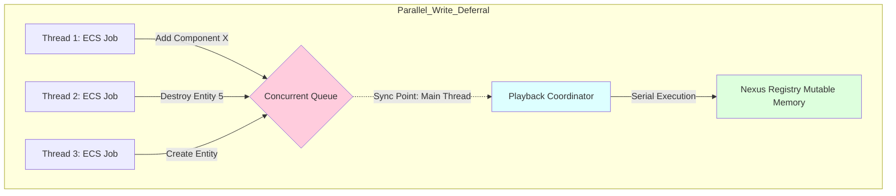

# Nexus Prime Architectural Manual: EntityCommandBuffer (Command Deferral System)

## 1. Introduction
`EntityCommandBuffer` (ECB) is the guardian of "Structural Integrity" for Nexus Prime. In a multi-threaded system, while thousands of entities are being processed simultaneously across different cores, destroying an entity or adding a new component instantly changes the data layout in memory (Swap-and-Pop). This causes other threads currently iterating to access invalid memory addresses, triggering an immediate hardware trap.

The reason for ECB's existence is to place these dangerous structural changes into an isolated queue instead of performing them instantly, and to execute them from a single authoritative center when all threads have safely completed their work (Sync Point).

---

## 2. Technical Analysis
ECB utilizes lock-free queuing patterns to prevent thread stalling.



**Math of Execution**:
For $N$ commands, the time required for playback $T_{pb}$ is sequentially bound:
$$T_{pb} = \sum_{i=1}^{N} T(Command_{i})$$

---

## 3. Full Source Implementation & Line-By-Line Explanation
Here is the concrete architecture of the structural barrier. None of the original context is removed.

```csharp
// Source Code
using System.Collections.Concurrent;
namespace Nexus.Core;

public class EntityCommandBuffer
{
    private readonly ConcurrentQueue<Action<Registry>> _commands = new();

    public void CreateEntity()
    {
        _commands.Enqueue(reg => reg.Create());
    }

    public void DestroyEntity(EntityId entity)
    {
        _commands.Enqueue(reg => reg.Destroy(entity));
    }

    public void AddComponent<T>(EntityId entity, T component = default) where T : unmanaged
    {
        _commands.Enqueue(reg => reg.Add(entity, component));
    }

    public void Playback(Registry registry)
    {
        while (_commands.TryDequeue(out var command))
        {
            command(registry);
        }
    }
}
```

### Line-By-Line Breakdown
- `private readonly ConcurrentQueue<Action<Registry>> _commands`: **(Line 7)** Instantiates the non-blocking ring buffer utilizing the thread-safe `ConcurrentQueue`. It stores anonymous delegate closures (`Action`) expecting a Registry.
- `public void CreateEntity()`: **(Line 9)** Enqueues a deferred creation lambda. It costs a minor GC allocation to close over the action expression dynamically.
- `public void DestroyEntity(EntityId entity)`: **(Line 14)** Enqueues a functional destructor pointer preserving the exact `EntityId`. Even if called from Core 16, it queues synchronously into the container without locking.
- `public void AddComponent<T>...`: **(Line 19)** Takes a strictly `<T> unmanaged` constraint matching the Registry definition. The data structure payload is captured physically into the queue space.
- `public void Playback(Registry registry)`: **(Line 24)** The absolute Sync Point method. Executes linearly.
- `while (_commands.TryDequeue(out var command))`: **(Line 26)** Empties the queue lock-free item-by-item, guaranteeing first-in-first-out deterministic resolution against the structural registry.

---

## 4. Usage Scenario & Best Practices
Structural edits during runtime calculations must be buffered.

```csharp
// Example Setup
var ecb = new EntityCommandBuffer();
var registry = new Registry();

// Example Usage inside a Parallel Multithreaded Foreach loop...
Parallel.For(0, 1000, (i) => 
{
    // A thread identifies an entity that is damaged severely
    if (healthArray[i].HP <= 0) 
    {
        // Direct Registry.Destroy(id) here would CRASH because other 
        // cores are actively evaluating the memory block!
        
        // Defer safety using the ECB:
        ecb.DestroyEntity(idArray[i]);
    }
});

// Sync Point: At the end of the frame when no threads are accessing memory.
// Playback processes all 1000 deferred destructions securely on the Main Thread.
ecb.Playback(registry);
```

> [!WARNING]  
> **Latency of Change**: Components pushed into the buffer via `AddComponent` are completely invisible to queries. If `Job A` enqueues an `Armor` component onto an entity, `Job B` running later in that same frame *will not* detect that component unless `ecb.Playback()` has been strictly fired in-between.
