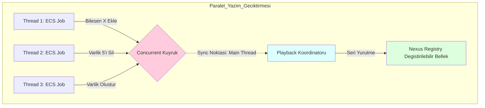

# Nexus Prime Mimari Rehberi: EntityCommandBuffer (Komut Geciktirme Sistemi)

## 1. Giriş
`EntityCommandBuffer` (ECB), Nexus Prime'ın "Yapısal Kararlılık" (Structural Integrity) koruyucusudur. Çok çekirdekli (Multi-threaded) bir sistemde, farklı çekirdeklerde binlerce varlık aynı anda işlenirken bir varlığı silmek veya yeni bir bileşen eklemek, bellekteki veri dizilimini anında değiştirir (Swap-and-Pop). Bu durum, o an veri üzerinde gezinmekte olan diğer iş parçacıklarının geçersiz bellek adreslerine erişmesine yol açarak anında donanımsal çökmelere (trap) neden olur.

ECB'nin varlık sebebi, bu tehlikeli yapısal değişiklikleri anında asıl belleğe yazmak yerine izole bir kuyruğa almak ve tüm iş parçacıkları işlerini güvenle bitirdiğinde (Sync Point) tek bir merkezden bu işlemleri yürütmektir.

---

## 2. Teknik Analiz
ECB, Thread kilitlenmesi olayını engellemek için Lock-Free pattern (kilitsiz örüntü) kullanır.



**Yürütme Matematiği**:
$N$ adet komut için "Playback" işlemi sırasında geçecek süre $T_{pb}$ kesinlikle ardışık biçimde bağlanmıştır:
$$T_{pb} = \sum_{i=1}^{N} T(Komut_{i})$$

---

## 3. Tam Kaynak Kod Uygulaması ve Satır Satır Açıklama
Orijinal bağlamın hiçbiri silinmeden yapısal bariyerin tam donanımsal mimarisi sunulmuştur.

```csharp
// Kaynak Kod (Source Code)
using System.Collections.Concurrent;
namespace Nexus.Core;

public class EntityCommandBuffer
{
    private readonly ConcurrentQueue<Action<Registry>> _commands = new();

    public void CreateEntity()
    {
        _commands.Enqueue(reg => reg.Create());
    }

    public void DestroyEntity(EntityId entity)
    {
        _commands.Enqueue(reg => reg.Destroy(entity));
    }

    public void AddComponent<T>(EntityId entity, T component = default) where T : unmanaged
    {
        _commands.Enqueue(reg => reg.Add(entity, component));
    }

    public void Playback(Registry registry)
    {
        while (_commands.TryDequeue(out var command))
        {
            command(registry);
        }
    }
}
```

### Satır Satır Kod Açıklaması (Line-By-Line Breakdown)
- `private readonly ConcurrentQueue<Action<Registry>> _commands`: **(Satır 7)** CPU bekleme düğümlerini atlayan ring buffer (halka önbellek) temelli thread-safe (iş parçacığı uyumlu) kuyruğu tanımlar. İçerisinde hedef Registry'e atılacak olan operasyonları lambda referansları (`Action`) olarak saklar.
- `public void CreateEntity()`: **(Satır 9)** Bir yaratım geciktirme kapatması (closure) enjekte eder. C# yapısı gereği bu ifade Managed Heap tarafında ufak bir delegate tahsisi oluşturur.
- `public void DestroyEntity(EntityId entity)`: **(Satır 14)** İlgili EntityId bilgisini hapseden fonsiyonel bir tahrip işaretini kuyruğa koyar. 16. çekirdekten dahi çağrılsa asıl bellekte race-condition yapmaz.
- `public void AddComponent<T>...`: **(Satır 19)** Sadece `<T> unmanaged` donanım kısıtlamasına uyan değerleri alır. Gönderilen struct verisi (payload) fiziksel hatlarıyla kuyruk belleğinde dondurulur.
- `public void Playback(Registry registry)`: **(Satır 24)** İş akışlarının donanımsal temasının bittiği mutlak Sync Noktası (Senkronizasyon) metodudur. Lineer çalışır.
- `while (_commands.TryDequeue(out var command))`: **(Satır 26)** Tüm kuyruğu FIFO (İlk giren ilk çıkar) temel deterministik prensibiyle hiç kilitlenme yaratmadan tekil şekilde Registry'e boşaltır ve kusar.

---

## 4. Kullanım Senaryosu ve En İyi Uygulamalar
Çalışma zamanı hesaplamaları esnasındaki yapısal düzenlemeler mutlaka arabelleğe alınmalıdır.

```csharp
// Ornek Kurulum
var ecb = new EntityCommandBuffer();
var registry = new Registry();

// Milyonlarca hesabin yapildigi Multi-Thread Parallel For döngüsünde...
Parallel.For(0, 1000, (i) => 
{
    // Cekirdek bir hedefteki hasarin ölümcül oldugunu hesapladı
    if (healthArray[i].HP <= 0) 
    {
        // Burada doğrudan Registry.Destroy(id) yazmak ÇÖKTÜRÜR çünkü 
        // diğer CPU çekirdekleri şu an bu dizi hafızası üzerinde dönüyor!
        
        // Guvenligi ECB uzerine delege et:
        ecb.DestroyEntity(idArray[i]);
    }
});

// Sync Point: Çerçeve sonu ulaştığında ve hafızada artık Thread dolaşmadığında...
// Playback güvenle 1000 yok etme komutunu Main Thread üzerinden çözer.
ecb.Playback(registry);
```

> [!WARNING]  
> **Değişim Gecikmesi (Latency of Change)**: `AddComponent` komutu üzerinden ECB arabelleğine fırlatılan bir bileşen dış dünyaya ve sorgulara tamamen körce kapalıdır. Eğer `A Sistemi` varlığa Zırh bileşeni eklerse, onu hemen ardından takip eden `B Sistemi` okuma yaptığında Zırhı *bulamaz* ve hata verir. Yeni bileşenin belirebilmesi ancak aralarından `ecb.Playback()` kesilmesinin çalıştırılması sayesinde mümkün olur.
