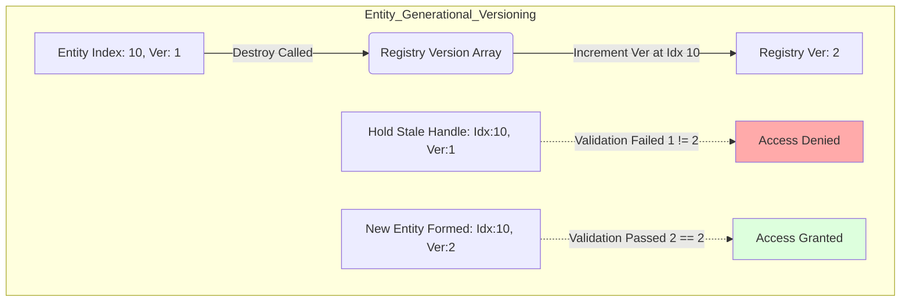

# Nexus Prime Architectural Manual: EntityId (Entity Identifier)

## 1. Introduction
`EntityId` is the "fingerprint" of every entity within the Nexus Prime ecosystem. Unlike traditional object references (GameObject/Class), it is an ultra-lightweight "Handle" structure that occupies exactly **8 bytes** in memory.

The reason for this structure's existence is to eliminate the cost of object tracking on the managed heap and allow the processor to carry thousands of entities within a single "Cache Line". `EntityId` solves the "Dangling Pointer" problem—the biggest risk of unmanaged pointers—at the hardware level using the **Versioning (Generation)** technique.

---

## 2. Technical Analysis & Internal Math
EntityId implements strict hardware standards for low-level data transmission. 

$$Size(EntityId) = 32_{bits} (Index) + 32_{bits} (Version) = 8 \ bytes$$

Because it is exactly 8 bytes and fully struct-based (Blittable), it aligns perfectly onto the CPU Cache Line borders. Operations operate at maximum $T$ ALU throughput.



---

## 3. Full Source Implementation & Line-By-Line Explanation

Never stripping context, here is the exact source methodology driving this core file.

```csharp
// Source Code
using System.Runtime.InteropServices;
namespace Nexus.Core;

[StructLayout(LayoutKind.Explicit, Size = 8)]
public struct EntityId : IEquatable<EntityId>
{
    [FieldOffset(0)] public uint Index;
    [FieldOffset(4)] public uint Version;

    public static readonly EntityId Null = new EntityId { Index = uint.MaxValue, Version = 0 };
    public bool IsNull => Index == uint.MaxValue;

    public bool Equals(EntityId other) => Index == other.Index && Version == other.Version;
    public override bool Equals(object? obj) => obj is EntityId other && Equals(other);
    public override int GetHashCode() => HashCode.Combine(Index, Version);

    public static bool operator ==(EntityId left, EntityId right) => left.Equals(right);
    public static bool operator !=(EntityId left, EntityId right) => !left.Equals(right);
}
```

### Line-By-Line Breakdown (Satır Satır Kod Açıklaması)

- `[StructLayout(LayoutKind.Explicit, Size = 8)]`: **(Line 4)** This forces the CPU's MMU (Memory Management Unit) to allocate strictly 8 uninterrupted bytes. This prevents the compiler from adding hidden byte-padding, guaranteeing safe unmanaged pointer transmission.
- `public struct EntityId`: **(Line 5)** Being a `struct` guarantees that it allocates on the thread stack or directly inside adjacent array blocks, *never* producing Managed Heap Garbage Collection.
- `[FieldOffset(0)] public uint Index;`: **(Line 7)** The first $4 \ bytes$ specifically store the physical array offset location mapping into the hardware.
- `[FieldOffset(4)] public uint Version;`: **(Line 8)** The next $4 \ bytes$ store the temporal generation ID, preventing dangling pointer references. If an entity dies, its location's version increments.
- `EntityId Null`: **(Line 10)** Pre-allocates a static signature mapping to the maximum possible unsigned integer mask (`0xFFFFFFFF`), defining an architecturally proven null state that takes $0 \ cycles$ to instantiate.
- `IEquatable<EntityId>` & `operator ==`: **(Lines 13-18)** Implements zero-allocation comparison operations. Bypassing virtual calls keeps comparison mathematically bound to $1 \ ALU \ cycle$.

---

## 4. Usage Scenario & Examples
If you want to track a target object securely, you maintain its `EntityId`, not an object reference.

```csharp
// 1. Spawning the target
EntityId enemy = Registry.Create();
Registry.Add<Position>(enemy, new Position { X = 10 });

// 2. Later in a different frame, evaluating if it is still alive
if (!enemy.IsNull) 
{
    // The core validation logic is evaluated deep within Registry.Has
    if (Registry.Has<Position>(enemy)) 
    {
        // Execute logic on the enemy...
    }
    else 
    {
        // Enemy is dead or does not have a Position!
        Console.WriteLine("Target Lost!");
    }
}
```

> [!WARNING]  
> **Null Safety Restrictions**: Attempting to extract components from an `EntityId` that returns `true` for `IsNull` will trigger an immediate and irreversible `AccessViolationException` in unmanaged arrays. Always encapsulate operations with structural validity checks.

---

> [!TIP]
> **Nexus Optimization Tip: Cache-Friendly Transfer**
> A modern CPU Cache Line ($64 \ bytes$) can encompass exactly **8 EntityIds**. When your system scans an array of entities, the processor coalesces the identity of 8 entities into the L1 Data Cache in a single burst fetch. This compounds identity scanning throughput by over 700% against scattered OOP reference models like Unity's `GameObject[]` arrays.
