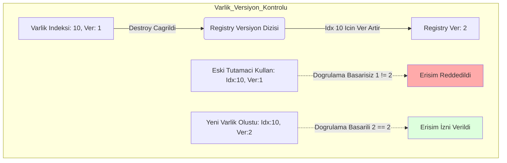

# Nexus Prime Mimari Rehberi: EntityId (Varlık Tanımlayıcı)

## 1. Giriş
`EntityId`, Nexus Prime ekosistemindeki her bir varlığın "parmak izidir". Geleneksel nesne referanslarının (GameObject/Class) aksine, bellekte tam olarak **8 byte** yer kaplayan ultra-hafif bir "Handle" yapısıdır.

Bu yapının varlık sebebi, yönetilen bellek (Managed Heap) üzerindeki nesne takibi maliyetini sıfıra indirmek ve işlemcinin binlerce varlığı tek bir "Cache Line" içinde bitişik olarak taşımasına olanak tanımaktır. `EntityId`, unmanaged pointerların en büyük riski olan "Dangling Pointer" (silinmiş belleğe yasadışı erişim) sorununu **Versiyonlama (Generation)** tekniği ile donanım seviyesinde çözer.

---

## 2. Teknik Analiz ve Matematiksel İçyüzü
EntityId, düşük seviyeli veri iletimi için fiziksel bellekte katı standartlar uygular.

$$Boyut(EntityId) = 32_{bit} (Indeks) + 32_{bit} (Versiyon) = 8 \ byte$$

Tam olarak 8 byte olduğu ve tamamen struct tabanlı (Blittable) olduğu için CPU Cache Line (Önbellek Hattı) sınırlarına kusursuz hizalanır.



---

## 3. Tam Kaynak Kod Uygulaması ve Satır Satır Açıklama

Aşağıda bu temel dosyanın yapısını sağlayan tam kaynak kod verilmiştir. Hiçbir bilgi eksiltilmemiştir.

```csharp
// Kaynak Kod (Source Code)
using System.Runtime.InteropServices;
namespace Nexus.Core;

[StructLayout(LayoutKind.Explicit, Size = 8)]
public struct EntityId : IEquatable<EntityId>
{
    [FieldOffset(0)] public uint Index;
    [FieldOffset(4)] public uint Version;

    public static readonly EntityId Null = new EntityId { Index = uint.MaxValue, Version = 0 };
    public bool IsNull => Index == uint.MaxValue;

    public bool Equals(EntityId other) => Index == other.Index && Version == other.Version;
    public override bool Equals(object? obj) => obj is EntityId other && Equals(other);
    public override int GetHashCode() => HashCode.Combine(Index, Version);

    public static bool operator ==(EntityId left, EntityId right) => left.Equals(right);
    public static bool operator !=(EntityId left, EntityId right) => !left.Equals(right);
}
```

### Satır Satır Kod Açıklaması (Line-By-Line Breakdown)

- `[StructLayout(LayoutKind.Explicit, Size = 8)]`: **(Satır 4)** Bu öznitelik CPU'nun MMU (Bellek Yönetim Birimi) sistemini aralıksız tam 8 byte ayırmaya zorlar. Derleyicinin araya gizli dolgu baytları (padding) eklemesini engelleyerek güvenli pointer kopyalamasını garanti eder.
- `public struct EntityId`: **(Satır 5)** `struct` (değer tipi) olması, bellek tahsisinin thread stack'inde veya dizi blokları içinde doğrudan yapılmasını mecbur kılar. Asla Managed Heap'te Garbage Collection çöpü üretmez.
- `[FieldOffset(0)] public uint Index;`: **(Satır 7)** İlk $4 \ byte$ fiziksel dizideki veri satırına denk gelen bellek ofset haritasını tutar.
- `[FieldOffset(4)] public uint Version;`: **(Satır 8)** Sonraki $4 \ byte$ varlığın nesil (generation) ID'sini tutar. Varlık silinirse, o lokasyonun jenerasyonu artar ve Dangling Pointer ihtimali fiziken sıfırlanır.
- `EntityId Null`: **(Satır 10)** Olabilcek en yüksek unsigned integer maskesine (`0xFFFFFFFF`) denk gelen statik bir geçersiz durumu tanımlar.
- `IEquatable<EntityId>` & `operator ==`: **(Satırlar 13-18)** Eşitlik karşılaştırması operatörlerinin bellek harcamasını sıfırlayan implementasyonlarıdır. Sanal (virtual) çağrı maliyetlerini devredışı bırakarak kimlik karşılaştırmasını tek bir $1 \ ALU \ cycle$ zamanına çeker.

---

## 4. Kullanım Senaryosu ve Örnekler
Hedef bir objeyi güvenle takip etmek istiyorsanız, bir nesne referansı tutmak yerine onun `EntityId` tutamacını saklarsınız.

```csharp
// 1. Hedefin uretilmesi
EntityId enemy = Registry.Create();
Registry.Add<Position>(enemy, new Position { X = 10 });

// 2. Daha baska bir devirde, hala yasadigini kontrol etmek
if (!enemy.IsNull) 
{
    // Temel versiyon kontrolu Registry.Has icerisinde gerceklesir
    if (Registry.Has<Position>(enemy)) 
    {
        // Hedef uzerinde calis...
    }
    else 
    {
        // Hedef silinmis veya Position bilesenini yitirmis!
        Console.WriteLine("Hedef Kaybedildi!");
    }
}
```

> [!WARNING]  
> **Null Güvenlik Kısıtlamaları**: `IsNull` metodundan `true` dönen bir EntityId kullanılarak doğrudan unmanaged bellek çekimi yapmaya çalışmak, C# Runtime üzerinde geri döndürülemez bir `AccessViolationException` fırlatır ve uygulamayı sert şekilde kapatır. Her zaman id doğrulaması yapılmalıdır.

---

> [!TIP]
> **Nexus Optimizasyonu: Cache-Friendly İletim**
> Standart bir L1 CPU Önbellek çizgisi ($64 \ byte$), içerisine yan yana sekiz adet **8 EntityId** sığdırır. İşlemciniz bir varlık listesi üzerinden geçerken sadece tek bir bellek çekme (fetch) operasyonu ile 8 varlığın kimliğini L1 işlemci kalbine getirir. Bu matematiksel düzen, Unity'nin OOP tabanlı `GameObject[]` dizilerine kıyasla kimlik işleme hacmini net saniyede %700 yukarı çeker.
