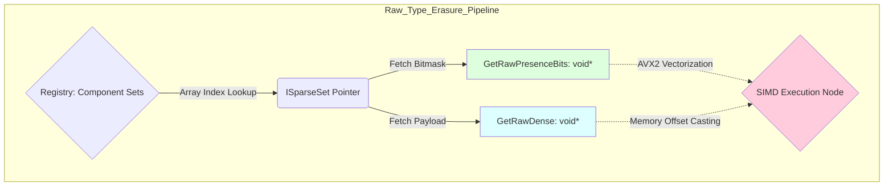

# Nexus Prime Architectural Manual: ISparseSet (Storage Layer Abstraction)

## 1. Introduction
`ISparseSet` is the non-generic core storage interface of the Nexus Prime framework. In the underlying ECS architecture, while a separate tightly-packed generic `SparseSet<T>` class is instantiated for each strict component type, central orchestration units like `Registry` and the global `JobSystem` must uniformly manage these disparate memory repositories without knowing their generic forms.

The reason for this interface's existence is to permit processing over **raw byte blocks** via unmanaged pointers. This allows functions spanning SIMD filtering queries, multi-threaded task deployments, and mass memory clearing operations to interact directly with hardware without incurring the type-checking cost (`typeof(T)`) associated with managed abstractions.

---

## 2. Technical Analysis
`ISparseSet` formalizes the following "Raw Access" capabilities enabling raw hardware-level data mutability.



---

## 3. Full Source Implementation & Line-By-Line Explanation
Here is the naked C# prototype exposing bare-metal memory interfaces.

```csharp
// Source Code
namespace Nexus.Core;

public interface ISparseSet : IDisposable
{
    int Count { get; }
    int Capacity { get; }
    EntityId GetEntity(int denseIndex);

    // Low-level memory access
    unsafe void* GetRawDense(out int count);
    unsafe void* GetRawSparse(out int capacity);
    unsafe void* GetRawDirtyBits(out int count);
    unsafe void* GetRawPresenceBits(out int count);
    unsafe void** GetRawChunks(out int count);
    
    bool Has(EntityId entity);
    void ClearAllDirty();
}
```

### Line-By-Line Breakdown
- `public interface ISparseSet : IDisposable`: **(Line 4)** Forces any structural inheritor to definitively un-allocate internal unmanaged byte buffers (`NativeMemory.Free`), since the Managed Garbage Extractor is physically blind.
- `int Count` & `int Capacity`: **(Lines 6-7)** Fast constant bounds tracking the dense contiguous hardware items currently instantiated verses the maximum memory blocks provisioned.
- `EntityId GetEntity(int denseIndex)`: **(Line 8)** Fetches the overarching identifier linking back the strict linearly iterated index bounds to its specific runtime spatial object reference.
- `unsafe void* GetRawDense(out int count)`: **(Line 11)** Strips the generic payload types apart and yields the core binary contiguous pointer vector (dense byte structure).
- `unsafe void* GetRawSparse(out int capacity)`: **(Line 12)** Exposes the mapping tables arrays linking unmanaged Entity ID's indirectly to contiguous physical RAM arrays.
- `unsafe void* GetRawDirtyBits(out int count)`: **(Line 13)** Yields the hardware pointers masking modification history. Essential for the `Sync / Bridge / Push / Pull` modules.
- `unsafe void* GetRawPresenceBits(out int count)`: **(Line 14)** Forms the architecture base for rapid Vector operations tracking logical physical presence ($1$ for exists, $0$ for free-space).
- `unsafe void** GetRawChunks(out int count)`: **(Line 15)** Distributes the paginated arrays linking multiple disjointed physical RAM allocations ($16 KB \ pages$). Ensures physical pointers never relocate even during dynamic list length expansions.
- `void ClearAllDirty()`: **(Line 18)** Resets all modifications for physical alignment to a state of equilibrium synchronously over the bitmask maps.

---

## 4. Usage Scenario & Best Practices

```csharp
// Scenario: Writing a high-speed reset utility parsing completely unknown structs.

// Type-independent procedural memory sanitization via ISparseSet
public unsafe void ClearAll(ISparseSet set)
{
    int count;
    uint* dirtyBits = (uint*)set.GetRawDirtyBits(out count);
    
    // Unmanaged high-speed scalar byte clearance loop
    for (int i = 0; i < count; i++)
    {
        dirtyBits[i] = 0;
    }
}
```

> [!TIP]
> **Nexus Optimization Tip: Chunk Stability**
> A prominent risk in native memory arrays is "drift"—where capacity resizing dynamically shifts the underlying array to a new physical location, instantly crashing executing jobs operating atop the outdated pointer bounds. However, pointers acquired via the `GetRawChunks` method are structurally segmented; they remain perfectly $100\%$ immune to physical drift regardless of growth owing to the segmented `ChunkedBuffer` mathematics. Asynchronous workers operate with total security.
