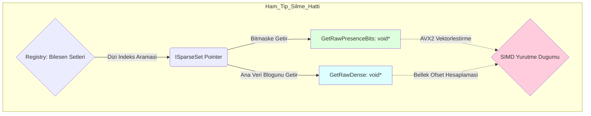

# Nexus Prime Mimari Rehberi: ISparseSet (Depolama Katmanı Soyutlaması)

## 1. Giriş
`ISparseSet`, Nexus Prime altyapısının jenerik olmayan (non-generic) birincil depolama arayüzüdür. Temeldeki ECS mimarisinde, her kesin bileşen tipi için birbirine sıkı sıkıya bağlı ayrı bir jenerik `SparseSet<T>` sınıfı oluşturulurken; `Registry` ve küresel `JobSystem` gibi merkezi orkestrasyon birimlerinin, bu farklı bellek depolarını kendi orijinal genelleştirilmiş formlarını bilmeksizin tek tip olarak yönetebilmesi gerekir.

Bu arayüzün varlık sebebi; SIMD sorgularında, çoklu iş parçacığı (multi-thread) dağıtımlarında ve kitlesel bellek temizleme operasyonlarında asıl veri yapısını (`typeof(T)`) kontrol etme maliyetinden kaçınarak işlemleri doğrudan **ham bayt blokları** (raw byte blocks) ve işaretçiler (pointers) kullanarak yürütmektir.

---

## 2. Teknik Analiz ve Matematiksel İçyüzü
`ISparseSet`, donanım seviyesinde veri düzenlemesi ve ham bellek manipülasyonu sağlayan saf yetenekleri standartlaştırır.



---

## 3. Tam Kaynak Kod Uygulaması ve Satır Satır Açıklama
İşte C# ile donanım sınıntısını en aza indiren korunaklı API imzası haritası.

```csharp
// Kaynak Kod (Source Code)
namespace Nexus.Core;

public interface ISparseSet : IDisposable
{
    int Count { get; }
    int Capacity { get; }
    EntityId GetEntity(int denseIndex);

    // Low-level memory access
    unsafe void* GetRawDense(out int count);
    unsafe void* GetRawSparse(out int capacity);
    unsafe void* GetRawDirtyBits(out int count);
    unsafe void* GetRawPresenceBits(out int count);
    unsafe void** GetRawChunks(out int count);
    
    bool Has(EntityId entity);
    void ClearAllDirty();
}
```

### Satır Satır Kod Açıklaması (Line-By-Line Breakdown)
- `public interface ISparseSet : IDisposable`: **(Satır 4)** Fiziksel yapıyı miras alan sınıfı son aşamada yönetilmeyen `NativeMemory` tahsis bloklarını `Free` ile yok etmesi (temizlemesi) için kesin zorunlu kılan güvenlik bildirimi. (Çünkü C# Garbage Collector bu belleği göremez).
- `int Count` & `int Capacity`: **(Satırlar 6-7)** Anlık olarak sistemde yer alan ve sıkıştırılarak basılan mevcut dizin miktarı ile fiziksek RAM miktarının üst blok donanım limitini karşılaştıran hızlı değişkenler.
- `EntityId GetEntity(int denseIndex)`: **(Satır 8)** Skaler ve homojen yürüyüş sırasında doğrusal bir hedefte yer edinen fiziksel endeks numarasının (Index), uzaysal nesne kimliğini (EntityId) yansıtan metot.
- `unsafe void* GetRawDense(out int count)`: **(Satır 11)** Jenerik yapı kısıtlamalarını by-pass edip fiziksel donanımı aralıksız dolduran mutlak bayt referans işaretçisinin adını geri döndürdüğü yerdir.
- `unsafe void* GetRawSparse(out int capacity)`: **(Satır 12)** Entity ID kimlik numaralarını, yoğun dizi (dense) indekslerine tek seferlik asimile eden ikincil Sparse tablosuna pencere açar.
- `unsafe void* GetRawDirtyBits(out int count)`: **(Satır 13)** Kayıt edilebilir eylemler haritasında son okunan çerçeveden beri organik olarak değişim geçirip flag (bayrak) yakan bit maskelendirme referansıdır. Unity Bridge'e sinyal yollar.
- `unsafe void* GetRawPresenceBits(out int count)`: **(Satır 14)** Verinin $0$ kısımlarında olmadığı/bulunmadığı ve mutlak $1$ kısımlarında bulunduğu Vector matematik algoritmalarının veri dizisine ulaşması amacı güder.
- `unsafe void** GetRawChunks(out int count)`: **(Satır 15)** Sayfalama (`16KB` alt paylara bölünme) blok dizisinin adres havuzuna parça tahsisli çift işaretçi (`pointer to pointer`) yollar.
- `void ClearAllDirty()`: **(Satır 18)** Modifikasyon döngüsü bittiği vakit bellek bloğunun izasyon maskesindeki bayrakların tüm iterasyonunu anında silme (equilibrium durumu) eylemini garantiler.

---

## 4. Kullanım Senaryosu ve En İyi Uygulamalar

```csharp
// Senaryo: Hiçbir bileşenin türünü/tipini bilmeden, tüm belleği tarayıcı bir analiz/reset aracı yazmak.

// ISparseSet uzerinden tip-bagimsiz donanimsal hızlı bellek temizligi
public unsafe void ClearAll(ISparseSet set)
{
    int count;
    uint* dirtyBits = (uint*)set.GetRawDirtyBits(out count);
    
    // Tipe bagimlilik olmadan calisan lineer ham byte blok sifirlama dongusu
    for (int i = 0; i < count; i++)
    {
        dirtyBits[i] = 0;
    }
}
```

> [!TIP]
> **Nexus Optimization Tip: Chunk Stability (Parça Kararlılığı)**
> Geleneksel C# dinamik dizi tiplerinde bellek uzatılırken (Resize) dizi silinip daha büyük bir blok şeklinde fiziken başka yere taşınabilir. Bu durumda "Bellek Kayması (Drift)" engellenemez, ve o sırada diğer CPU çekirdeklari orada okuma yapıyorsa motor anında çöker. Fakat, parçasal `ChunkedBuffer` mimarisine sahip olan ISparseSet sınıflarında kapasite genişlerse bile `GetRawChunks` aracılığıyla dönen mevcut parçacık pointer adresleri sonsuza dek fiziksel olarak yerine mıhlanmıştır. Paralel asenkron thread mantığı hiçbir kilitlenme korkusu yaşamadan tam performans okuma yürütür.
