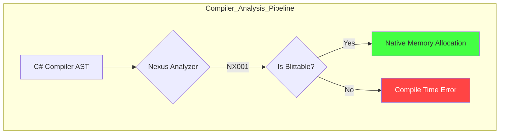
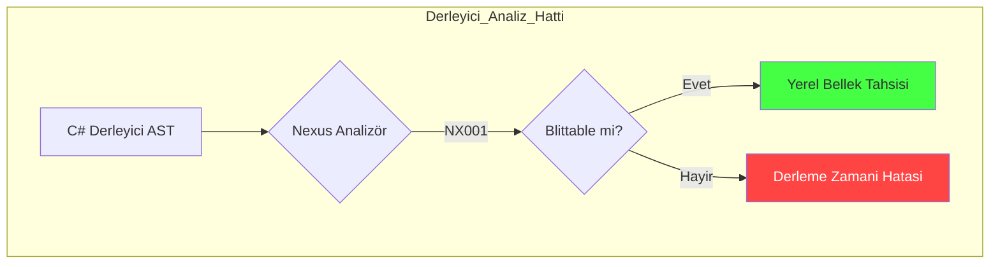

# Core Deep-Dive: Static Safety & The Analyzer Suite

---

## Abstract
This paper explores the **Nexus Analyzer Suite**, a collection of Roslyn-based static analysis rules designed to enforce memory safety in unmanaged C# environments. We formalize the **Blittable Constraint Logic** and explore the theoretical prevention of **Garbage Collector (GC) Leakage** in high-performance execution headers.

---

## 1. Safety Formalization

The Nexus Analyzers operate as a formal verification layer on top of the standard C# compiler, catching architectural violations before runtime.

### 1.1 The Blittable Theorem (NX001)
A type $T$ is considered **Nexus-Safe** if and only if it is a bit-wise identical representation across the managed/unmanaged boundary.
$$Safe(T) \iff \forall f \in T, Safe(f) \wedge T.IsValueType \wedge \neg T.IsManaged$$

The analyzer recursively crawls the field hierarchy of every `[NexusComponent]`, ensuring that pointers to managed arrays or strings never enter the unmanaged registry.



---

## 2. GC Leakage Prevention (NX003)

In real-time systems, an implicit allocation (like **Boxing**) inside a loop can trigger a GC Collect, causing a frame stutter.

### 2.1 Allocation Tracking Logic
The analyzer scans the Abstract Syntax Tree (AST) for:
1. **Implicit Boxing**: `object o = 10;`
2. **Closure Capture**: Lambdas capturing managed references.
3. **Array Initializations**: `new int[32]` inside a system's `Execute` call.

**Performance Impact of Boxing (Math Constraint):**
Given an update loop running at 60 FPS processing $N = 100,000$ entities. If a single boxing allocation takes 24 bytes:
$$ \text{Garbage Per Frame} = N \times 24 \text{ bytes} = 2.4 \text{ MB} $$
$$ \text{Garbage Per Second} = 2.4 \text{ MB} \times 60 = 144 \text{ MB/s} $$
This rapid allocation rate guarantees inevitable GC pauses. By enforcing a **Zero-Allocation Policy** at the compiler level, Nexus prevents this entirely.

---

## 3. Implementation: Diagnostic Enforcement

**Code Implementation (Analyzer Logic):**
```csharp
public override void Initialize(AnalysisContext context) {
    context.RegisterSymbolAction(AnalyzeSymbol, SymbolKind.NamedType);
}

private void AnalyzeSymbol(SymbolAnalysisContext context) {
    var typeSymbol = (INamedTypeSymbol)context.Symbol;
    if (typeSymbol.GetAttributes().Any(ad => ad.AttributeClass.Name == "NexusComponent")) {
        // ALGORITHM: Recursive Blittable Check
        if (!IsBlittable(typeSymbol)) {
            var diagnostic = Diagnostic.Create(RuleNX001, typeSymbol.Locations[0], typeSymbol.Name);
            context.ReportDiagnostic(diagnostic);
        }
    }
}
```

---

## 4. Conclusion
Nexus Analyzers transform "unsafe" code into "safe unmanaged" code. By shifting the verification burden to the compiler, developers gain the performance of C++ while maintaining the safety and iteration speed of C#.

---
<br><br>
---

# Derinlemesine İnceleme: Statik Güvenlik ve Analiz Paketi

---

## Özet
Bu makale, unmanaged C# ortamlarında bellek güvenliğini sağlamak için tasarlanmış Roslyn tabanlı statik analiz kuralları olan **Nexus Analyzer Suite**'i incelemektedir. **Blittable Kısıtlama Mantığı**'nı formülize ediyor ve yüksek performanslı yürütme başlıklarında **Garbage Collector (GC) Sızıntısı**nın teorik olarak nasıl önlendiğini keşfediyoruz.

---

## 1. Güvenlik Formülizasyonu

Nexus Analizörleri, standart C# derleyicisi üzerinde resmi bir doğrulama katmanı olarak çalışır ve çalışma zamanından (runtime) önce mimari ihlalleri yakalar.

### 1.1 Blittable Teoremi (NX001)
Bir $T$ tipinin **Nexus-Güvenli** kabul edilebilmesi için yönetilen/yönetilmeyen sınırında bit düzeyinde özdeş bir temsile sahip olması gerekir.
$$Safe(T) \iff \forall f \in T, Safe(f) \wedge T.IsValueType \wedge \neg T.IsManaged$$

Analizör, her `[NexusComponent]` özniteliğine sahip yapının alan hiyerarşisini rekürsif olarak tarar ve yönetilmeyen registry'ye asla yönetilen dizilerin (array) veya metinlerin (string) girmemesini sağlar.



---

## 2. GC Sızıntısı Önleme (NX003)

Gerçek zamanlı sistemlerde, bir döngü içindeki örtük bir bellek tahsisatı (**Boxing** gibi) bir GC toplama işlemini tetikleyerek kare atlamalarına (stutter) neden olabilir.

### 2.1 Tahsisat Takip Mantığı
Analizör, Soyut Sözdizimi Ağacını (AST) şu durumlar için tarar:
1. **Örtük Boxing**: `object o = 10;`
2. **Closure Yakalama**: Yönetilen referansları yakalayan lambda ifadeleri.
3. **Dizi Başlatma**: Bir sistemin `Execute` çağrısı içinde `new int[32]` kullanımı.

**Boxing İşleminin Performans Etkisi (Matematiksel Kısıtlama):**
60 FPS'de çalışan ve $N = 100,000$ varlık işleyen bir döngü düşünün. Tek bir boxing tahsisatı 24 byte alıyorsa:
$$ \text{Kare Başına Çöp} = N \times 24 \text{ byte} = 2.4 \text{ MB} $$
$$ \text{Saniye Başına Çöp} = 2.4 \text{ MB} \times 60 = 144 \text{ MB/s} $$
Bu hızlı tahsisat oranı, kaçınılmaz GC duraklamalarını (pause) garanti eder. Nexus, derleyici seviyesinde **Sıfır-Tahsisat Politikası** uygulayarak bunu tamamen önler.

---

## 3. Uygulama: Tanılama Zorlaması

**Kod Uygulaması (Analizör Mantığı):**
```csharp
public override void Initialize(AnalysisContext context) {
    context.RegisterSymbolAction(AnalyzeSymbol, SymbolKind.NamedType);
}

private void AnalyzeSymbol(SymbolAnalysisContext context) {
    var typeSymbol = (INamedTypeSymbol)context.Symbol;
    if (typeSymbol.GetAttributes().Any(ad => ad.AttributeClass.Name == "NexusComponent")) {
        // ALGORİTMA: Rekürsif Blittable Kontrolü
        if (!IsBlittable(typeSymbol)) {
            var diagnostic = Diagnostic.Create(RuleNX001, typeSymbol.Locations[0], typeSymbol.Name);
            context.ReportDiagnostic(diagnostic);
        }
    }
}
```

---

## 4. Sonuç
Nexus Analizörleri "unsafe" (güvensiz) kodu "güvenli unmanaged" koda dönüştürür. Doğrulama yükünü derleyiciye kaydırarak, geliştiriciler C++ performansını elde ederken C#'ın güvenlik ve iterasyon hızı avantajlarını korurlar.
