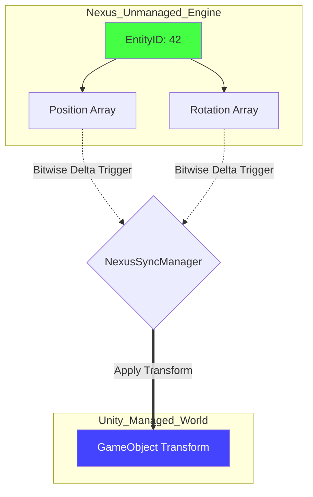
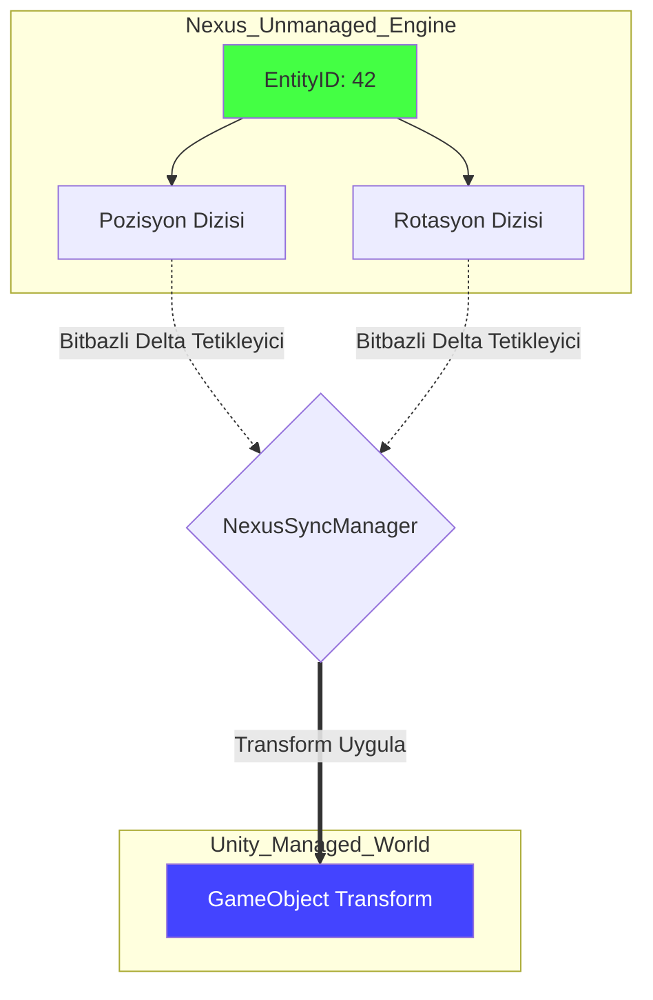

# Core Deep-Dive: The Nexus-Unity Bridge Protocol

---

## Abstract
This paper details the **Nexus Bridge Protocol**, the high-speed synchronization layer between the Nexus Unmanaged Engine and the Unity Managed World. We explore the **Direct Memory Mapping** architecture, the use of **Dirty-Sync Generators**, and the protocol for maintaining state consistency with zero GC pressure.

---

## 1. The Synchronization Protocol: Two-World Unity

The challenge of any high-performance ECS in a managed engine is "The Marshalling Gap." Nexus solves this by treating Unity GameObjects purely as **Visual Views** of the unmanaged **Data Truth**.

### 1.1 Direct Mapping Architecture
Nexus uses a static `NexusObjectMapping` table that creates a 1-to-1 link between an `EntityId` (Unique ID) and a `GameObject` reference.

**Protocol Workflow:**
1. **Creation**: An entity is spawned in Nexus; a `GameObject` is instantiated in Unity and registered to the map.
2. **Logic**: Nexus systems update `Position` and `Rotation` in contiguous unmanaged memory computations.
3. **Sync Phase**: The `NexusSyncManager` iterates through changed entities, mapping unmanaged pointers directly to Unity's `Transform` properties.



---

## 2. The "Dirty Sync" Optimization

Synchronizing 100,000 Transforms every frame is a prohibitive cost for the Unity main thread. Nexus utilizes a **Selective Dirty Sync** protocol to eliminate redundant property accesses.

### 2.1 Protocol Logic: Bitwise Delta
Each Nexus component set maintains a "Dirty Buffer" (a bitmask of elements modified in the current frame).

**Sync Algorithm Formulation:**
$$SyncSet = \{E \ | \ Bitset_{Position}[E] \lor Bitset_{Rotation}[E]\}$$

By only processing entities in the `SyncSet`, the Bridge reduces the update overhead by over $90\%$ in typical scenarios where most world objects are static.

**Performance Impact:**
If $N_{Total} = 100,000$ and $N_{Dirty} = 5,000$:
$$C_{Standard} = O(N_{Total}) \Rightarrow \text{100,000 Transform API calls (Heavy Stutter)}$$
$$C_{Nexus} = O(N_{Dirty}) \Rightarrow \text{5,000 Transform API calls (Smooth 60 FPS)}$$

---

## 3. Implementation: The Sync Loop

**Code Implementation:**
```csharp
public static void Sync(Registry registry) {
    // 1. Get the bitset of changed components
    var changedMask = registry.GetDirtyMask<TransformTag>();

    // 2. Iterate using SIMD-accelerated blocks
    foreach (var entity in changedMask.Entities) {
        if (NexusObjectMapping.TryGet(entity.Index, out GameObject go)) {
            // Direct memory to property bridge
            Position* p = registry.Get<Position>(entity);
            go.transform.position = p->Value;
        }
    }
}
```

---

## 4. Usage Scenario: Massive Crowd Rendering
In a scenario with 10,000 units, only 500 might be moving at any given time. The **Dirty Sync** ensures that Unity only receives 500 `transform.position` calls, while the other 9,500 units remain resting in unmanaged memory with absolute zero-cost overhead to the managed world.

---

## 5. Conclusion
The Nexus Bridge Protocol minimizes the bridging cost by marrying the high-performance unmanaged engine with Unity's visual power. Developers manage thousands of objects in the unmanaged layer while paying only the cost for the precise visual changes rendered in Unity.

---
<br><br>
---

# Derinlemesine İnceleme: Nexus-Unity Köprü Protokolü

---

## Özet
Bu makale, Nexus Yönetilmeyen Motoru (Unmanaged Engine) ile Unity Yönetilen Dünyası (Managed World) arasındaki yüksek hızlı senkronizasyon katmanı olan **Nexus Köprü Protokolü**'nü detaylandırmaktadır. **Doğrudan Bellek Eşleme** mimarisini, **Dirty-Sync Jeneratörlerini** ve sıfır GC baskısı ile durum tutarlılığını koruma protokolünü inceliyoruz.

---

## 1. Senkronizasyon Protokolü: İki Dünyanın Birleşimi

Yönetilen bir motorda herhangi bir yüksek performanslı ECS'nin zorluğu "Sıralama (Marshalling) Uçurumu"dur. Nexus, Unity GameObject'lerini unmanaged dünyadaki "Gerçek Veri"nin (Data Truth) sadece birer **Görsel Görünümü** (Visual View) olarak ele alarak bu sorunu çözer.

### 1.1 Doğrudan Bellek Eşleme Mimarisi
Nexus, bir `EntityId` (Eşsiz ID) ile bir `GameObject` referansı arasında 1'e 1 bağ oluşturan statik bir `NexusObjectMapping` tablosu kullanır.

**Veri Aktarım Protokolü (İş Akışı):**
1. **Oluşturma**: Nexus tarafında bir varlık oluşturulur ve Unity tarafında bir GameObject ile eşleşen bir `EntityId` atanır.
2. **Mantık**: Nexus sistemleri, `Position` ve `Rotation` bileşenlerini bitişik unmanaged tamponlarda günceller.
3. **Senk Evresi**: `NexusSyncManager`, sadece değişen verileri (Dirty bits) seçip doğrudan Unity Transform'larına yama yapar.



---

## 2. "Dirty Sync" Optimizasyonu

100.000 objenin her karede senkronize edilmesi Unity ana iş parçacığı (Main Thread) için ağır bir yüktür. Nexus, gereksiz özellik okumalarını engellemek için sadece **değişen** (dirty) bileşenleri işleyen seçici bir protokol kullanır.

### 2.1 Protokol Mantığı: Bitbazlı Delta
Her Nexus bileşen seti, geçerli karede değiştirilen öğelerin bir bit maskesini ("Dirty Buffer") tutar.

**Senkronizasyon Algoritması Formülasyonu:**
$$SyncSet = \{E \ | \ Bitset_{Pozisyon}[E] \lor Bitset_{Rotasyon}[E]\}$$

Bridge, sadece `SyncSet` içindeki varlıkları işleyerek, dünya nesnelerinin çoğunun statik olduğu tipik senaryolarda güncelleme yükünü $\%90$'dan fazla azaltır.

**Performans Etkisi:**
Eğer $N_{Toplam} = 100,000$ ve $N_{Degisen} = 5,000$ ise:
$$C_{Standart} = O(N_{Toplam}) \Rightarrow \text{100,000 Transform API çağrısı (Ağır Takılma)}$$
$$C_{Nexus} = O(N_{Degisen}) \Rightarrow \text{5,000 Transform API çağrısı (Pürüzsüz 60 FPS)}$$

---

## 3. Uygulama: Senkronizasyon Döngüsü

**Kod Uygulaması:**
```csharp
public static void Sync(Registry registry) {
    // 1. Değişen bileşenlerin bit maskesini al
    var changedMask = registry.GetDirtyMask<TransformTag>();

    // 2. SIMD hızlandırmalı bloklar kullanarak itere et
    foreach (var entity in changedMask.Entities) {
        if (NexusObjectMapping.TryGet(entity.Index, out GameObject go)) {
            // Doğrudan bellekten özellik köprüsüne
            Position* p = registry.Get<Position>(entity);
            go.transform.position = p->Value;
        }
    }
}
```

---

## 4. Kullanım Senaryosu: Dev Muazzam Kalabalık Renderlama
10.000 birimlik bir senaryoda, herhangi bir zamanda sadece 500'ü hareket ediyor olabilir. **Dirty Sync**, Unity'nin sadece 500 `transform.position` çağrısı almasını sağlarken, diğer 9.500 birim yönetilen dünya için mutlak sıfır maliyetle yönetilmeyen bellekte istirahat eder.

---

## 5. Sonuç
Nexus Köprü Protokolü, yüksek performanslı unmanaged dünyayı Unity'nin görsel gücüyle birleştirirken, aradaki aktarım maliyetini minimize eder. Geliştiriciler binlerce objeyi unmanaged olarak yönetirken, Unity tarafında sadece görsel değişimlerin maliyetini öderler.
