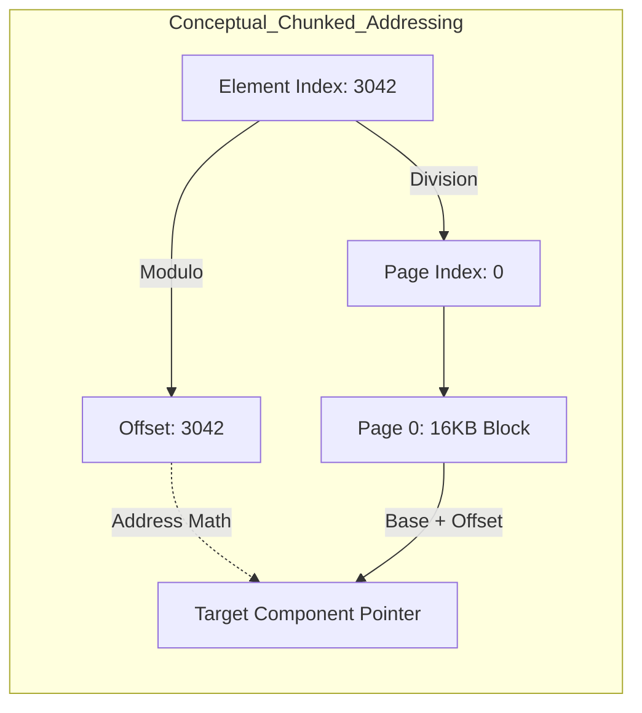
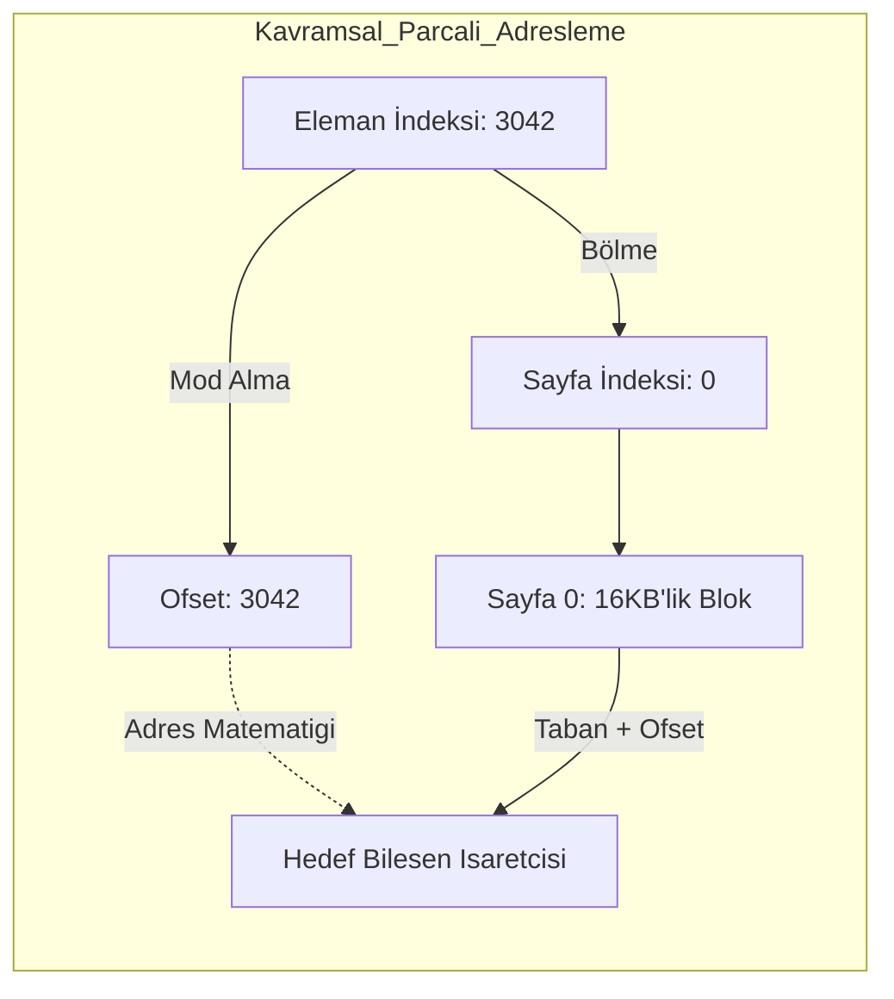

# Core Deep-Dive: The ChunkedBuffer & Memory Paging

---

## Abstract
This paper details the **Nexus ChunkedBuffer**, the low-level unmanaged storage infrastructure that powers the Registry. We explore the implementation of **Pointer Stability**, formalizing the paging efficiency through **16KB segmented allocation** and the impact of hardware-centric alignment on data throughput.

---

## 1. The Chunked Architecture

### 1.1 Pointer Stability & Addressing
In a traditional contiguous array, resizing invalidates all pointers ($P \rightarrow \emptyset$) as memory is re-allocated and copied to a larger region. Nexus solves this via a segmented table approach. 

**Addressing Formula:**
For any element index $i$, its memory location is resolved as:
$$Page_{idx} = \lfloor i / ElementsPerPage \rfloor$$
$$Offset = i \pmod{ElementsPerPage}$$
$$Ptr = Pages[Page_{idx}] + (Offset \times sizeof(T))$$

Since the `Pages` table stores pointers to fixed 16KB blocks that are never moved, every pointer to an element is **Stable for the lifetime of the buffer**.



---

## 2. Hardware Symbiosis: Paging & TLB

### 2.1 16KB Page Efficiency
Nexus utilizes 16KB chunks (4 typical OS pages). This layout is optimized for the **Translation Lookaside Buffer (TLB)**.

**TLB Miss Mitigation:**
The number of TLB lookups $L$ required to scan $N$ elements is:
$$L = \lceil (N \times sizeof(T)) / 16384 \rceil$$

By using larger, aligned blocks, Nexus reduces TLB pressure by $4\times$ compared to standard 4KB paging, minimizing the high-latency cost of page table walks in the CPU architecture.

### 2.2 64-Byte Cache-Line Alignment
To avoid **Cache-Line Splits**, every chunk and element start is strictly aligned.
- **Constraint**: $Address \pmod{64} \equiv 0$.
- **Impact**: Ensures that a single CPU read operation always fetches a complete component entry without triggering redundant bus cycles.

---

## 3. Implementation: Paged Access

**Code Implementation:**
```csharp
public unsafe class ChunkedBuffer<T> where T : unmanaged {
    private void** _chunks; // Page table
    private const int PageSize = 16384;
    private int _elementsPerPage;
    private int _sizeofT;

    public T* Get(int index) {
        int pageIndex = index / _elementsPerPage;
        int offset = index % _elementsPerPage;
        
        // Base address + 64 byte padding safety + physical offset calculation
        return (T*)((byte*)_chunks[pageIndex] + 64 + (offset * _sizeofT));
    }
}
```

---

## 4. Conclusion
The ChunkedBuffer ensures that the software operates "invisibly" aligned with the hardware layout constraints. With robust page alignments and pointer stability, Nexus transforms array resizing from a catastrophic memory bottleneck into a frictionless scaling mechanic.

---
<br><br>
---

# Derinlemesine İnceleme: ChunkedBuffer ve Bellek Sayfalaması

---

## Özet
Bu makale, Registry'yi güçlendiren düşük seviyeli yönetilmeyen depolama altyapısı olan **Nexus ChunkedBuffer**'ı detaylandırmaktadır. **Pointer Stabilitesi** uygulamasını, **16KB parçalı tahsisat** yoluyla sayfalama verimliliğini ve donanım odaklı hizalamanın veri akış hızı üzerindeki etkisini formülize ediyoruz.

---

## 1. Chunked Mimarisi

### 1.1 Pointer Stabilitesi ve Adresleme
Geleneksel bir bitişik dizide (contiguous array), bellek yeniden tahsis edilip (re-allocation) daha büyük bir alana kopyalandığı için yeniden boyutlandırma işlemi tüm işaretçileri (pointers) geçersiz kılar ($P \rightarrow \emptyset$). Nexus, bunu parçalı tablo yaklaşımıyla çözer.

**Adresleme Formülü:**
Herhangi bir $i$ indeksi için bellek konumu şu şekilde çözülür:
$$Sayfa_{idx} = \lfloor i / SayfaBasinaEleman \rfloor$$
$$Ofset = i \pmod{SayfaBasinaEleman}$$
$$İşaretçi = Sayfalar[Sayfa_{idx}] + (Ofset \times sizeof(T))$$

`Pages` tablosu asla taşınmayan sabit 16KB'lık bloklara işaretçiler sakladığından, bir elemana olan her işaretçi **tamponun ömrü boyunca stabildir**.



---

## 2. Donanım Simbiyozu: Sayfalama ve TLB

### 2.1 16KB Sayfa Verimliliği
Nexus, 16KB'lık chunk'lar (4 standart OS sayfası) kullanır. Bu düzen, **Translation Lookaside Buffer (TLB)** için optimize edilmiştir.

**TLB Kaçırma (Miss) Azaltma:**
$N$ sayıda elemanı taramak için gereken TLB araması $L$:
$$L = \lceil (N \times sizeof(T)) / 16384 \rceil$$

Büyük ve hizalı bloklar kullanarak Nexus, standart 4KB sayfalamaya kıyasla TLB baskısını $4$ kat azaltır ve CPU mimarisindeki sayfa tablosu taramalarının yüksek gecikme maliyetini en aza indirir.

### 2.2 64-Byte Önbellek Satırı Hizalaması
**Önbellek Satırı Bölünmelerini** (Cache-Line Splits) önlemek için her chunk ve eleman başlangıcı kesin olarak hizalanır.
- **Kısıt**: $Adres \pmod{64} \equiv 0$.
- **Etki**: Tek bir CPU okuma işleminin, gereksiz veri yolu döngülerini tetiklemeden her zaman tam bir bileşen girişini getirmesini sağlar.

---

## 3. Uygulama: Sayfalı Erişim

**Kod Uygulaması:**
```csharp
public unsafe class ChunkedBuffer<T> where T : unmanaged {
    private void** _chunks; // Sayfa tablosu
    private const int PageSize = 16384;
    private int _elementsPerPage;
    private int _sizeofT;

    public T* Get(int index) {
        int pageIndex = index / _elementsPerPage;
        int offset = index % _elementsPerPage;
        
        // Taban adresi + 64 byte padding guvenligi + fiziksel ofset hesaplamasi
        return (T*)((byte*)_chunks[pageIndex] + 64 + (offset * _sizeofT));
    }
}
```

---

## 4. Sonuç
ChunkedBuffer, yazılımın donanım yerleşim kısıtlamalarıyla "görünmez" bir şekilde uyum içinde çalışmasını sağlar. Güçlü sayfa hizalamaları ve pointer stabilitesi ile Nexus, dizi yeniden boyutlandırma işlemini felaketvari bir bellek darboğazı olmaktan çıkarıp sürtünmesiz bir ölçeklenme mekaniğine dönüştürür.
