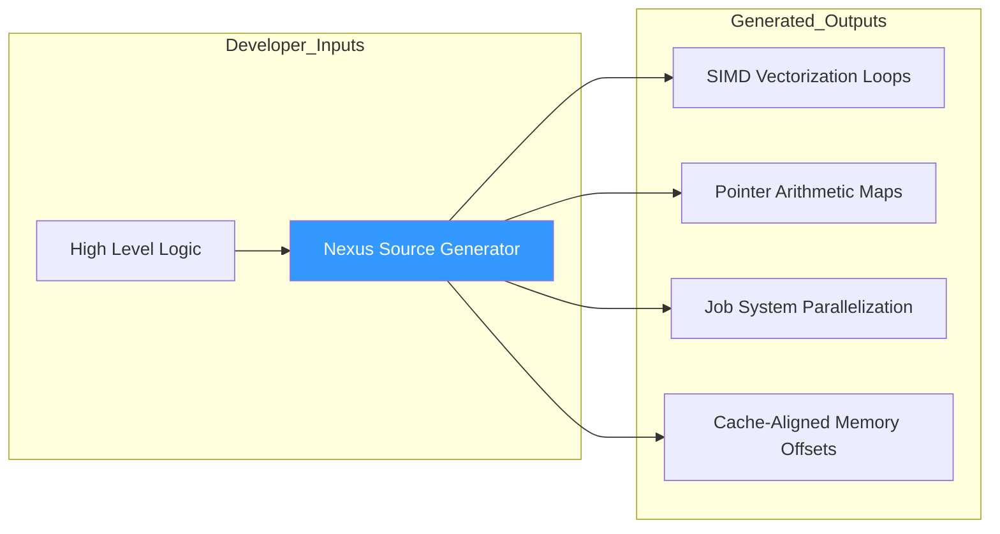
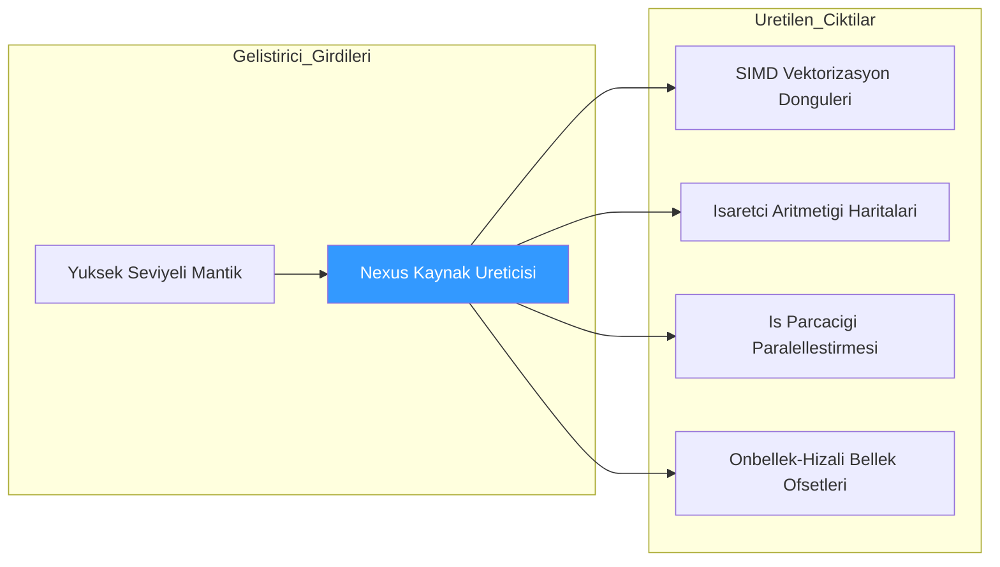

# Core Deep-Dive: Automation via Roslyn Source Generators

---

## Abstract
This paper analyzes the **Nexus Generator Architecture**, a system designed to eliminate human error and boilerplate in high-performance ECS systems. We formalize the **Boilerplate Reduction Factor** and analyze the efficiency of **Incremental Source Generation** in bridging the gap between high-level logic and low-level hardware-optimized execution.

---

## 1. The Productivity Equation: Boilerplate Destruction

The primary goal of the Nexus Generator is to maximize developer velocity without sacrificing the $O(1)$ performance of the underlying unmanaged structures. In a manual unmanaged ECS, the developer must handle memory alignment, pointer arithmetic, and dependency resolution.

### 1.1 Manual vs. Generated Comparison
To illustrate the reduction in technical debt, consider a simple system that updates entity positions based on velocity.

#### [BAD] Manual Implementation (Hardcoded / High-Error)
```csharp
public unsafe void RunManual(Registry registry) {
    var posSet = registry.GetSet<Position>();
    var velSet = registry.GetSet<Velocity>();

    // Manual pointer arithmetic and loop orchestration
    for (int i = 0; i < posSet.Count; i++) {
        EntityId id = posSet.GetEntity(i);
        if (velSet.Has(id)) {
            Position* p = posSet.Get(id);
            Velocity* v = velSet.Get(id);
            p->Value += v->Value * dt;
        }
    }
}
```
*Issues*: Each `if(velSet.Has(id))` causes a branch misprediction. Manual indexing is prone to "Off-by-one" errors.

#### [GOOD] Nexus Generated Approach (Clean / Optimized)
```csharp
public partial class MoveSystem : INexusSystem {
    [Read] Velocity velocity;
    [Write] Position position;

    public unsafe void Execute(EntityId entity, Position* p, Velocity* v) {
        p->Value += v->Value * dt;
    }
}
```
*Observation*: The developer only writes the **Payload Logic**. The generator produces a `Run()` method that resolves pointers via AVX-optimized batches, ensuring zero branch penalties.

**Boilerplate Reduction Math:**
Let $L_{Logic}$ be the lines of core payload logic, and $L_{Plumbing}$ be the lines of memory orchestration.
With manual implementations, $L_{Total} = L_{Logic} + L_{Plumbing}$, often making $L_{Plumbing} \approx 4 \times L_{Logic}$.
With Nexus Generators, $L_{Total} \approx L_{Logic}$.
Productivity $P$ increases linearly as the boilerplate drops to $\approx 0\%$.



---

## 2. Incremental Generation Mechanics

Nexus utilizes the Roslyn **Incremental Generator** API to ensure that background compilation remains fluid even with millions of entities.

### 2.1 The Incremental Pipeline
The generator avoids full re-scans by using a stateful pipeline:
1. **Source Tracking**: Only re-generates code if the specific `partial class` or its component dependencies change.
2. **IL-Style Emission**: Specifically emits linear code blocks that trigger the JIT's most aggressive optimization pass (**Tier 2 Optimization**).

---

## 3. Usage Scenario: Massive Scale Physics
When scaling to $1,000,000$ entities, the "Boilerplate" becomes a bottleneck for the compiler and the CPU. Nexus Generators produce a "Hot-Path" loop that uses 64-byte aligned pointers, allowing the CPU's pre-fetcher to saturate the memory bus. A hand-written approach would be practically unmaintainable to update across 50 different hardware-aligned systems.

---

## 4. Conclusion
Nexus Generators prove that high-performance programming does not have to be a manual labor. By automating the hardware-specific layers, Nexus provides a "Safety-First" environment for "Performance-First" development.

---
<br><br>
---

# Derinlemesine İnceleme: Roslyn Kaynak Üreticileri ile Otomasyon

---

## Özet
Bu makale, yüksek performanslı ECS sistemlerindeki boilerplate kod yükünü ortadan kaldırmak için tasarlanmış **Nexus Generator Mimarisini** incelemektedir. **Boilerplate Azaltma Faktörü**'nü formülize ediyor ve üst düzey mantık ile düşük seviyeli donanım optimizasyonlu yürütme arasındaki boşluğu dolduran **Artımlı Kaynak Üretimi** (Incremental Source Generation) verimliliğini analiz ediyoruz.

---

## 1. Boilerplate (Kendini Tekrar Eden Kod) Yok Etme Süreci

Nexus Jeneratörü'nün asıl amacı, temel özellikleri kaybetmeden ve yönetilmeyen yapıların $O(1)$ performansından ödün vermeden geliştirici hızını maksimize etmektir. Geleneksel bir unmanaged döngüde geliştirici; bellek hizalaması, pointer aritmetiği ve bileşen kontrolü (Has check) gibi konularla manuel ilgilenmelidir.

### 1.1 Manuel ve Jeneratör Karşılaştırması
Teknik borcun nasıl azaldığını göstermek için hız (velocity) bileşenini konum (position) bileşenine ekleyen basit bir sistem düşünelim.

#### [KÖTÜ] Manuel Uygulama (Sabit Kodlu / Yüksek Hatalı)
```csharp
public unsafe void RunManual(Registry registry) {
    var posSet = registry.GetSet<Position>();
    var velSet = registry.GetSet<Velocity>();

    // Manuel pointer aritmetigi ve dongu
    for (int i = 0; i < posSet.Count; i++) {
        EntityId id = posSet.GetEntity(i);
        if (velSet.Has(id)) {
            Position* p = posSet.Get(id);
            Velocity* v = velSet.Get(id);
            p->Value += v->Value * dt;
        }
    }
}
```
*Sorunlar*: Her bir `if(velSet.Has(id))` çağrısı "branch misprediction" (dallanma tahmini hatası) riski yaratır. Indexleme dış hatalara ("Off-by-one") açıktır.

#### [İYİ] Nexus Jeneratör Yaklaşımı (Temiz / Optimize)
```csharp
public partial class MoveSystem : INexusSystem {
    [Read] Velocity velocity;
    [Write] Position position;

    public unsafe void Execute(EntityId entity, Position* p, Velocity* v) {
        p->Value += v->Value * dt;
    }
}
```
*Gözlem*: Geliştirici SADECE **Temel Mantığı** (Payload Logic) yazar. Jeneratör, arka planda dallanma cezası (branch penalty) olmaksızın pointer'ları AVX ile çözen devasa bir `Run()` fonksiyonu üretir.

**Boilerplate Azaltma Matematiği:**
Temel mantık satırlarına $L_{Mantik}$ ve geri kalan tesisat/hizalama satırlarına $L_{Tesisat}$ diyelim.
Manuel bir uygulamada $L_{Toplam} = L_{Mantik} + L_{Tesisat}$'dır. Çoğu zaman $L_{Tesisat} \approx 4 \times L_{Mantik}$.
Nexus Jeneratörleriyle $L_{Toplam} \approx L_{Mantik}$ olur.
Verimlilik $P$, boilerplate miktarı $\approx \%0$'a düştüğünde doğrusal olarak artar.



---

## 2. Artımlı Üretim Mekanikleri (Incremental Generation)
Nexus, milyonlarca varlık olsa bile arka plan derlemesinin akıcı kalmasını sağlamak için Roslyn **Incremental Generator** API'sini kullanır.

### 2.1 İleri Seviye Üretim Hattı
Jeneratör, şu adımlarla tam yeniden taramalardan kaçınır:
1. **Kaynak Takibi**: Sadece belirli bir `partial class` veya bağımlı olduğu bileşenler değiştiğinde kodu yeniden üretir.
2. **IL-Style Emisyonu**: JIT'in en agresif optimizasyon katmanını (**Tier 2**) tetikleyen doğrusal kod blokları yayar.

---

## 3. Kullanım Senaryosu: Dev Ölçekli Fizik
1.000.000 varlığa ölçeklendiğinde, "Boilerplate" hem derleyici hem de CPU için bir darboğaz haline gelir. Nexus Jeneratörleri, CPU'nun ön hazırlayıcısının (pre-fetcher) bellek veri yolunu tam kapasiteyle kullanmasını sağlayan 64-byte hizalı pointer döngüleri üretir. Elde yazılmış bir kod ile 50 ayrı sistemi donanım uyumlu tutmak pratikte imkansızdır.

---

## 4. Sonuç
Nexus Jeneratörleri, yüksek performanslı programlamanın manuel bir işçilik olmak zorunda olmadığını kanıtlar. Donanıma özgü katmanları otomatikleştirerek Nexus, "Performans Öncelikli" geliştirme için "Güvenlik Öncelikli" bir yaklaşım sunar.
