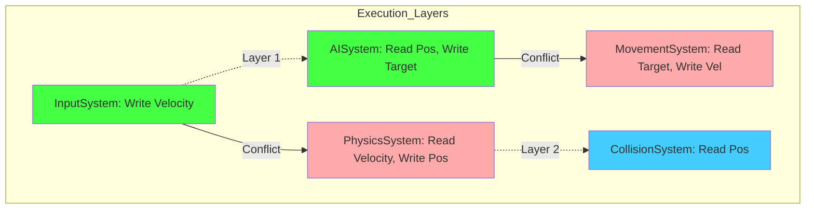
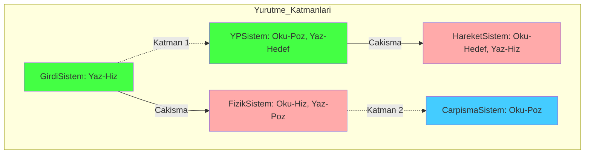

# Core Deep-Dive: Nexus Job System & Parallel Orchestration

---

## Abstract
This paper explores the architecture of the **Nexus Job System**, a dependency-aware parallel execution engine. We analyze the transformation of logical system hierarchies into **Directed Acyclic Graphs (DAGs)** and the subsequent scheduling of these graphs into discrete execution layers. By utilizing specialized variants of **Kahn's Algorithm**, Nexus achieves maximum multi-core utilization while guaranteeing data safety through strict read/write conflict resolution.

---

## 1. The Dependency Model (Static Analysis)

### 1.1 Read/Write Conflict Matrix
The Job System ensures data integrity by analyzing the access patterns of each system. Two systems, $S_A$ and $S_B$, are considered in conflict if they share a component type $T$ such that at least one system performs a **Write** operation.

**The Dependency Rule:**
- **Read-Read**: No conflict. Concurrent execution allowed.
- **Read-Write**: Conflict. Sequential execution required.
- **Write-Write**: Conflict. Sequential execution required.

### 1.2 The DAG Transformation
Each registered system is treated as a node $N$ in a graph $G = (V, E)$. An edge $(U, V)$ exists if system $U$ must complete before system $V$ starts due to component access conflicts.



---

## 2. Mathematical Scheduling: Kahn's Algorithm Variant

Nexus Prime utilizes a layer-based scheduling approach to maximize throughput. Instead of a simple linear sort, we group nodes into layers $L_1, L_2, \dots, L_n$ where all nodes in a given layer have an **In-Degree** of zero relative to the remaining graph.

### 2.1 Layer Construction Proof
The number of layers $n$ represents the **Critical Path Length** of the simulation. The maximum parallelism at any given moment is $|L_i|$.

**The Algorithm Formulation:**
1. Calculate in-degrees $D(v)$ for all system nodes $v \in V$.
2. While there are unprocessed nodes:
   - Identify all nodes with $D(v) = 0$.
   - Assign these nodes to the current Layer $L_i$.
   - Remove these nodes from the graph and update the in-degrees $D(u) = D(u) - 1$ for all dependent nodes $u$.

### 2.2 Speedup and Amdahl's Law
The theoretical speedup $S$ of the Nexus Job System is bounded by the ratio of sequential work vs. parallelizable work:

$$S(p) = \frac{1}{(1-f) + \frac{f}{p}}$$

Where $f$ is the fraction of parallelizable systems (nodes in layers with size $> 1$) and $p$ is the number of available CPU cores.

---

## 3. Implementation: Layer Execution

The Job System executes layers in strict sequence, but within each layer, systems are dispatched to the thread pool with minimal overhead.

**Code Implementation:**
```csharp
public void Execute()
{
    foreach (var layer in _layers) // Sequential Layers (Dependencies resolved)
    {
        // Parallel Systems within Layer (Zero Conflicts)
        Parallel.ForEach(layer, node =>
        {
            node.System.Execute();
        });
    }
}
```

---

## 4. Performance Metrics: Temporal Tracking
The Job System tracks the execution cost of every node using high-precision stopwatches, enabling real-time bottleneck detection.

| Metric | Purpose | Unit |
| :--- | :--- | :--- |
| **ExecutionTimeMs** | Individual system cost | Milliseconds |
| **WaitTime** | Time spent waiting for previous layer | Milliseconds |
| **LayerDensity** | Number of systems running concurrently | Count |

---

## 5. Conclusion
The Nexus Job System allows developers to focus simply on requesting data arrays without thinking about multithreading locks or race conditions. All the complex dependency mathematics are orchestrated by the DAG scheduler, guaranteeing performance bounds that strictly follow Amdahl's law curves.

---
<br><br>
---

# Derinlemesine İnceleme: Nexus İş Sistemi ve Paralel Orkestrasyon

---

## Özet
Bu makale, bağımlılık duyarlı bir paralel yürütme motoru olan **Nexus İş Sistemi**'nin (Job System) mimarisini incelemektedir. Mantıksal sistem hiyerarşilerinin **Yönlü Döngüsüz Çizgelere (DAG)** dönüştürülmesini ve bu çizgelerin ayrık yürütme katmanlarına planlanmasını analiz ediyoruz. Nexus, **Kahn Algoritması**'nın özel varyantlarını kullanarak, katı okuma/yazma çakışma çözümü yoluyla veri güvenliğini garanti ederken maksimum çok çekirdekli kullanımı başarır.

---

## 1. Bağımlılık Modeli (Statik Analiz)

### 1.1 Okuma/Yazma Çakışma Matrisi
İş Sistemi, her sistemin erişim modellerini analiz ederek veri bütünlüğünü sağlar. İki sistem ($S_A$ ve $S_B$), en az bir sistemin **Yazma** işlemi gerçekleştirdiği ortak bir bileşen tipi $T$ paylaşıyorsa çakışma durumunda kabul edilir.

**Bağımlılık Kuralları:**
- **Oku-Oku**: Çakışma yok. Eşzamanlı yürütme mümkün.
- **Oku-Yaz**: Çakışma var. Sıralı yürütme zorunlu.
- **Yaz-Yaz**: Çakışma var. Sıralı yürütme zorunlu.

### 1.2 DAG Dönüşümü
Kayıtlı her sistem, bir $G = (V, E)$ çizgesinde bir $N$ düğümü olarak kabul edilir. Eğer bileşen erişim çakışmaları nedeniyle $U$ sistemi $V$ sisteminden önce tamamlanmak zorundaysa, bir $(U, V)$ kenarı (edge) oluşturulur.



---

## 2. Matematiksel Planlama: Kahn Algoritması Varyantı

Nexus Prime, veri akışını maksimize etmek için katman tabanlı bir planlama yaklaşımı kullanır. Düğümler (sistemler), $L_1, L_2, \dots, L_n$ katmanlarına gruplanır.

### 2.1 Katman Oluşturma Kanıtı
Katman sayısı $n$, simülasyonun **Kritik Yol Uzunluğunu** temsil eder. Belirli bir andaki maksimum paralellik ise $|L_i|$ kadardır.

**Algoritma Formülasyonu:**
1. Tüm sistem düğümleri $v \in V$ için "Giriş Derecelerini" (In-Degree) $D(v)$ hesapla.
2. İşlenmemiş düğüm kaldığı sürece:
   - Giriş derecesi $D(v) = 0$ olan tüm düğümleri tanımla.
   - Bu düğümleri mevcut Katman $L_i$'ye ata.
   - Bu düğümleri çizgiden çıkar ve bağımlı oldukları düğümlerin giriş derecelerini $D(u) = D(u) - 1$ şeklinde güncelle.

### 2.2 Hızlanma ve Amdahl Yasası
Nexus İş Sistemi'nin teorik hızlanması $S$, sıralı iş yükü ile paralel hale getirilebilir iş yükü arasındaki orana bağlıdır:

$$S(p) = \frac{1}{(1-f) + \frac{f}{p}}$$

Burada $f$ paralel hale getirilebilir sistemlerin oranıdır (boyutu $> 1$ olan katmanlardaki düğümler) ve $p$ kullanılabilir CPU çekirdek sayısıdır.

---

## 3. Uygulama: Katman Yürütme

İş Sistemi, katmanları katı bir sırayla yürütür, ancak her katman içinde sistemler minimum ek yük ile iş parçacığı havuzuna (thread pool) gönderilir.

**Kod Örneği:**
```csharp
public void Execute()
{
    foreach (var layer in _layers) // Sıralı Katmanlar (Bağımlılıklar çözüldü)
    {
        // Katman İçindeki Paralel Sistemler (Çakışma Yok)
        Parallel.ForEach(layer, node =>
        {
            node.System.Execute();
        });
    }
}
```

---

## 4. Performans Metrikleri: Zamansal Takip
İş Sistemi, yüksek hassasiyetli kronometreler kullanarak her düğümün yürütme maliyetini takip eder ve gerçek zamanlı darboğaz tespitine olanak tanır.

| Metrik | Amaç | Birim |
| :--- | :--- | :--- |
| **ExecutionTimeMs** | Bireysel sistem maliyeti | Milisaniye |
| **WaitTime** | Önceki katmanı beklerken geçen süre | Milisaniye |
| **LayerDensity** | Eşzamanlı çalışan sistem sayısı | Adet |

---

## 5. Sonuç
Nexus İş Sistemi, geliştiricinin paralel programlama karmaşıklığıyla (Race Condition, Deadlock) uğraşmak yerine sadece veri erişimlerini tanımlamasına odaklanmasını sağlar. Geri kalan tüm orkestrasyon, matematiksel kesinlik ve donanım duyarlılığı ile sistem tarafından otomatik olarak yönetilir.
