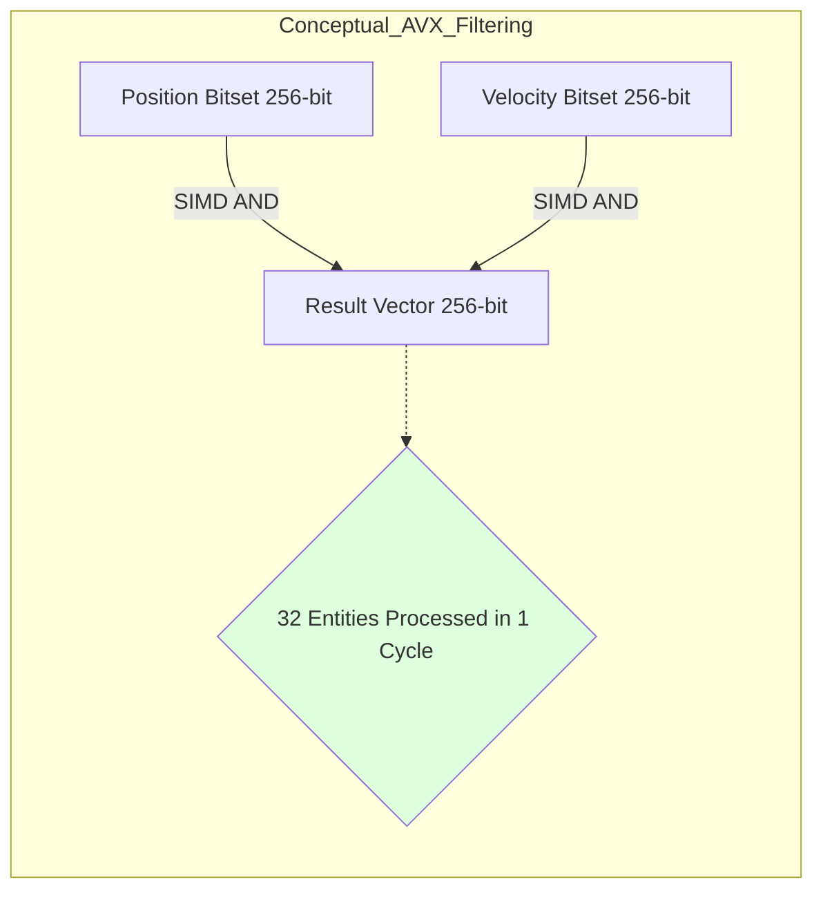
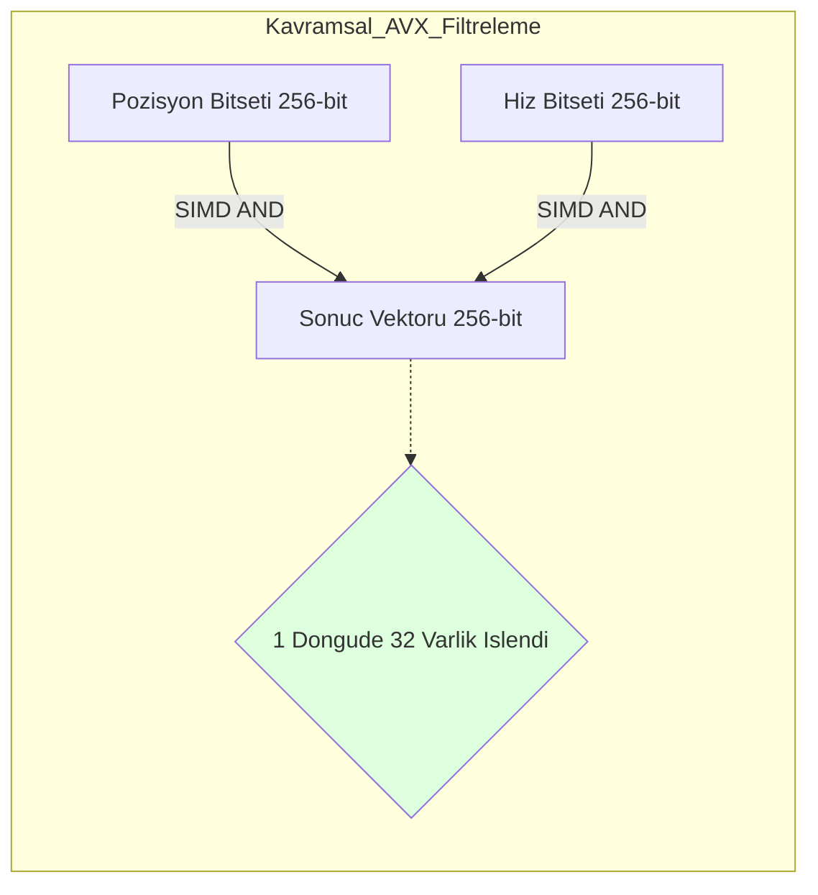

# Core Deep-Dive: The Nexus SIMD Query Engine

---

## Abstract
This paper explores the design and implementation of the **Nexus Query Engine**, a high-performance filtering system. We formalize the **SIMD-Accelerated Bitset Filtering** logic and analyze the hardware **Spatial Locality** advantages that allow Nexus to outpace traditional scalar iteration models by orders of magnitude.

---

## 1. Bitset Selection Logic

Nexus treats entity presence as a binary state within a component bitset. Filtering multiple components is reduced to a bitwise intersection.

### 1.1 Multi-Component Filtering Equation
A query for components $C_1 \cap C_2 \cap \dots \cap C_n$ is resolved by:
$$ResultBitset = Bitset(C_1) \ \& \ Bitset(C_2) \ \& \ \dots \ \& \ Bitset(C_n)$$

### 1.2 SIMD Vectorization Throughput
Using AVX2/AVX-512, Nexus processes multiple 64-bit segments in parallel. The throughput $T$ (entities per cycle) is defined as:
$$T = \frac{RegisterWidth_{bits}}{InstructionsPerCycle}$$

For AVX2 (256-bit), a single instruction filters 32 entities simultaneously, bypassing the **Branch Misprediction** penalty of scalar `if` checks.



---

## 2. Hardware Locality & Cache Efficiency

### 2.1 The L2 Cache Advantage
For 1,000,000 entities, the bitset size is calculated as:
$$Size = \frac{1,000,000}{8} = 125,000 \ bytes \approx 122 \ KB$$

This payload fits entirely within the L2 cache ($256KB - 512KB$) of modern CPUs, ensuring that the entire filtering phase occurs without a single DRAM access after the first load. Traditional OOP iteration checks require dereferencing pointers back to RAM for hundreds of megabytes dynamically.

---

## 3. Implementation: SIMD Filter

**Code Implementation:**
```csharp
// Vectorized filtering loop (conceptual)
public unsafe void Filter(uint* maskA, uint* maskB, uint* result, int length) {
    for (int i = 0; i < length; i += 8) {
        // Load 256 bits into YMM registers
        var vecA = Avx2.LoadVector256(&maskA[i]);
        var vecB = Avx2.LoadVector256(&maskB[i]);
        
        // Parallel AND
        var vecRes = Avx2.And(vecA, vecB);
        
        // Store result back to memory
        Avx2.Store(&result[i], vecRes);
    }
}
```

---

## 4. Conclusion
The Nexus Query Engine translates data access from a logical "search" operation into a purely mathematical flow. By utilizing hardware instruction sets (SIMD) and compact data representations, filtering is executed at the absolute peak memory bandwidth limits of the host CPU.

---
<br><br>
---

# Derinlemesine İnceleme: Nexus SIMD Sorgu Motoru

---

## Özet
Bu makale, Nexus Sorgu Motoru'nun tasarımını ve uygulamasını incelemektedir. **SIMD-Hızlandırmalı Bitset Filtreleme** mantığını formülize ediyoruz ve Nexus'un geleneksel skaler iterasyon modellerini geride bırakmasını sağlayan donanım **Spatial Locality** (Alanda Yerellik) avantajlarını analiz ediyoruz.

---

## 1. Bitset Seçim Mantığı ve SIMD

Nexus, bileşen varlığını bir bit maskesi içinde ikili bir durum olarak kabul eder. Birden fazla bileşeni filtrelemek, bit düzeyinde bir kesişime indirgenir.

### 1.1 Çoklu Bileşen Filtreleme Denklemi
$C_1 \cap C_2 \cap \dots \cap C_n$ bileşenleri için bir sorgu şu şekilde çözülür:
$$SonucBitseti = Bitset(C_1) \ \& \ Bitset(C_2) \ \& \ \dots \ \& \ Bitset(C_n)$$

### 1.2 Vektörize Akış Hızı (Throughput)
AVX2/AVX-512 kullanarak Nexus, birden fazla 64-bit segmenti paralel olarak işler. Akış hızı $T$ (döngü başına varlık) şu şekilde tanımlanır:
$$T = \frac{RegisterGenisligi_{bit}}{KomutBasinaDongu}$$

AVX2 (256-bit) kullanarak, tek bir komut 32 varlığı aynı anda filtreler. Bu, skaler `if` kontrollerinin yol açtığı **Dallanma Tahmin Hatası** maliyetini ortadan kaldırır.



---

## 2. Donanım Yerelliği ve Önbellek Verimliliği

### 2.1 L2 Önbellek Avantajı
1.000.000 varlık için bit seti boyutu:
$$Boyut = \frac{1.000,000}{8} = 125.000 \ byte \approx 122 \ KB$$

Bu veri yükü, modern CPU'ların L2 önbelleklerine ($256KB - 512KB$) tamamen sığar. Bu, ilk yüklemeden sonra tüm filtreleme aşamasının DRAM erişimi olmadan gerçekleşmesini sağlar. Geleneksel OOP iterasyonunda bu işlem MB'larca RAM referansının çözülmesini gerektirir.

---

## 3. Uygulama: SIMD Filtreleme

**Kod Uygulaması:**
```csharp
// Vektörize edilmiş filtreleme döngüsü (kavramsal)
public unsafe void Filter(uint* maskA, uint* maskB, uint* result, int length) {
    for (int i = 0; i < length; i += 8) {
        // 256 biti YMM register'larına yükle
        var vecA = Avx2.LoadVector256(&maskA[i]);
        var vecB = Avx2.LoadVector256(&maskB[i]);
        
        // Paralel AND işlemi
        var vecRes = Avx2.And(vecA, vecB);
        
        // Sonucu belleğe geri kaydet
        Avx2.Store(&result[i], vecRes);
    }
}
```

---

## 4. Sonuç
Nexus Sorgu Motoru, veri erişimini mantıksal bir "arama" işleminden matematiksel bir "akış" işlemine dönüştürür. Donanım yönergelerini (SIMD) tam kapasiteyle kullanarak simülasyonun en ağır yüklerinden biri olan filtrelemeyi mutlak zirve bellek bant genişliği sınırlarında yürütür.
