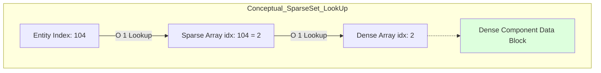

# Core Deep-Dive: The Nexus Registry & SparseSet Architecture

---

## Abstract
This paper analyzes the architectural foundations of the **Nexus Registry**, the central orchestration unit of the Nexus Prime ECS framework. We explore the implementation of the **SparseSet** data structure, formalizing its $O(1)$ access complexity and the versioning mechanism used to guarantee memory safety in highly dynamic unmanaged environments.

---

## 1. Philosophical Grounding: DOD vs. OOP
The Nexus Registry is the "Central Brain" of the simulation, but unlike a manager in OOP, it does not hold objects. It serves as a **Data Stream Orchestrator**.

### 1.1 The Registry Solution
The Registry treats an **Entity** as a lightweight 64-bit handle (Index + Version).
- **Contiguity**: Components are stored in contiguous buffers.
- **SIMD Friendliness**: Data is laid out ready for vector units (AVX/SSE).

---

## 2. Advanced SparseSet Mechanics

### 2.1 The O(1) Access Proof
The core of the Registry is the `SparseSet<T>`. It maps an `EntityId` to its component data via a dense array, ensuring that iterations are always performed on $100\%$ packed memory.

**Address Calculation Logic:**
Given an entity index $i$, the address of its component data $C$ is calculated as:

$$Address(C) = Base_{dense} + (Sparse[i] \times sizeof(T))$$

Since both array indexing and pointer addition are constant-time operations on modern CPUs, component retrieval is strictly $O(1)$.



### 2.2 Versioning & Recycle Pool
To prevent "Stale Pointer" bugs in unmanaged memory, Nexus utilizes a 32-bit versioning system.
- **Validation Constraint**: An entity handle is valid if and only if:
  $$Handle.Version == Registry.Versions[Handle.Index]$$
- **Recycle Logic**: Destroyed indices are pushed to a LIFO stack. Upon recycling, the version is incremented, effectively invalidating all previous handles to that index.

---

## 3. Implementation: Component Management

**Code Implementation:**
```csharp
public struct EntityId {
    public int Index;
    public int Version;
}

// Internal Registry logic showing O(1) dense access
public T* Get<T>(EntityId entity) where T : unmanaged {
    var set = GetSet<T>();
    int denseIndex = set.Sparse[entity.Index];
    return &set.Dense[denseIndex];
}
```

---

## 4. Conclusion
The Nexus Registry transforms memory access from a stochastic process into a deterministic mathematical operation. With $O(1)$ complexity and absolute hardware locality, it pushes the theoretical performance limits of modern processors.

---
<br><br>
---

# Derinlemesine İnceleme: Nexus Registry ve SparseSet Mimarisi

---

## Özet
Bu makale, Nexus Prime ECS çerçevesinin merkezi yönetim birimi olan **Nexus Registry**'nin mimari temellerini incelemektedir. **SparseSet** veri yapısının uygulamasını, $O(1)$ erişim karmaşıklığını ve dinamik unmanaged ortamlarda bellek güvenliğini sağlamak için kullanılan versiyonlama mekanizmasını formülize ediyoruz.

---

## 1. Felsefi Temel: DOD vs. OOP
Nexus Registry simülasyonun "Merkezi Beyni"dir, ancak OOP'deki bir yöneticinin aksine içinde nesne barındırmaz. Bir **Veri Akış Orkestratörü** olarak görev yapar.

- **Bitişiklik (Contiguity)**: Bileşenler bitişik tamponlarda saklanır.
- **SIMD Dostu**: Veriler vektör birimleri (AVX/SSE) için hazır şekilde düzenlenir.

---

## 2. Gelişmiş SparseSet Mekaniği

### 2.1 O(1) Erişim Kanıtı
Registry'nin kalbi `SparseSet<T>` yapısıdır. Bir `EntityId`'yi bileşen verisine yoğun (dense) bir dizi üzerinden eşler, böylece iterasyonların her zaman $\%100$ paketlenmiş bellek üzerinde yapılmasını sağlar.

**Adres Hesaplama Mantığı:**
Bir varlık indeksi $i$ verildiğinde, bileşen verisi $C$'nin adresi şu şekilde hesaplanır:

$$Adres(C) = Base_{yoğun} + (Sparse[i] \times sizeof(T))$$

Modern işlemcilerde hem dizi indeksleme hem de pointer toplama işlemleri sabit zamanlı olduğundan, bileşen erişimi kesinlikle $O(1)$'dir.


### 2.2 Versiyonlama ve Geri Dönüşüm
Yönetilmeyen bellekte "Bayat İşaretçi" (Stale Pointer) hatalarını önlemek için Nexus 32-bit versiyonlama kullanır.
- **Doğrulama Kısıtı**: Bir varlık tutamacı ancak şu durumda geçerlidir:
  $$Tutamac.Versiyon == Registry.Versiyonlar[Tutamac.Indeks]$$
- **Geri Dönüşüm Mantığı**: Yok edilen indeksler bir LIFO yığına itilir. Geri dönüşüm anında versiyon artırılır, böylece o indekse işaret eden önceki tüm tutamaçlar geçersiz kılınır.

---

## 3. Uygulama: Bileşen Yönetimi

**Kod Uygulaması:**
```csharp
public struct EntityId {
    public int Index;
    public int Version;
}

// O(1) yoğun erişimi gösteren dahili Registry mantığı
public T* Get<T>(EntityId entity) where T : unmanaged {
    var set = GetSet<T>();
    int denseIndex = set.Sparse[entity.Index];
    return &set.Dense[denseIndex];
}
```

---

## 4. Sonuç
Nexus Registry, bellek erişimini rastgele bir süreçten deterministik bir matematiksel işleme dönüştürür. $O(1)$ karmaşıklığı ve donanım yerelliği (locality) ile modern işlemcilerin teorik performans sınırlarını zorlar.
