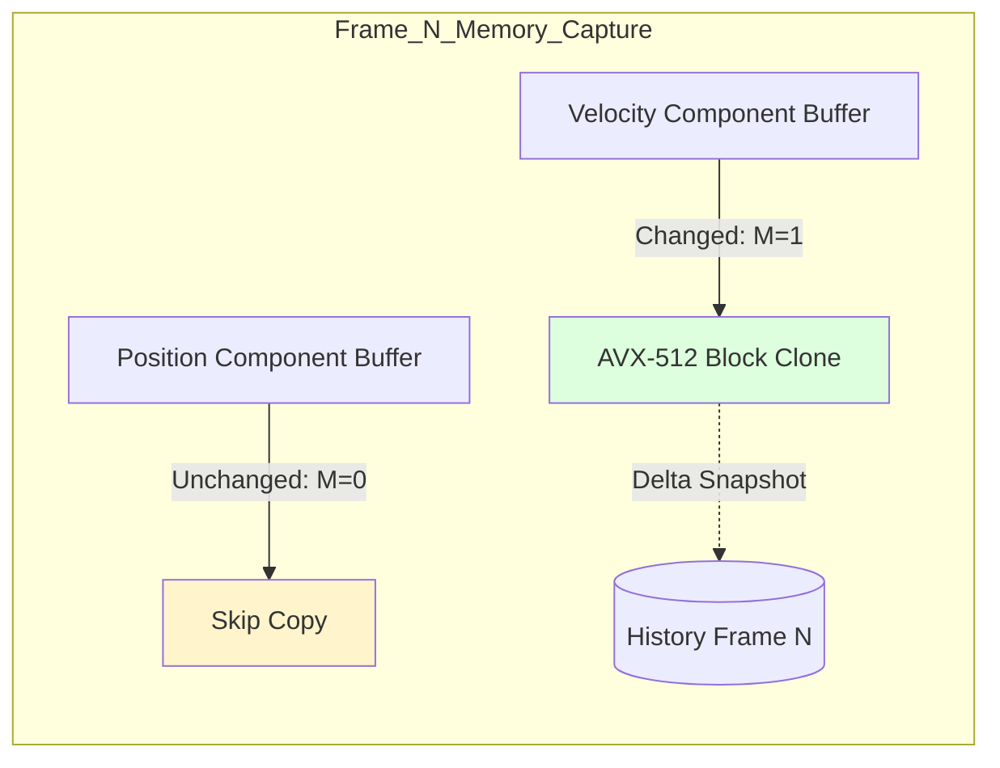
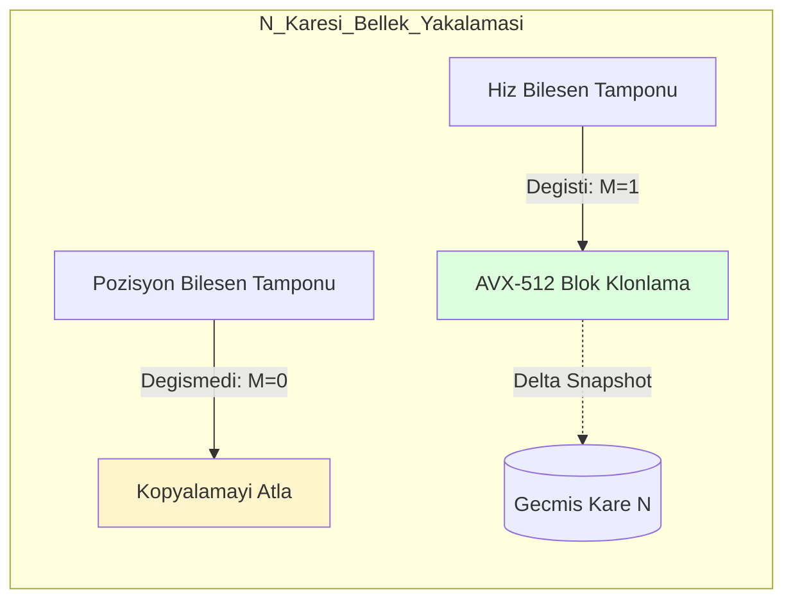

# Core Deep-Dive: Temporal Management & Differential Snapshots

---

## Abstract
This paper analyzes the **Nexus SnapshotManager**, a high-performance temporal state management system. We examine the use of **Differential Snapshotting** to minimize memory consumption and formalize the hardware-accelerated **Block Memory Copies** that allow for sub-millisecond full-state captures.

---

## 1. Block Memory Transfer Mechanics

Nexus avoids the performance penalty of per-element iteration during state capture by utilizing hardware-native memory blocks.

### 1.1 SIMD-Accelerated Copy Performance
Capture latency $L$ for a dataset of size $B$ bytes is defined as:
$$L = \frac{B}{BW_{mem} \times \eta}$$

Where $BW_{mem}$ is the raw memory bandwidth and $\eta$ is the efficiency factor of the SIMD implementation. By utilizing instructions like `VMOVDQU` (AVX-512), Nexus achieves $\eta \approx 0.95$, saturating the memory bus and allowing 1GB of state to be cloned in approximately $20-30 \mu s$ on modern workstation hardware.

---

## 2. Differential Snapshotting Logic

To conserve memory in the circular history buffer, Nexus defaults to **Delta Snapshots**.

### 2.1 The Dirty-Bit Optimization
A snapshot $S_{i}$ for a frame $i$ is only stored for component types where the **Dirty Mask** $M$ is non-zero.
- **Full Capture**: $S = \cup_{j=1}^{C} Set_j$
- **Delta Capture**: $S_{delta} = \cup \{Set_j \ | \ Mask_j \neq 0\}$

This reduces the average frame capture size $B_{avg}$ by:
$$B_{avg} = B_{total} \times \rho$$
Where $\rho$ is the "Activity Ratio" of components per frame, typically $\rho < 0.05$ in real-time simulations.



---

## 3. Implementation: Fast Clone

**Code Implementation:**
```csharp
public unsafe void RecordFrame(Registry registry) {
    var snapshot = new Snapshot();
    foreach (var set in registry.ActiveSets) {
        if (set.IsDirty) {
            // Allocate unmanaged block
            void* buffer = NativeMemory.Alloc(set.Size);
            // High-speed block copy
            NexusMemory.Copy(set.RawPtr, buffer, set.Size);
            snapshot.Add(set.TypeId, buffer);
        }
    }
    _history.Push(snapshot);
}
```

---

## 4. Conclusion
The Nexus Snapshot system reduces temporal state management from an iterative database burden into an ultra-fast hardware block-copy operation. Through differential capture matrices and SIMD vectors, it delivers reliable state historization natively compatible with Rollback Netcode architectures.

---
<br><br>
---

# Derinlemesine İnceleme: Zamansal Yönetim ve Diferansiyel Snapshot'lar

---

## Özet
Bu makale, yüksek performanslı bir zamansal durum yönetim sistemi olan **Nexus SnapshotManager**'ı incelemektedir. Bellek tüketimini en aza indirmek için **Diferansiyel Snapshotting** (Farklılık Tabanlı Kayıt) kullanımını inceliyor ve alt milisaniye bazında tam durum yakalamaya olanak tanıyan donanım hızlandırmalı **Blok Bellek Kopyaları**nı formülize ediyoruz.

---

## 1. Bellek Transfer Mekaniği ve SIMD

Nexus, durum yakalama sırasında eleman bazlı iterasyon maliyetinden donanıma özgü bellek bloklarını kullanarak kaçınır.

### 1.1 Blok Kopyalama Performansı
$B$ byte boyutundaki bir veri kümesi için yakalama gecikmesi $L$:
$$L = \frac{B}{BW_{bellek} \times \eta}$$

Burada $BW_{bellek}$ ham bellek bant genişliğini, $\eta$ ise SIMD uygulamasının verimlilik faktörünü temsil eder. AVX-512 (`VMOVDQU`) gibi yerel komutları kullanarak Nexus, $\eta \approx 0.95$ verimliliğe ulaşarak bellek veri yolunu doyurur ve 1GB'lık durumun modern iş istasyonlarında yaklaşık $20-30 \mu s$ içinde kopyalanmasına olanak tanır.

---

## 2. Diferansiyel Snapshot Mantığı

Nexus, dairesel geçmiş tamponunda yer kazanmak için varsayılan olarak **Delta Snapshot**'ları kullanır.

### 2.1 Kirli Bit Maskesi (Dirty-Bit) Optimizasyonu
Bir $i$ karesi için snapshot $S_{i}$, sadece **Dirty Mask** $M$ değeri sıfırdan farklı olan bileşen tipleri için saklanır.
- **Tam Yakalama**: $S = \cup_{j=1}^{C} Set_j$
- **Delta Yakalama**: $S_{delta} = \cup \{Set_j \ | \ Mask_j \neq 0\}$

Bu, ortalama kare yakalama boyutu $B_{avg}$'yi şu şekilde azaltır:
$$B_{avg} = B_{total} \times \rho$$
Burada $\rho$, her karedeki bileşenlerin "Aktivite Oranı"dır ve gerçek zamanlı simülasyonlarda genellikle $\rho < 0.05$ civarındadır.



---

## 3. Uygulama: Hızlı Klonlama

**Kod Uygulaması:**
```csharp
public unsafe void RecordFrame(Registry registry) {
    var snapshot = new Snapshot();
    foreach (var set in registry.ActiveSets) {
        if (set.IsDirty) {
            // Unmanaged blok tahsis et
            void* buffer = NativeMemory.Alloc(set.Size);
            // Yüksek hızlı blok kopyalama
            NexusMemory.Copy(set.RawPtr, buffer, set.Size);
            snapshot.Add(set.TypeId, buffer);
        }
    }
    _history.Push(snapshot);
}
```

---

## 4. Sonuç
Nexus Snapshot sistemi, zamansal yönetimi ağır bir veritabanı işleminden hafif bir donanım bellek kopyalama işlemine indirger. Diferansiyel kayıt ve SIMD hızlandırması ile sistem, Rollback Netcode (Geri Alımlı Ağ Kodu) mimarileriyle yerel olarak uyumlu, güvenilir bir durum tarihçelendirmesi sağlar.
