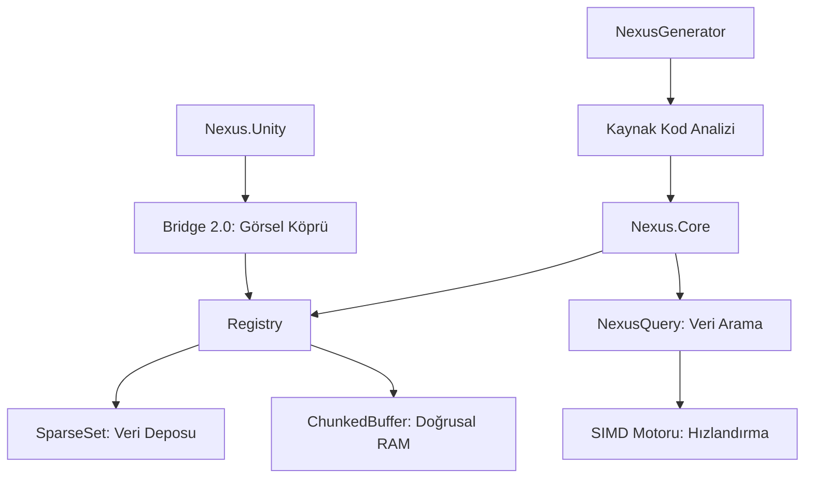
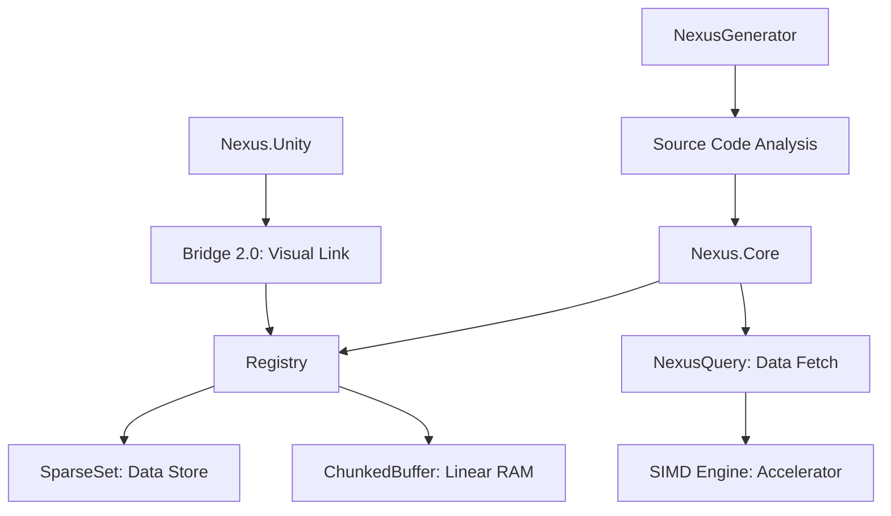

# Nexus Manifesto: Mimari ve Felsefe

## Giriş: Neden Nexus?

Modern yazılım geliştirme, donanımın fiziksel gerçeklerinden uzaklaşarak soyutlama katmanları (OOP, Garbage Collection, Managed Memory) altında ezilmiştir. Nesne Yönelimli Programlama (OOP), geliştirici dostu görünse de, işlemci (CPU) ve bellek (RAM) arasındaki devasa hız farkını (Memory Wall) görmezden gelir. 

"OOP Öldü" diyemeyiz, ancak "Performans Kritiği Gerektiren Yerlerde OOP Yetersizdir" diyebiliriz. Nexus, bu yetersizliğe donanım dostu (**Hardware-aware**) bir çözüm sunar.

### 📚 Performance Glossary (Performans Sözlüğü)

Gelişmiş performans optimizasyonlarını anlamak için önce işlemcinin diliyle konuşmalıyız:

| Terim | Açıklama | Nexus Uygulaması |
| :--- | :--- | :--- |
| **L1/L2/L3 Cache** | İşlemci çekirdeğine en yakın ve en hızlı bellek katmanları. | Nexus, veriyi Cache dostu `ChunkedBuffer` yapılarında tutar. |
| **Data Locality** | İlişkili verilerin bellekte yan yana bulunması durumu. | `SparseSet` ve `Registry` ile veriler ardışık bellekte saklanır. |
| **SIMD** | *Single Instruction multiple Data*. Tek komutla birden fazla veriyi işleme. | `NexusQuery`, AVX2/SSE komutlarıyla verileri topluca günceller ($T_{throughput} \times 8$). |
| **Branch Prediction** | İşlemcinin kodun akışını (if/else) tahmin etme yeteneği. | Nexus, dallanmayı minimize ederek tahmin hatalarını (misprediction) önler ($P_{miss} \rightarrow 0$). |
| **Memory Barrier** | İşlemcinin komut sırasını karıştırmasını engelleyen güvenlik sınırı. | Unmanaged kopyalama işlemlerinde veri tutarlılığı için kullanılır. |
| **Cache Miss** | İşlemcinin aradığı veriyi Cache'de bulamayıp RAM'e gitmek zorunda kalması. | **Nexus'un temel amacı bu oranı %0'a yaklaştırmaktır.** |

---

## Felsefi Temel: Data-Oriented Design (DOD)

OOP'un temel hatası, veriyi "Nesne" (Object) denilen küçük kutulara hapsetmesi ve bu kutuları belleğin rastgele yerlerine (Heap) saçmasıdır. İşlemci bu verilere erişmek istediğinde sürekli "Cache Miss" yaşar ve RAM'den veri gelmesini bekler. Çoğu işlemcide RAM gecikmesi $100 \text{ ns}$ mertebesindeyken, L1 Cache erişimi $1 \text{ ns}$ sürer.

**Performans Kazanımı Denklemi:**
Bir döngüdeki $N$ iterasyon için zaman $T$:
$$T(N) = N \times (P_{hit} \times t_{cache} + P_{miss} \times t_{ram})$$

Nexus, **Data-Oriented Design** felsefesini benimseyerek $P_{miss} \rightarrow 0$ hedefine ulaşır:
1.  **Veri Kutsaldır**: Nesneler değil, veriler üzerinde işlem yapılır.
2.  **Bellek Düzeni Tasarımdır**: Veriyi nasıl sakladığınız, ne yazdığınız kadar önemlidir.
3.  **İşlemciye Saygı**: İşlemcinin veriyi saniyede GB'larca hızla okuyabileceği ardışık bellek (Sequential Memory) düzenleri kurulur.

---

## Mimari Şema: Modüler Yapı

Nexus bir bütündür ancak modüler bir hiyerarşi ile çalışır:

---

## Nexus Çözümü: Donanım Dostu Programlama

Nexus, C# dünyasında C++ performansı sunar:
- **Zero GC**: Çalışma anında (runtime) bellek tahsisi yapılmaz, Garbage Collector tetiklenmez.
- **Pointer Magic**: `unsafe` kod blokları ve ham bellek adresleme ile veri transferi maksimum hıza ulaşır.
- **Parallel processing**: Veri parçaları (chunks), modern işlemcilerin tüm çekirdeklerine $O(1)$ maliyetle eşit şekilde dağıtılır.

---

> [!IMPORTANT]
> **Nexus Optimization Tip: Clock Cycle Efficiency**
> Nexus bir döngüyü işlerken, işlemcinin `pipeline` (boru hattı) yapısını asla tıkamaz. Sanal metod tabloları (vtable) veya referans takibi (reference tracking) yoktur. Her işlem doğrudan bellek adresi üzerinden yapılır, bu da her bir varlık (entity) için harcanan "Clock Cycle" miktarını minimuma indirir.

---
  
---

# Nexus Manifesto: Architecture and Philosophy

## Introduction: Why Nexus?

Modern software development has drifted away from the physical realities of hardware by burdening itself under layers of abstraction (OOP, Garbage Collection, Managed Memory). While Object-Oriented Programming (OOP) appears developer-friendly, it ignores the massive speed difference between the processor (CPU) and memory (RAM), known as the **Memory Wall**.

We cannot say "OOP is Dead," but we can say "OOP is Inadequate for Performance-Critical Areas." Nexus provides a **Hardware-aware** solution to this inadequacy.

### 📚 Performance Glossary

To understand advanced performance optimizations, we must first speak the language of the processor:

| Term | Description | Nexus Implementation |
| :--- | :--- | :--- |
| **L1/L2/L3 Cache** | The fastest memory layers closest to the processor core. | Nexus stores data in cache-friendly `ChunkedBuffer` structures. |
| **Data Locality** | The state where related data is located side-by-side in memory. | Data is stored in contiguous memory using `SparseSet` and `Registry`. |
| **SIMD** | *Single Instruction Multiple Data*. Processing multiple data points with a single instruction. | `NexusQuery` updates data in bulk using AVX2/SSE instructions ($T_{throughput} \times 8$). |
| **Branch Prediction** | The processor's ability to predict the flow of code (if/else). | Nexus minimizes branching to prevent mispredictions ($P_{miss} \rightarrow 0$). |
| **Memory Barrier** | A safety boundary preventing the processor from reordering instructions. | Used for data consistency during unmanaged copy operations. |
| **Cache Miss** | The state where the processor cannot find data in the Cache and must go to RAM. | **Nexus's primary goal is to approach a 0% cache miss rate.** |

---

## Philosophical Foundation: Data-Oriented Design (DOD)

The fundamental flaw of OOP is imprisoning data inside small boxes called "Objects" and scattering them across random locations in memory (Heap). When the processor wants to access this data, it constantly experiences "Cache Misses" and waits for data from RAM. While most CPUs have RAM latencies around $100 \text{ ns}$, an L1 Cache access requires only $1 \text{ ns}$.

**Performance Gain Equation:**
For $N$ iterations in a loop, the processing time $T$ is:
$$T(N) = N \times (P_{hit} \times t_{cache} + P_{miss} \times t_{ram})$$

Nexus embraces the **Data-Oriented Design** philosophy to push $P_{miss} \rightarrow 0$:
1.  **Data is Sacred**: Operations are performed on data, not on objects.
2.  **Memory Layout is Design**: How you store data is as important as what you write.
3.  **Respect the Processor**: Sequential memory layouts are established where the processor can read data at speeds of GBs per second.

---

## Architectural Schema: Modular Structure

Nexus is a cohesive whole but operates with a modular hierarchy:

---

## Nexus Solution: Hardware-Friendly Programming

Nexus offers C++ performance within the C# world:
- **Zero GC**: No memory allocation at runtime, no Garbage Collector triggers.
- **Pointer Magic**: Data transfer reaches maximum speed with `unsafe` code blocks and raw memory addressing.
- **Parallel Processing**: Data chunks are distributed equally across all cores of modern processors with $O(1)$ dispatch cost.

---

> [!IMPORTANT]
> **Nexus Optimization Tip: Clock Cycle Efficiency**
> While Nexus processes a loop, it never clogs the processor's `pipeline`. There are no virtual method tables (vtable) or reference tracking. Every operation is performed directly via memory addresses, minimizing the number of "Clock Cycles" spent for each entity.
