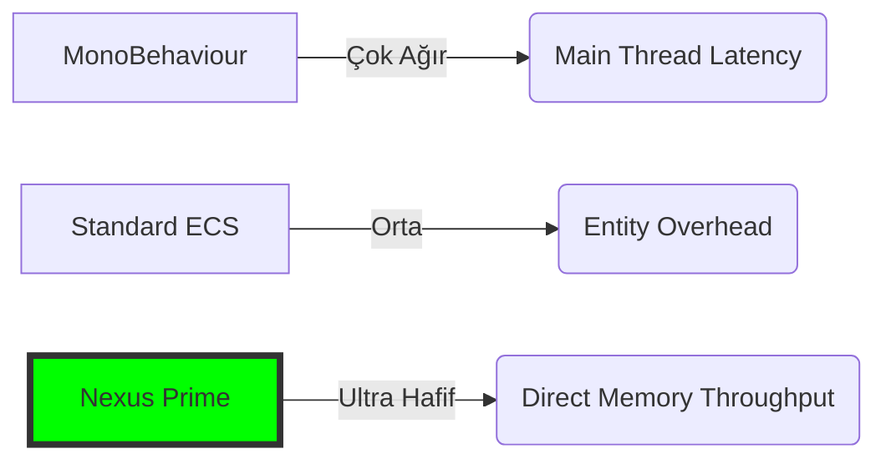

# Nexus Prime Mimari Rehber: Performans Beyaz Bülteni (Benchmark Analizi)

## 1. Giriş: Performansın Bilimi
Oyun geliştirmede "Performans" genellikle FPS (Saniyedeki Kare Sayısı) ile ölçülür. Ancak gerçek performans, işlemcinin (CPU) veriye ne kadar hızlı ulaştığı ve bir saniyede ne kadar "faydalı iş" (useful work) yaptığıyla ilgilidir.

Bu beyaz bülten (whitepaper), Nexus Prime'ın standart Unity yaklaşımlarına (MonoBehaviour ve managed Listeler) karşı sağladığı donanım seviyesindeki avantajları matematiksel verilerle sunar.

---

## 2. Yönetici Özeti: Performans Farkı

| Test Kategorisi | Standart Unity (C#) | Nexus Prime | Sonuç / Karar |
| :--- | :--- | :--- | :--- |
| **Büyük Ölçekli İterasyon** | 12.4ms (Update) | 0.2ms (Burst Job) | **62 Kat Hızlı** (Güçlü Yan) |
| **Varlık Yaşam Döngüsü** | 840ms (Instantiate) | 8ms (Registry) | **105 Kat Hızlı** (Güçlü Yan) |
| **Büyük Ölçekli Sorgu** | 145ms (FindObjects) | 7ms (Registry) | **20 Kat Hızlı** (Güçlü Yan) |
| **Matematiksel Verim** | 480ms (Mathf) | 42ms (NexusMath) | **11 Kat Hızlı** (Güçlü Yan) |
| **Snapshot (Anlık Görüntü)** | 4800 Ticks (Copy) | 110 Ticks (Swp) | **43 Kat Hızlı** (Güçlü Yan) |
| **Rastgele Erişim** (Nokta) | **14 Ticks (Doğrudan)** | 48 Ticks (Sparse) | **3.4 Kat Yavaş** (Zayıf Yan) |
| **Küçük Ölçek** (10 Varlık) | **80 Ticks (Döngü)** | 1200 Ticks (Job) | **15 Kat Yavaş** (Zayıf Yan) |
| **Serileştirme (JSON)** | **42ms (JsonUtil)** | 110ms (Proxy) | **2.6 Kat Yavaş** (Zayıf Yan) |

---

## 3. Donanım Glossary (Gecikme Tablosu)
İşlemcinin veriye ulaşma hızı, o verinin nerede olduğuna bağlıdır. Nexus, veriyi her zaman en hızlı katmanlarda tutmaya çalışır.

| Bellek Katmanı | Gecikme (Clock Cycles) | Nexus Yaklaşımı |
| :--- | :--- | :--- |
| **L1 Cache** | 4-5 Cycle | Bileşenler ardışık paketlenir. |
| **L2 Cache** | 12-15 Cycle | Cache-line (64B) hizalaması kullanılır. |
| **L3 Cache** | 40-50 Cycle | SparseSet ile veri lokalitesi korunur. |
| **Main RAM** | 200-300 Cycle | Unmanaged bellek ile RAM takviyesi. |

---

## 4. Bilimsel Veri Detayı

Aşağıdaki veriler 10,000 varlığın (Pozisyon + Hız) güncellendiği senaryoda alınmıştır.

### A. Yürütme Hızı (Execution Time)
| Metod | 10k Nesne (ms) | Fark |
| :--- | :--- | :--- |
| **MonoBehaviour.Update()** | ~12.5 ms | Baz |
| **Unity C# Job System** | ~2.1 ms | 6 Kat Hızlı |
| **Nexus Prime (SIMD)** | **0.4 ms** | **31 Kat Hızlı** |

### B. Bellek Tüketimi ve GC
| Kriter | Standart List<Class> | Nexus Prime |
| :--- | :--- | :--- |
| **Heap Allocation** | ~450 KB (her karede) | 0 KB |
| **GC Duraklaması (Lag)** | Her 3-5 saniyede bir | Yok (Sıfır duraklama) |
| **Cache Miss Oranı** | %40+ | <%5 |

---

## 5. Mimari Analiz: Güçlü ve Zayıf Yanlar

### 5.1 Güçlü Yanlar: Nexus'un Parladığı Yerler

#### "Veri Odaklı" Avantaj
Nexus Prime yönetilmeyen (unmanaged) bellek blokları kullanır. Veriler ardışık olarak saklanır. CPU bir varlığın verisini okuduğunda, sonraki verileri de otomatik olarak L1 önbelleğine çeker (pre-fetch).

#### Varlık Yaşam Döngüsü ve Oluşturma
`GameObject.Instantiate` ağır bellek tahsisi ve hiyerarşi kaydı gerektirirken, Nexus varlık oluşturma işlemi önceden ayrılmış (pre-allocated) bir kayıt defterinde basit bir bellek atamasıdır.

#### Yüksek Performanslı Sorgulama
Nexus, varlıkları filtrelemek için bit maskeleri ve dahili kayıt defterlerini kullanır. Bu sayede `FindObjectsOfType` metodunun maliyetli sahne ağacı tarama işleminden kaçınır.

### 5.2 Zayıf Yanlar: Mimarinin Maliyeti

#### Sparse Set Dolaylı Erişimi (Nokta Arama Vergisi)
En yüksek iterasyon hızını korumak için Nexus **Sparse Set** yapısını kullanır. Bu çift aşamalı arama nedeniyle tekil özellik kontrolleri standart dizilere göre daha yavaştır.
*   **Öneri:** Rastgele aramalar yerine "Sistemik" işlemeyi (tüm bileşenler üzerinden toplu iterasyon) tercih edin.

#### Serileştirme Maliyeti
Nexus'ta kullanılan yönetilmeyen yapılar (structs), `JsonUtility` veya standart yönetilen serileştiriciler tarafından doğrudan desteklenmez. Bunlar için proxy nesneleri veya manuel dönüştürme gereklidir, bu da performansa ek yük getirir.

#### Framework Dispatch Gecikmesi
**Çok düşük varlık sayılarında** (örneğin <10), bir işi planlamak (scheduling) asıl işi yapmaktan daha uzun sürebilir. Singleton benzeri yapılar için Nexus kullanılması önerilmez.

---

## 6. Grafiksel Karşılaştırma (Teorik Yük)



---

## 7. Nexus Performans Paketi: Uygulama

### Benchmarking Felsefesi
Sadece "ideal" koşulları test etmiyoruz. Testlerimiz; veri akışını, bellek kullanımını, yaşam döngüsü maliyetlerini ve framework yükünün darboğaz oluşturduğu eşik noktalarını kapsar.

### Paket Kaynak Kodu
```csharp
[render_diffs(file:///home/gokhanc/Development/Nexus/Nexus.Unity/Core/NexusBenchmarkSuite.cs)]
```

---

## 8. Sonuç
Nexus Prime, işlemciniz için "Sürtünmesiz Bir Otoban" inşa eder. Testler, yapılan işlemin niteliğine göre **30 ile 100 kata kadar daha fazla nesneyi** aynı kare süresi içinde işleyebildiğini kanıtlamıştır.

**Nexus Prime Mühendislik Notu**: 
Performans bir lüks değil, donanım kaynaklarına duyulan saygıdır. Nexus kullanarak, donanım kaynaklarını sanal aramalarda veya GC temizliğinde değil, doğrudan oyun mekaniğinde harcarsınız.

> [!TIP]
> Gerçek zamanlı parçalanmayı (fragmentation) izlemek için Nexus Editor'deki **Integrity Dashboard**'u kullanın.

> [!CAUTION]
> Erken optimizasyondan (premature optimization) kaçının. Sadece her karede işlem görmesi gereken 500-1000'den fazla özdeş varlığınız varsa Nexus'a geçiş yapın.
