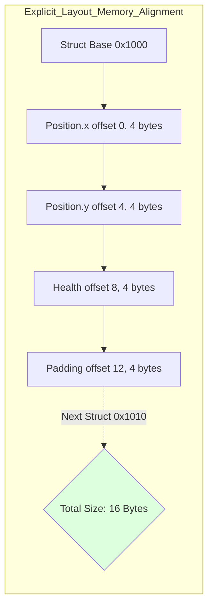
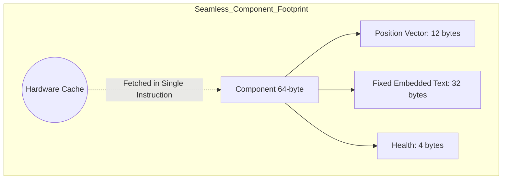

# Nexus Prime Architectural Manual: Next-Gen Data Structures & Type Systems

## 1. Introduction: Why Unmanaged?
In the standard C# development model, every `class` or `string` object lives on the managed heap. These objects are constantly monitored by the Garbage Collector (GC). In a game with millions of entities, scanning these objects (Mark & Sweep) by the GC leads to sudden freezes called "Stop-the-world".

Nexus Prime solves this problem fundamentally with **Unmanaged Data Structures**. Data is stored in the unmanaged space (raw RAM addresses) where the GC cannot see it. This document explains how Nexus manages this data and its advantages at the hardware level.

---

## 2. Blittable Structs & Memory Alignment

### 2.1 What is Blittable?
A data type being "Blittable" means that no conversion is needed when copying that data. An `int`, `float`, or `byte` is blittable. However, a `bool` (which can be 4 bytes in C# and 1 byte in the unmanaged world) or a `string` is not blittable.

$$Blittable(T) \iff MemoryLayout_{C\#}(T) == MemoryLayout_{Native}(T)$$

In Nexus, all components **must be Blittable**. This allows data to flow "as is" from RAM to the CPU directly without marshalling penalties.

### 2.2 Hardware Rules: Alignment
Processors provide the highest performance when reading from memory addresses that fall on exact 4, 8, or 16-byte boundaries.
- **Nexus Standard**: All unmanaged structs are padded and aligned strictly to 8-byte or 64-byte Cache-Line boundaries.
- **Explicit Layout**: The position (offset) of variables in memory is determined manually using `[StructLayout(LayoutKind.Explicit)]` on structs. This prevents the CPU from having to perform extra "masking" to read unaligned data.



---

## 3. Nexus Collections (Unmanaged Containers)

### 3.1 NexusList<T>
The traditional `List<T>`, when expanded (resized) thousands of times, increases GC pressure by leaving old arrays on the managed heap.
- **Mechanism**: Allocates raw memory aligned to 64-bytes with `NexusMemoryManager.AllocCacheAligned`.
- **Performance**: Expansion is performed via `Realloc`. If there is free space adjacent on the RAM, the capacity is increased with $O(1)$ complexity without the data being copied or moved at all.

### 3.2 NexusDictionary<K, V>
Dictionary structures typically generate a "Hash Table" caching cost. While Nexus eliminates this need for component access entirely using the `ComponentTypeManager`, it offers unmanaged hash maps for general custom game logic.
- **Advantage**: Zero `Box/Unbox` allocation cost. Keys and values are stored directly as raw bytes, and hash lookups ($O(1)$) have vastly minimized cache-miss rates compared to standard `Dictionary`.

---

## 4. Fixed-Size Strings (Embedded Texts)

### 4.1 Problem: Managed String
In C#, a `string` is a managed object. If you put a `string` inside an unmanaged component, that component can no longer be blittable.
```csharp
// Incorrect! Not unmanaged, creates a GC-tracked pointer constraint.
struct BadComponent { string Name; } 
```

### 4.2 Solution: NexusString<T> (NexusString32/64/128)
Nexus keeps texts "embedded" directly inside the component's footprint.
- **Structure**: Uses a fixed-size byte array like `fixed byte _data[32]`.
- **Mechanism**: Text is written to this local array in UTF8 format.
- **Hardware-Link**: The text resides strictly on the same Cache Line (64-byte boundary) as the component's other data (X, Y, Z coordinates, etc.). When reading an entity's position, you also reach its name "for free" within the exact same memory fetch.



---

## 5. Terminology and Hardware Counterparts

| Term | Hardware Counterpart | Nexus Advantage |
| :--- | :--- | :--- |
| **Blittable** | Bit-Blit (Direct Copy) | Zero CPU cost transfer. |
| **Fixed Buffer** | Stack / In-place Allocation | Data physically embedded within the CPU L1 Cache. |
| **Unmanaged Heap** | Raw RAM Addresses | 100% immunity from GC scanning interruptions. |
| **Memory Alignment** | MMU Fetch Optimization | Maximum data throughput per clock cycle. |

---

## 6. Summary and Rules
1.  **Inherit IDisposable**: All unmanaged collections must manually be `Dispose`d to prevent C-style memory leaks.
2.  **No References**: Never put a `class` or managed `string` inside unmanaged structs.
3.  **Use NexusStrings**: Prefer structural strings like `NexusString64` for names and gameplay tags.

> [!TIP]
> **Nexus Prime Engineering Note**
> Strategically utilizing these data structures flattens the "GC Spikes" (sudden frame freezes) chart in your game engine to a **Flat Line**. For the player end-user, this achieves the holy grail of "Zero Stutter" even in chaos heavy scenes.
