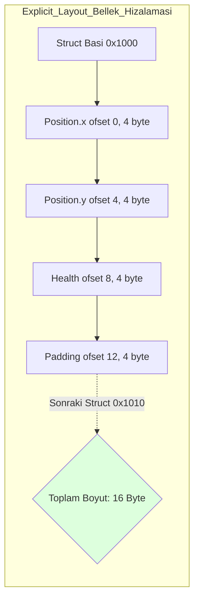
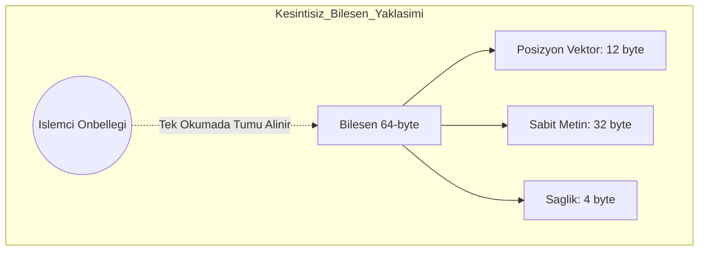

# Nexus Prime Mimari Rehber: Next-Gen Veri Yapıları & Tip Sistemi

## 1. Giriş: Neden Unmanaged?
Standart C# geliştirme modelinde, her `class` veya `string` nesnesi yönetilen yığın (Managed Heap) üzerinde yaşar. Bu nesneler Garbarage Collector (GC) tarafından sürekli izlenir. Milyonlarca varlığın olduğu bir oyunda, GC'nin bu nesneleri taraması (Mark & Sweep) "Stop-the-world" denilen ani donmalara yol açar.

Nexus Prime, bu sorunu **Unmanaged Veri Yapıları** ile kökten çözer. Veriler, GC'nin göremeyeceği unmanaged alanda (RAM'in ham adreslerinde) saklanır. Bu doküman, Nexus'un bu verileri nasıl yönettiğini ve donanım seviyesindeki avantajlarını açıklar.

---

## 2. Blittable Structs & Memory Alignment

### 2.1 Blittable Nedir?
Bir veri tipinin "Blittable" olması, o verinin kopyalanırken hiçbir dönüşüme (conversion) ihtiyaç duymaması demektir. Bir `int`, `float` veya `byte` blittable'dır. Ancak bir `bool` (C#'ta 4 byte, unmanaged dünyada 1 byte olabilir) veya `string` blittable değildir.

$$Blittable(T) \iff MemoryLayout_{C\#}(T) == MemoryLayout_{Native}(T)$$

Nexus'ta tüm bileşenler **Blittable** olmak zorundadır. Bu, verinin RAM'den CPU'ya "olduğu gibi" akmasını sağlar.

### 2.2 Donanım Kuralları: Alignment
İşlemciler bellekten 4, 8 veya 16 bytelık sınır (boundary) adreslerinden okuma yaparken en yüksek performansı verir.
- **Nexus Standardı**: Tüm unmanaged structlar 8-byte veya 64-byte Cache-Line sınırlarına hizalanır.
- **Explicit Layout**: Structlar üzerinde `[StructLayout(LayoutKind.Explicit)]` kullanılarak değişkenlerin bellekteki konumu (offset) manuel olarak belirlenir. Bu, CPU'nun veriyi okumak için fazladan "maskeleme" yapmasını engeller.



---

## 3. Nexus Collections (Unmanaged Kaplar)

### 3.1 NexusList<T>
Geleneksel `List<T>`, binlerce kez büyüdüğünde (resize) eski veriyi managed heap üzerinde bırakarak GC baskısını artırır.
- **Mekanizma**: `NexusMemoryManager.AllocCacheAligned` ile 64-byte hizalı ham bellek tahsis eder.
- **Performans**: Büyüme işlemi `Realloc` ile yapılır. Eğer RAM üzerinde yan tarafta boş yer varsa, veri *hiç taşınmadan* $O(1)$ karmaşıklıkta kapasite artırılır.

### 3.2 NexusDictionary<K, V>
Sözlük yapıları genellikle "Hash Table" maliyeti üretir. Nexus, bileşen erişimleri için `ComponentTypeManager` ile bu ihtiyacı ortadan kaldırsa da, oyunun genel mantığı için unmanaged hash mapler sunar.
- **Avantaj**: Sıfır `Box/Unbox` maliyeti. Anahtarlar ve değerler doğrudan ham byte olarak saklanır. Hash arama ($O(1)$) cache-miss oranları CPU hizalamaları ile minimuma indirgenmiştir.

---

## 4. Fixed-Size Strings (Gömülü Metinler)

### 4.1 Problem: Managed String
C#'ta `string` bir nesnedir (object). Bir bileşenin içine `string` koyarsanız, o bileşen artık blittable / unmanaged olamaz.
```csharp
// Hatalı! Unmanaged değil, GC Heap üzerinde isaretci (pointer) uretir.
struct BadComponent { string Name; } 
```

### 4.2 Çözüm: NexusString<T> (NexusString32/64/128)
Nexus, metinleri bileşenin içine "gömülü" (embedded) olarak tutar.
- **Yapı**: `fixed byte _data[32]` gibi sabit boyutlu bir byte dizisi kullanır.
- **Mekanizma**: Metin, UTF8 formatında bu diziye yazılır.
- **Hardware-Link**: Metin, bileşenin diğer verileriyle aynı Cache Line (64-byte sınır) üzerinde durur. Bir varlığın pozisyonunu okurken ismine de "bedavaya" (aynı bellek okumasında) ulaşmış olursunuz.



---

## 5. Terminoloji ve Donanım Karşılıkları

| Terim | Donanım Karşılığı | Nexus Avantajı |
| :--- | :--- | :--- |
| **Blittable** | Bit-Blit (Direct Copy) | Sıfır CPU maliyetli transfer. |
| **Fixed Buffer** | Stack / In-place Allocation | CPU L1 Cache içinde yerleşik veri. |
| **Unmanaged Heap** | Raw RAM Addresses | GC taramasından %100 muafiyet. |
| **Memory Alignment** | MMU Fetch Optimization | Saat döngüsü (cycle) başına maksimum veri aktarımı. |

---

## 6. Özet ve Kurallar
1.  **Inherit IDisposable**: Tüm unmanaged koleksiyonlar `Dispose` edilerek C stili sızıntılar önlenmelidir.
2.  **No References**: Structların içine asla `class` veya managed `string` koymayın.
3.  **Use NexusStrings**: İsim ve etiketler (Tag) için `NexusString64` gibi unmanaged metin yapılarını tercih edin.

> [!TIP]
> **Nexus Prime Mühendislik Notu**
> Bu veri yapılarını kullanmak, oyununuzdaki "GC Spikes" (ani takılmalar) grafiğini **Düz Bir Çizgiye (Flat Line)** indirger. Oyuncu açısından bu, en yoğun savaşlarda bile "Sıfır Takılma" demektir.
