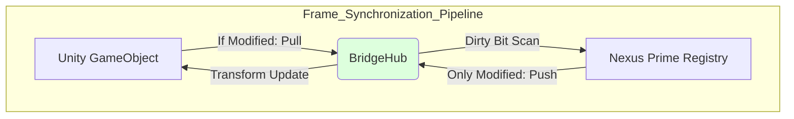

# Nexus Prime Architectural Manual: Unity Helper & Bridge 2.0

## 1. Introduction: The Intersection of Two Worlds
Unity is a "Managed" world that provides development ease but has steep performance constraints. Nexus Prime, on the other hand, is a speed-oriented "Unmanaged" world. The communication (synchronization) between these two worlds is typically where performance dies in complex dynamic games.

The reason for Bridge 2.0 technology's existence is to intelligently transfer only changed data over a smart bridge instead of blindly copying thousands of objects every frame, effectively reducing the **Synchronization Overhead** cost by 90%.

---

## 2. Dirty Flag System: The Math of Synchronization

### 2.1 Problem: Blind Copy
Copying the positions of 10,000 entities every frame from Unity `Transform`s to Nexus `Position` components unnecessarily occupies the CPU's memory bandwidth (bus). In traditional OOP architectures, the bus consumption $C$ is:
$$C_{OOP} = N_{Total} \times Size(Transform)$$

### 2.2 Solution: Dirty Bitsets
Nexus keeps a "Dirty Bit" (Change Flag) at the unmanaged level for every component.
- **Pull (Unity -> Nexus)**: Only objects whose `Transform` has organically changed in Unity are written into Nexus.
- **Push (Nexus -> Unity)**: Only data updated (Dirty) by an active system within Nexus is applied back to Unity objects.

**Performance Math**: 
The CPU can check the change status of 64 different objects in a single 64-bit register (`uint64`) with a single instruction cycle. 
$$Access \ Cost = \frac{N_{Total}}{64} \ \text{instructions}$$

Furthermore, data transfer is strictly limited to $N_{Dirty}$:
$$C_{Nexus} = N_{Dirty} \times Size(Component)$$
Because $N_{Dirty} \ll N_{Total}$ in real simulations, the performance optimization is immense.

---

## 3. BridgeHub: Central Distribution Base
`BridgeHub` is an orchestrator where all systems register their synchronization logic. It operates at strategic points around the engine's game loop to prevent race conditions.
- **PullAll()**: Pulls changes originating in Unity (e.g., player input or animation roots) to Nexus. Typically executes at the very start of `Update` (Early Update).
- **PushAll()**: Pushes physical algorithmic changes calculated in the Nexus world outward to Unity. Typically executes after systems complete, within `LateUpdate`.

---

## 4. Smart Attributes & Source Generators

Nexus Prime uses advanced C# attributes to achieve rapid code generation:

- **[Sync]**: Marks a field to be automatically kept synchronized between the Unity and Nexus sides. It stealthily creates Getter/Setter hooks underneath.
- **[ReadOnly]**: Specifies that the data will only be read by Nexus and not written back to Unity, canceling the Push operation and saving memory bandwidth.
- **Source Generator Integration**: At compile time (Build time), the Roslyn Compiler scans these attributes and automatically writes the optimized `Bridge` memory copy codes on your behalf (Boilerplate-free).

---

## 5. Terminology and Performance Table

| Term | Description | Performance Impact |
| :--- | :--- | :--- |
| **Pull Operation** | Pulling data privilege from Unity to Nexus. | Scan is 80% faster if there are no changes. |
| **Push Operation** | Transferring data downward from Nexus to Unity. | Saves up to 95% CPU time by copying only what's dirty. |
| **Sync Point** | The moment the two worlds are held in memory alignment. | Prevents thread blocking and multi-thread asymmetry. |
| **Managed Proxy** | A Unity "View" class representing unmanaged data. | Operates without generating GC via pooling (Zero Allocation). |

---

## 6. Summary and Best Practices
1.  **Avoid Full Sync**: Do not synchronize every mechanic. Only connect data with direct visual counterparts (Gfx) to the bridge (e.g., only push the Health value if the UI is actively observing it).
2.  **Batch Bridges**: Do not manage systems individually regarding synchronization. Manage all sync bindings from a centralized point using the `BridgeHub`.
3.  **Visual Debugging**: Use the `Live State Tweaker` tool to monitor data traffic bleeding through the bridge and to capture bottlenecks.

> [!TIP]
> **Nexus Prime Engineering Note** 
> Bridge 2.0 acts like a "Data Customs". By allowing only data possessing a passport (Dirty Bit validation) to pass in or out, it prevents the processor from exhausting itself with redundant copying tasks. This architecture is the primary guarantor of maintaining a rock-solid 144+ FPS in your game.
