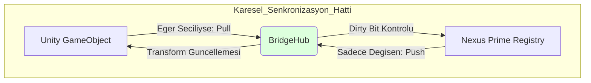

# Nexus Prime Mimari Rehber: Unity Helper & Bridge 2.0

## 1. Giriş: İki Dünyanın Kesişimi
Unity, geliştirme kolaylığı sağlayan ancak performans kısıtları olan "Managed" (Yönetilen) bir dünyadır. Nexus Prime ise hız odaklı "Unmanaged" (Yönetilmeyen) bir dünyadır. Bu iki dünyanın birbiriyle konuşması (senkronizasyonu), genellikle oyunlarda performansın öldüğü yerdir.

Bridge 2.0 teknolojisinin varlık sebebi, her karede binlerce nesneyi körü körüne kopyalamak yerine, sadece değişen verileri akıllıca bir köprü üzerinden aktararak **Synchronization Overhead** (Senkronizasyon Yükü) maliyetini %90 oranında azaltmaktır.

---

## 2. Dirty Flag Sistemi: Senkronizasyon Matematiği

### 2.1 Problem: Blind Copy (Kör Kopyalama)
Her karede 10,000 varlığın pozisyonunu Unity `Transform`undan Nexus `Position` bileşenine kopyalamak, CPU'nun bellek bant genişliğini (bus) gereksiz yere işgal eder. Geleneksel OOP mimarisinde veri yolu tüketimi $C$ şu şekildedir:
$$C_{OOP} = N_{Total} \times Size(Transform)$$

### 2.2 Çözüm: Dirty Bitsets
Nexus, her bir bileşen için unmanaged seviyede bir "Dirty Bit" (Değişim Bayrağı) tutar.
- **Pull (Unity -> Nexus)**: Sadece `Transform`ı değişen objeler Nexus'a yazılır.
- **Push (Nexus -> Unity)**: Sadece Nexus içindeki bir sistem tarafından güncellenen (Dirty) veriler Unity objelerine uygulanır.

**Performans Matematiği**: 
CPU, 64-bitlik tek bir register (`uint64`) kullanarak 64 farklı nesnenin değişim durumunu tek bir saat döngüsünde (cycle) tarayabilir.
$$Erişim \ Maliyeti = \frac{N_{Total}}{64} \ \text{komut}$$

Ayrıca veri aktarımı sadece $N_{Dirty}$ için gerçekleşir:
$$C_{Nexus} = N_{Dirty} \times Size(Component)$$
Gerçek simülasyonlarda genelde $N_{Dirty} \ll N_{Total}$ olduğu için muazzam düzeyde optimizasyon kazanılır.

---

## 3. BridgeHub: Merkezi Dağıtım Üssü
`BridgeHub`, tüm sistemlerin senkronizasyon mantığını kaydettiği bir orkestratördür. Oyunun döngüsü etrafında stratejik noktalarda çalışarak race condition (yarış durumu) sorunlarını önler.
- **PullAll()**: Unity'deki (örneğin input veya animasyon bazlı) değişimleri Nexus'a çeker. Genellikle `Update` başında (Early Update) çalışır.
- **PushAll()**: Nexus dünyasındaki fiziksel algoritmik değişimleri Unity'ye iter. Genellikle sistemler işini bitirdikten sonra, `LateUpdate` içinde çalışır.

---

## 4. Smart Attributes & Source Generators

Nexus Prime, kod üretim hızı için ileri seviye C# özniteliklerini (Attributes) kullanır:

- **[Sync]**: Bir alanı hem Unity hem de Nexus tarafında otomatik olarak senkronize tutmak için işaretler. Altında otomatik olarak Getter/Setter kancaları oluşturur.
- **[ReadOnly]**: Verinin sadece Nexus tarafından okunacağını, Unity'ye geri yazılmayacağını belirterek Push işlemini iptal eder ve bant genişliğinden tasarruf sağlar.
- **Source Generator Entegrasyonu**: Derleme zamanında (Build time), Roslyn Compiler bu öznitelikleri tarayarak sizin yerinize optimize edilmiş `Bridge` bellek kopyalama kodlarını otomatik yazar (Boilerplate-free).

---

## 5. Terminoloji ve Performans Tablosu

| Terim | Açıklama | Performans Etkisi |
| :--- | :--- | :--- |
| **Pull Operation** | Unity'den Nexus'a veri çekme yetkisidir. | Değişim yoksa tarama işlemi %80 daha hızlıdır. |
| **Push Operation** | Nexus'tan Unity'ye aktarım yapılmasıdır. | Yalnızca kirli (dirty) olanlarda %95 CPU kazancı sağlar. |
| **Sync Point** | İki dünyanın belleksel hizalamada tutulduğu andır. | Multi-thread asimetrisini ve thread bloklamasını önler. |
| **Managed Proxy** | Unmanaged veriyi temsil eden Unity "View" sınıfıdır. | GC yaratmadan (sıfır allocation) çalışır (Havuzlanmış). |

---

## 6. Özet ve İyi Uygulamalar
1.  **Avoid Full Sync (Tam Senkronizasyondan Kaçının)**: Her mekaniği senkronize etmeyin. Sadece görsel (Gfx) karşılığı olan verileri köprüye bağlayın (örn: Health değerini sadece UI güncelleniyorsa ittirin).
2.  **Batch Bridges (Toplu Köprüler)**: Yönetimi sistem başına yapmak yerine, `BridgeHub` kullanarak tüm senkronizasyonları tek bir merkezi noktadan yönetin.
3.  **Visual Debugging (Görsel Hata Ayıklama)**: Köprü üzerinden sızan veri trafiğini izlemek ve darboğazları yakalamak için `Live State Tweaker` aracını kullanın.

> [!TIP]
> **Nexus Prime Mühendislik Notu** 
> Bridge 2.0, bir "Veri Gümrüğü" (Data Customs) gibi çalışır. Sadece pasaportu bulunan (Dirty Bit onaylı) verinin girmesine veya çıkmasına izin vererek işlemcinin gereksiz kopyalama işleriyle yorulmasını engeller. Bu mimari, oyununuzun stabil 144+ FPS değerlerinde kalmasının temel garantörüdür.
