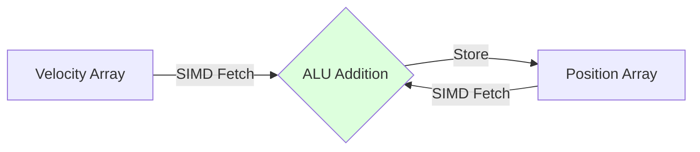
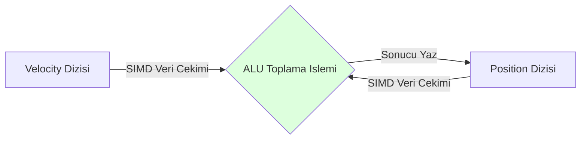

# The Nexus Architecture: Comprehensive Tutorial & Mastery Guide

## 1. Introduction
Welcome to the Nexus Prime Mastery Guide. This document provides an exhaustive, step-by-step tutorial on integrating Nexus Prime into your Unity projects and mastering its high-performance, Data-Oriented Design (DOD) patterns. By following this guide, you will learn how to bypass Unity's managed overhead and unlock the raw mathematical potential of the hardware.

---

## 2. Installation: Integrating Nexus with Unity
Before writing code, Nexus must be integrated into the Unity compilation pipeline.

### Step 2.1: Package Architecture
Nexus is distributed as an unmanaged `.dll` or source package. 
1. Open Unity's `Window -> Package Manager`.
2. Select **"Add package from disk..."** or **"Add package from git URL..."**.
3. Point to the Nexus Prime repository.

### Step 2.2: Scene Initialization
Nexus requires an entry point to hook into the Unity player loop.
1. Create an empty `GameObject` in your initial scene.
2. Name it `[Nexus_Core]`.
3. Add the `NexusInitializer` component. This component intercepts Unity's `Update`, `LateUpdate`, and `FixedUpdate` loops and redirects them to the Nexus `JobSystem`.

> [!WARNING]
> Ensure only **one** `NexusInitializer` exists per scene. Multiple initializers will cause memory duplication and undefined mathematical behaviors.

---

## 3. Core Concepts & Mathematical Foundation
Nexus discards Object-Oriented Programming (OOP). Instead of objects containing data and logic, we use pure memory arrays.
- **Entity**: An $8-byte$ integer ID. Not an object.
- **Component**: An `unmanaged struct` containing only data. No logic.
- **System**: A static or parallel function that reads/writes to arrays of components.

**Mathematical Advantage**: 
When iterating a `GameObject[]`, the CPU suffers scattered memory reads (Cache Miss). In Nexus, data is packed sequentially.
$$T_{iteration} = \frac{N}{CacheLineSize} \times CacheMissPenalty$$
Nexus forces $CacheMissPenalty \rightarrow 0$.

---

## 4. Scenario 1: The Basic Movement System
Let's create a system that moves thousands of entities.

### 4.1 Defining Components (Data)
All components must be `unmanaged` (blittable). Avoid classes.

```csharp
// Unmanaged struct defining spatial data
public struct Position : unmanaged 
{ 
    public float X, Y, Z; 
}

// Unmanaged struct defining vector forces
public struct Velocity : unmanaged 
{ 
    public float Vx, Vy, Vz; 
}
```

### 4.2 Spawning Entities (Memory Allocation)
```csharp
// Create 10,000 entities instantly in raw memory
for(int i = 0; i < 10000; i++)
{
    EntityId entity = Registry.Create();
    Registry.Add(entity, new Position { X = 0, Y = 0, Z = 0 });
    Registry.Add(entity, new Velocity { Vx = 1, Vy = 0, Vz = 0 });
}
```

### 4.3 The System (Logic)
Instead of `MonoBehaviour.Update`, we write a Nexus System.

```csharp
public partial class MovementSystem : INexusSystem 
{
    // Source Generator automatically injects pointers
    [Write] private Position* _positions;
    [Read] private Velocity* _velocities;

    public unsafe void Execute() 
    {
        // Parallel execution over raw pointers
        NexusHelper.ForEach((ref Position p, ref Velocity v) => 
        {
            p.X += v.Vx * Time.deltaTime;
            p.Y += v.Vy * Time.deltaTime;
            p.Z += v.Vz * Time.deltaTime;
        });
    }
}
```



---

## 5. Scenario 2: Bridging to Unity (Visuals)
Nexus calculates math; Unity renders visuals. We use the Bridge 2.0 architecture to synchronize them.

### 5.1 The Sync Component
```csharp
// The [Sync] attribute auto-generates bridge logic
[Sync]
public struct TransformSync : unmanaged 
{
    public float PosX, PosY, PosZ;
    public bool IsDirty; // Used to track changes
}
```

### 5.2 Unity Managed Proxy
Attach this to your Unity Prefab:
```csharp
public class NexusView : MonoBehaviour 
{
    public EntityId LinkedEntity;
    
    void LateUpdate() 
    {
        // BridgeHub checks the 'IsDirty' flag and only copies memory if true
        if (BridgeHub.Pull(LinkedEntity, out TransformSync data)) 
        {
            transform.position = new Vector3(data.PosX, data.PosY, data.PosZ);
        }
    }
}
```

| Bridge Action | Operation | CPU Cost |
| :--- | :--- | :--- |
| **Pull** | Read Nexus -> Write Unity | Minimal (if Dirty) |
| **Push** | Read Unity -> Write Nexus | Heavy (if blind) |

---

## 6. Scenario 3: Structural Changes (EntityCommandBuffer)
Adding components inside a multi-threaded system causes race conditions. We use `EntityCommandBuffer` (ECB).

```csharp
public unsafe void Execute(EntityCommandBuffer ecb) 
{
    NexusHelper.ForEach((EntityId id, ref Health h) => 
    {
        if (h.Value <= 0) 
        {
            // Defer destruction to the end of the frame
            ecb.DestroyEntity(id); 
            
            // Defer spawning explosion
            EntityId fx = ecb.CreateEntity();
            ecb.AddComponent(fx, new ExplosionData { Radius = 5.0f });
        }
    });
}
```

---

## 7. Summary & Best Practices
- **Never Allocate in Systems**: Avoid `new` objects. Use the Managed Heap only once during initialization.
- **Data Alignment**: Keep structs under 64 bytes if possible to perfectly fit CPU Cache Lines.
- **Profiling**: Always benchmark `Push/Pull` operations; synchronization is where performance dies.

---
<br><br>
---

# Nexus Mimarisi: Kapsamlı Eğitim ve Ustalık Rehberi (TR)

## 1. Giriş
Nexus Prime Ustalık Rehberi'ne hoş geldiniz. Bu belge, Nexus Prime'ı Unity projelerinize entegre etmek ve yüksek performanslı Veri Yönelimli Tasarım (DOD) kalıplarında ustalaşmak için adım adım, kapsamlı bir eğitim sunar. Bu rehberi takip ederek, Unity'nin yönetilen (managed) yükünü nasıl atlayacağınızı ve donanımın saf matematiksel potansiyelini nasıl ortaya çıkaracağınızı öğreneceksiniz.

---

## 2. Kurulum: Nexus'u Unity'ye Entegre Etmek
Kod yazmaya başlamadan önce, Nexus'un Unity derleme hattına entegre edilmesi gerekir.

### Adım 2.1: Paket Mimarisi
Nexus, yönetilmeyen (unmanaged) bir `.dll` veya kaynak kod paketi olarak dağıtılır.
1. Unity'nin `Window -> Package Manager` menüsünü açın.
2. **"Add package from disk..."** veya **"Add package from git URL..."** seçeneğini seçin.
3. Nexus Prime deposunu/dizinini gösterin.

### Adım 2.2: Sahne İlklendirmesi
Nexus'un Unity oyun döngüsüne (player loop) kanca atabilmesi için bir giriş noktasına ihtiyacı vardır.
1. İlk sahnenizde boş bir `GameObject` oluşturun.
2. Adını `[Nexus_Core]` yapın.
3. `NexusInitializer` bileşenini ekleyin. Bu bileşen Unity'nin `Update` ve `LateUpdate` döngülerini yakalar ve doğrudan Nexus `JobSystem`'ine yönlendirir.

> [!WARNING]
> **Uyarı:** Herhnagi bir sahnede yalnızca **bir adet** `NexusInitializer` bulunduğundan emin olun. Birden fazla başlatıcı fiziksel bellekte kopyalanmaya ve tanımsız matematiksel çöküşlere neden olur.

---

## 3. Temel Kavramlar & Matematiksel Temel
Nexus, Nesne Yönelimli Programlamayı (OOP) reddeder. Veri ve mantığı içeren nesneler (class) yerine, saf bellek dizileri kullanırız.
- **Entity (Varlık)**: $8-byte$'lık bir tam sayı kimliğidir (ID). Bir nesne değildir.
- **Component (Bileşen)**: Sadece veri içeren, mantık barındırmayan `unmanaged struct` (yönetilmeyen yapı) tipidir.
- **System (Sistem)**: Bileşen dizilerini okuyan/yazan statik veya paralel donanım fonksiyonlarıdır.

**Matematiksel Avantaj**: 
Bir `GameObject[]` dizisi üzerinde döngü çalıştırılırken, CPU bellekte dağınık okumalar yapar (Cache Miss). Nexus'ta veriler ardışık olarak sımsıkı paketlenir.
$$T_{iterasyon} = \frac{N}{CacheLineBoyutu} \times CacheMissCezasi$$
Nexus mimarisi $CacheMissCezasi \rightarrow 0$ olmasını donanımsal olarak zorlar.

---

## 4. Senaryo 1: Temel Hareket Sistemi
Binlerce varlığı hareket ettiren bir sistem yazalım.

### 4.1 Bileşenlerin Tanımlanması (Veri)
Tüm bileşenler donanım seviyesinde `unmanaged` (blittable) olmalıdır. Sınıf (`class`) kullanmaktan kaçının.

```csharp
// Uzaysal verileri tanımlayan yönetilmeyen yapı
public struct Position : unmanaged 
{ 
    public float X, Y, Z; 
}

// Vektörel kuvvetleri tanımlayan yapı
public struct Velocity : unmanaged 
{ 
    public float Vx, Vy, Vz; 
}
```

### 4.2 Varlıkların Üretilmesi (Bellek Tahsisi)
```csharp
// Ham bellek üzerinde anında 10.000 varlık oluşturun
for(int i = 0; i < 10000; i++)
{
    EntityId entity = Registry.Create();
    Registry.Add(entity, new Position { X = 0, Y = 0, Z = 0 });
    Registry.Add(entity, new Velocity { Vx = 1, Vy = 0, Vz = 0 });
}
```

### 4.3 Sistem (Mantık)
`MonoBehaviour.Update` yerine, saf bir Nexus Sistemi yazarız.

```csharp
public partial class MovementSystem : INexusSystem 
{
    // Kaynak Üretici (Source Generator) bellek işaretçilerini otomatik enjekte eder
    [Write] private Position* _positions;
    [Read] private Velocity* _velocities;

    public unsafe void Execute() 
    {
        // Ham pointer'lar üzerinden paralel yürütme
        NexusHelper.ForEach((ref Position p, ref Velocity v) => 
        {
            p.X += v.Vx * Time.deltaTime;
            p.Y += v.Vy * Time.deltaTime;
            p.Z += v.Vz * Time.deltaTime;
        });
    }
}
```



---

## 5. Senaryo 2: Unity'ye Köprü Kurmak (Görseller)
Nexus matematiği hesaplar; Unity ise görselleri işler. Bu iki dünyayı senkronize etmek için Bridge 2.0 (Köprü) mimarisini kullanırız.

### 5.1 Senkronizasyon Bileşeni
```csharp
// [Sync] özniteliği köprü kopyalama kodunu otomatik üretir
[Sync]
public struct TransformSync : unmanaged 
{
    public float PosX, PosY, PosZ;
    public bool IsDirty; // Değişimleri izlemek için kullanılır
}
```

### 5.2 Unity Managed Proxy (Yönetilen Vekil)
Bu betiği Unity Prefab'ınıza ekleyin:
```csharp
public class NexusView : MonoBehaviour 
{
    public EntityId LinkedEntity;
    
    void LateUpdate() 
    {
        // BridgeHub 'IsDirty' bayrağını okur ve sadece değişim varsa kopyalar
        if (BridgeHub.Pull(LinkedEntity, out TransformSync data)) 
        {
            transform.position = new Vector3(data.PosX, data.PosY, data.PosZ);
        }
    }
}
```

| Köprü Eylemi | İşlem Açıklaması | CPU Maliyeti |
| :--- | :--- | :--- |
| **Pull (Çekme)** | Nexus'u Oku -> Unity'ye Yaz | Minimum (Eğer sadece Dirty bit aktif ise) |
| **Push (İtme)** | Unity'yi Oku -> Nexus'a Yaz | Yüksek (Eğer körü körüne kopyalanırsa) |

---

## 6. Senaryo 3: Yapısal Değişimler (EntityCommandBuffer)
Eşzamanlı ve multi-threaded çalışan bir sistemin tam ortasında belleğe yeni bir bileşen eklemek veri yarışına (race condition) yol açar. Güvenlik için `EntityCommandBuffer` (ECB) kullanırız.

```csharp
public unsafe void Execute(EntityCommandBuffer ecb) 
{
    NexusHelper.ForEach((EntityId id, ref Health h) => 
    {
        if (h.Value <= 0) 
        {
            // Silme komutunu çerçevenin sonuna (Sync Point) ertele
            ecb.DestroyEntity(id); 
            
            // Yeni varlık üretme komutunu ertele
            EntityId fx = ecb.CreateEntity();
            ecb.AddComponent(fx, new ExplosionData { Radius = 5.0f });
        }
    });
}
```

---

## 7. Özet ve İyi Uygulamalar (Best Practices)
- **Sistem İçi Tahsisat Yapmayın**: `new` anahtar kelimesini sistemlerin (Execute) içinde asla kullanmayın. Managed Heap'i sadece oyun başlarken bir kez kullanın.
- **Veri Hizalaması**: Yapıların (Struct) 64 byte'ın altında kalmasına özen gösterin; böylece CPU L1 Önbellek hattına tamamen, milimetrik otururlar.
- **Analiz (Profiling)**: `Push/Pull` köprü operasyonlarının maliyetini daima profilleme araçlarıyla izleyin; senkronizasyon performansın öldüğü yerdir.