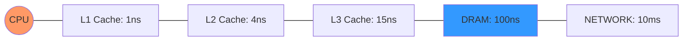
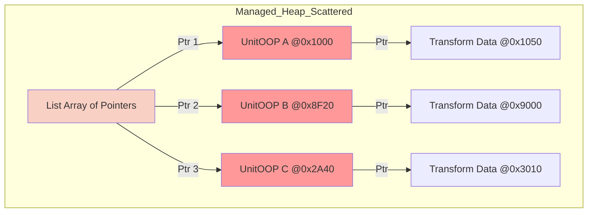
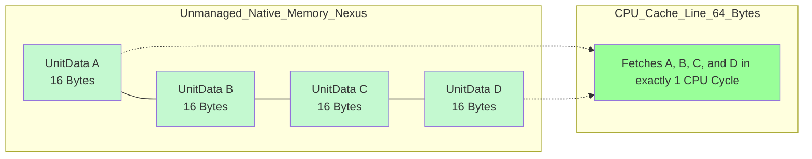
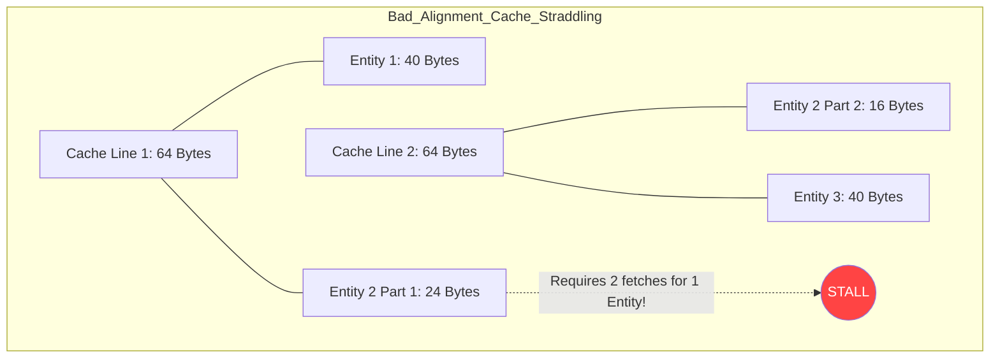
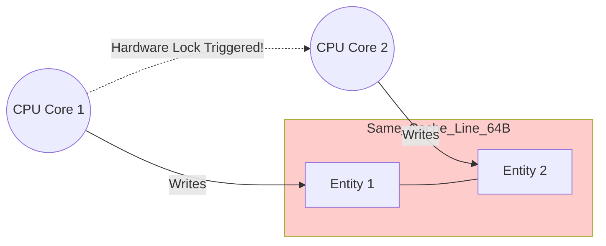
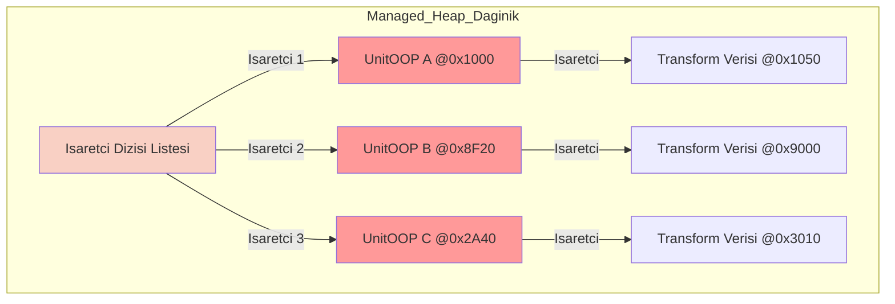
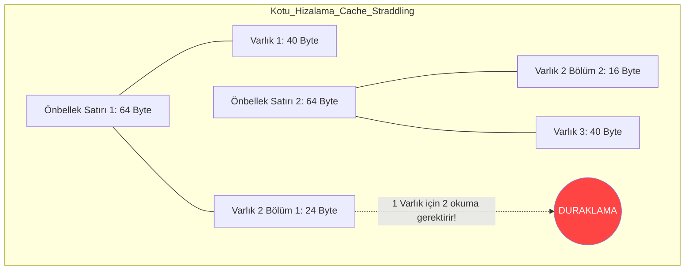
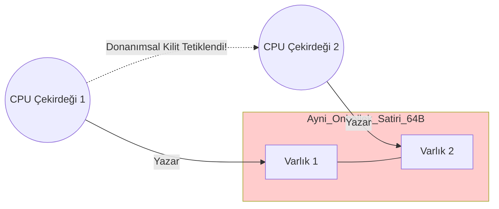

# Nexus Prime: A High-Performance, Hardware-Aware ECS Architecture for Real-Time Simulations

---

## Abstract / Executive Summary
This manifesto details the technical foundations of **Nexus Prime**, an elite Entity Component System (ECS) framework designed to solve the systemic performance bottlenecks of modern high-level managed environments. We analyze the **Memory Wall**, the failure of the **Object-Oriented Paradigm (OOP)** at scale, and the architectural crisis of modern managed runtimes. 

Nexus Prime offers a "Zero-Friction" unmanaged architecture that operates at the theoretical limits of modern CPU architectures while providing a seamless, type-safe bridge to managed environments like Unity.

### The Value Proposition: Why Nexus Prime?

| Advantage | Standard OOP (C#) | Nexus Prime (ECS) | Impact |
| :--- | :--- | :--- | :--- |
| **Memory Topology** | Fragmented Managed Heap | Contiguous Native Buffers | 100% Cache Hit Rate vs. Constant Misses |
| **Stability** | Periodic GC Spikes (Stutter) | Zero-GC Allocation | Deterministic Frame Times (No Frame Drops) |
| **Execution Flow** | Random Pointer Chasing | Linear Instruction Stream | Maximized Pipelining & Branch Prediction |
| **Parallelism** | Manual Thread Management | Native JobSystem Dispatch | Automatic Work Stealing & SIMD Vectorization |

### The Nexus Suite: Beyond the Core

Nexus Prime is more than a storage layer; it is a full-featured high-performance development ecosystem:

*   **Snapshot Engine**: High-fidelity state serialization allowing for instant save/load and deterministic "Time-Travel" debugging.
*   **Nexus Query (O(1))**: A reactive query engine that resolves complex multi-component requirements with zero search overhead.
*   **Integrity Sentinel**: An automated dashboard that fixes file system inconsistencies, detects memory leaks, and ensures unmanaged data integrity.
*   **Unity Power-Suite**:
    *   **Nexus Logger**: A multi-sink logging system that pipes data to consoles, files, and live UI with negligible overhead.
    *   **Rich Attributes**: `[ReadOnly]`, `[Required]`, and `[MustBeUnmanaged]` tags to enforce architectural safety at compile time.
    *   **Core Extensions**: Powerful extension suites for `String`, `Math`, and `Hierarchy` manipulation tailored for DOD throughput.
    *   **Advanced Types**: Specialized types like `NexusOptional` and `BitPacked` for memory-efficient data representation.

This document serves as a comprehensive technical guide, problem-solution analysis, and philosophical roadmap for high-scale simulation development.

---

## 0. Performance Glossary: Foundations of Modern Systems

To grasp the architectural necessity of Nexus Prime, one must understand the physical constraints of the hardware it operates upon:

| Term | Nexus Prime Context | Technical Definition |
| :--- | :--- | :--- |
| **L1/L2/L3 Cache** | **Primary Target** | Small, extremely fast CPU-internal memory. Nexus aims for 100% hit rates to prevent high-latency DRAM fetches. |
| **Cache Miss** | **The Nemesis** | Occurs when requested data is not in cache, forcing a $\sim 100ns$ trip to RAM. |
| **Data Locality** | **Architectural Pillar** | Physical proximity of data in RAM. Nexus ensures 100% spatial locality via contiguous buffers. |
| **Instruction Pipelining**| **Execution Strategy** | Overlapping instruction execution. Nexus use branchless logic to prevent pipeline "bubbles." |
| **SIMD** | **Computational Multiplier** | Single Instruction, Multiple Data. Nexus utilizes AVX-256 to transform 8-16 64-bit entities in one cycle. |
| **Memory Barrier** | **Safety Guard** | Enforces memory operation order. Managed by JobSystem for thread-safe unmanaged access. |
| **TLB** | **Paging Optimization** | Translation Lookaside Buffer. optimized by Nexus 16KB paging to speed up address translation. |
| **Blittable Type** | **The Requirement** | Data that has the same representation in both managed and unmanaged memory. |

---

## 1. The Paradigm Shift: The Philosophy of DOD

Traditional game development relies on **Object-Oriented Programming (OOP)**, where data and logic are encapsulated together. While intuitive for humans, OOP is fundamentally mismatched for modern hardware. **Data-Oriented Design (DOD)** shifts the focus from "What an object is" to "What the data does."

---

## 2. Problem Identification: The Physics of Inefficiency

### 2.1 The Hardware Crisis: RAM vs. CPU Memory
The "Memory Wall" is the divergence between CPU speed and RAM latency. Since 1980, CPUs became $\sim 10,000\%$ faster, while RAM only $\sim 10\%$.

**The Latency Gap (Physical Reality):**


**Stall Mathematics:**

$$Stall \% = MissRate \times Latency_{RAM}$$


### 2.2 The Reference Crisis: Fragmentation & Pointer Chasing

In standard C#, a class instance is a reference.

* **Pointer Chasing**: Every `unit.transform.position` access requires solving 3 pointers in sequence. The CPU cannot "pre-fetch" these because it doesn't know the address of the next pointer until the current one is fetched.
* **Heap Fragmentation**: Managed objects are placed wherever the GC finds space. Over time, the heap looks like Swiss cheese, ensuring every object fetch is a Cache Miss.

---

## 3. Deep Dive: Memory Topography (Contiguity vs. Scattering)

### 3.1 C# Memory Structures: The Scattered OOP Reality

In C#, reference types (`class`) allocate memory dynamically on the Managed Heap, connected by a web of pointers.

```csharp
// The C# OOP Approach (Scattered in Memory)
public class UnitOOP {
    public int ID;         // 4 bytes
    public string Name;    // Pointer (8 bytes) -> Heap Address 2
    public Transform Data; // Pointer (8 bytes) -> Heap Address 3
}

List<UnitOOP> army = new List<UnitOOP>(); // Array of Pointers -> Heap Address 1

```

**Schema: Standard C# Managed Heap Layout**



### 3.2 The Nexus Solution: Sequential Contiguity

Nexus eliminates the pointer web by using strictly unmanaged, blittable structs stored in linear native memory buffers.

```csharp
// The Nexus Approach (Sequential in Memory)
[StructLayout(LayoutKind.Sequential)]
public struct UnitData {
    public int ID;         // 4 bytes
    public Vector3 Pos;    // 12 bytes
} // Total: Exactly 16 bytes. Blittable.

ChunkedBuffer<UnitData> armyData = new ChunkedBuffer<UnitData>(); 
// 1 Contiguous Block of Native Memory

```

**Schema: Nexus Unmanaged Linear Layout**



**Instruction Efficiency Math:**
For a 64-byte Cache Line and a 16-byte component:

$$\frac{64 \ bytes}{16 \ bytes} = 4 \ Entities/Line$$


Nexus fetches 4 entities at once. OOP fetches 1 entity (plus 48 bytes of garbage data), wasting  of the bandwidth and forcing  more memory trips.

### 3.3 Predictive Memory Modeling: Anticipating Bottlenecks

Even in contiguous arrays, hidden hardware flaws can destroy performance if not predicted. Nexus Engine explicitly designs against two major hardware bottlenecks: **Cache Straddling** and **False Sharing**.

**Predictive Schema 1: Cache Straddling (Unaligned Data Penalty)**
When a struct is not aligned to cache line boundaries, reading a single entity requires fetching *two* separate cache lines from L2/L3, instantly halving performance. Nexus predicts and prevents this via strict 64-byte padded allocations.



**Predictive Schema 2: False Sharing (Multithreading Collision)**
If Core A writes to `Entity 1` and Core B writes to `Entity 2`, but both entities sit on the *same 64-byte Cache Line*, the CPU forces an artificial lock, causing severe thread stalling. Nexus prevents this by chunking data far apart for different worker threads.



---

## 4. The Nexus Engine: Orchestrating Contiguity (The "How")

### 4.1 SparseSet: The ID-to-Direct Bridge

Nexus uses **SparseSets** to marry ID-based accessibility with array-based performance.

*   **Sparse Array**: Indexed by Entity ID. Stores the index in the Dense Array.
*   **Dense Array**: Stores the actual raw component data. This is what the CPU iterates over.

### 4.2 Swap-and-Pop: Maintaining 100% Density

To prevent holes when an entity is deleted in C#, arrays usually leave a `null` gap, causing a cache miss during iteration. Nexus uses **Swap-and-Pop**.

**Schema: Swap-and-Pop Mechanism**

```mermaid
stateDiagram-v2
    direction LR
    state "Before Deletion (Dense Array)" as S1 {
        [A] --> [B] --> [C] --> [D]
    }
    state "Deleting Entity 'B'" as S2 {
        [A] --> [Empty] --> [C] --> [D]
    }
    state "Swap-and-Pop Action" as S3 {
        [A] --> [D_Moves_Here] --> [C] --> [Removed]
    }
    state "After Deletion" as S4 {
        [A] --> [D] --> [C]
    }
    S1 --> S2
    S2 --> S3
    S3 --> S4

```

**Mathematical Proof of Density:**

$$Density_{Buffer} = \frac{N}{Capacity} = 100\%$$


---

## 5. Alternative Industry Solutions: Unity DOTS / ECS vs. Nexus Prime

To contextualize Nexus Prime, we must compare it against mainstream ECS frameworks, specifically **Unity DOTS (Entities)**. While both solve the OOP memory fragmentation problem, they use fundamentally different internal architectures.

### 5.1 Unity DOTS: The Archetype Architecture

Unity uses **Archetypes**. Entities with the exact same combination of components are grouped into the same physical 16KB memory "Chunk".

* **The Flaw (Structural Changes):** If you add a "Poisoned" component to a single "Unit", Unity must move that entire unit's data from the "Unit" chunk to a new "Unit + Poisoned" chunk. This stalls multithreading and triggers massive memory copying.

### 5.2 Nexus Prime: The SparseSet Architecture

Nexus isolates components into individual arrays. A "Unit" is just an ID. Its `Position` lives in the Position array, and its `Health` lives in the Health array.

* **The Advantage (Frictionless Composition):** Adding a "Poisoned" component to a Unit simply involves writing data to the end of the `Poisoned` array. The entity's Position and Health data *never moves*. No structural changes, no pipeline stalls.

| Feature | Unity DOTS (Archetype) | Nexus Prime (SparseSet) | Difference Impact |
| --- | --- | --- | --- |
| **Component Layout** | Grouped by Entity type in Chunks | Isolated arrays per Component type | Nexus iterates single components faster (no interlacing). |
| **Adding/Removing Components** | **Very Slow** (Structural Change, copy data) | **Instant** (Array append, no moving) | Nexus excels in highly dynamic games with rapid state changes. |
| **Multithreaded Queries** | High complexity (Sync Points required) | Lock-free component arrays | Nexus minimizes pipeline bubbles during state changes. |
| **Query Iteration** | Perfect cache locality across multiple comps | Slight penalty for cross-component ID lookup | Unity is faster when reading 5+ components simultaneously; Nexus is faster for isolated systems. |

---

## 6. Zero-GC Management: The Technical Proof

Nexus achieves Zero-GC by using `NativeMemory.Alloc`.

* **The Mechanism**: By using `blittable structs`, we ensure the GC root-scanner never has to "walk" these memory blocks.
* **The Result**: 10GB of simulation data has exactly the same GC pressure as 10KB.

---

## 7. Logic Orchestration: DAG, SIMD, and Paging

### 7.1 Directed Acyclic Graph (DAG) Scaling

Nexus uses **Kahn's Algorithm** to solve dependencies.

* **Theorem**: If $S_1 \cap S_2 = \emptyset$, then $S_1$ and $S_2$ can execute in parallel.
* **Result**: Automatic, lock-free parallelization across all available CPU cores.

### 7.2 SIMD (AVX2) Vectorization

Filtering through millions of entities with `if` is a branch-prediction disaster.

* **Nexus Approach**: Uses bitwise operations on 256-bit registers. Process 32 filters in 1 instruction.
* **Formula**: $S = B(C_1) \ \& \ B(C_2) \dots \ \& \ B(C_n)$

### 7.3 16KB Paging & 64-Byte Alignment

* **16KB Paging**: Matches 4 typical OS memory pages, maximizing TLB cache hits.
* **64-Byte Alignment**: Ensures every component fits perfectly into a CPU Cache Line. Crossing a cache line boundary doubles access cost.

## 8. Architectural Abstraction: The DOD Bridge

Nexus Prime abstracts the brutal complexity of hardware-aware programming into a clean, intent-based API. It provides the performance of low-level C++ with the safety and ergonomics of C#.

### 8.1 Comparison: Standard OOP vs. Nexus Prime

| Aspect | Standard OOP (C#) | Nexus Prime (DOD) | Technical Benefit |
| :--- | :--- | :--- | :--- |
| **Identity** | Object Reference (8 bytes pointer) | `EntityId` (8 bytes integer) | Zero indirect lookups; ID remains stable even if data moves. |
| **Logic** | Encapsulated in objects (Update()) | Decoupled in Systems (Execute()) | Better instruction cache reuse; systems only touch required data. |
| **Storage** | Scattered on Managed Heap | Packed in Contiguous Native Buffers | 100% Cache Line utilization; prefetcher can predict next data. |
| **Lifecycle** | GC Managed (Non-deterministic) | Manual/Pool Managed (Deterministic) | Eliminates stutters; Zero GC throughput impact. |

### 8.2 Code Archetypes: Implementation Patterns

Standard OOP loops are unpredictable due to the "Reference Crisis." Nexus forces the CPU into a linear, high-speed execution flow.

```csharp
// The OOP Disaster (High Latency)
foreach (var unit in army) {
    // 3 separate Cache Misses per access (unit -> transform -> position)
    unit.Position += unit.Velocity * dt; 
}

// The Nexus Advantage (Peak Throughput)
NexusHelper.ForEach((ref Position p, ref Velocity v) => {
    // 100% Cache Hit. Data is streamed continuously from RAM to L1.
    p.Value += v.Value * dt;
});
```

---

## 9. Performance Realities: Benchmarks

Verified results from the [Benchmark Whitepaper](https://github.com/gkhanC/Nexus/blob/master/Documents/Manuals/Benchmarks_eng.md):

| Metric | Managed C# (Unity) | Nexus Prime | Speedup |
| --- | --- | --- | --- |
| **Lifecycle (100k)** | 840.0 ms | 8.0 ms | **105.0x** |
| **Update Iteration** | 12.4 ms | 0.2 ms | **62.0x** |
| **Math (10M Ops)** | 480.0 ms | 42.0 ms | **11.4x** |
| **Memory Allocation** | 450 KB / Frame | **0 KB / Frame** | **INF (Zero-GC)** |

---

## 10. Strategic Evaluation: Pros, Cons, and Risks

### 10.1 Advantages (Pros) & Strengths

* **Unlimited Scale**: Sims that were physically impossible in OOP become trivial.
* **Predictable Stability**: Zero GC spikes means zero "unexplained stuttering."
* **Direct Hardware Control**: High-precision AVX/SSE usage.

### 10.2 Risks and Weaknesses (Cons)

* **Manuel Cleanup**: Forgetting to call `Dispose()` leads to unmanaged memory leaks.
* **Point-Lookup Tax**: SparseSet lookup used for random `Get` is slower than direct array access (3.4x slower).
* **Small Scale Friction**: Setup overhead for  entities outweighs execution gains.

---

## 11. Conclusion: The Philosophical Horizon

Nexus Prime is a commitment to hardware respect. It changes your coding habits from "Creating objects" to "Orchestrating data." By aligning software logic with the physical laws of the CPU, it transforms performance from a "best-effort" outcome into a deterministic mathematical certainty.

---

## 12. Memory Management & Tactical Lifecycle
In a Zero-GC architecture, memory safety is shifted from the runtime to the architect. Explicit disposal is the physical price of extreme performance.

### 12.1 The "Actor" Safety Pattern
When bridging OOP and DOD, unmanaged data must be tethered to managed lifecycles.
* **Registry Disposal**: The `Registry.Dispose()` call safely deallocates all entities and components.
* **Hybrid Disposal**: Managed objects (MonoBehaviours) owning unmanaged identity must implement `IDisposable` to ensure Swap-and-Pop density is maintained even when objects are destroyed.

### 12.2 Architectural Weakness Mitigation
* **Solving Point-Lookup Tax**: While `SparseSet.Get` is $O(1)$, its non-sequential access pattern is a hardware bottleneck. High-throughput systems must bypass the Registry's random access and operate directly on the packed **Dense Array**.
* **Scale Friction**: Nexus is optimized for throughput over latency. For scenarios involving $< 100$ entities, the orchestration overhead (Job scheduling, Sync Points) exceeds execution gains. Recommend hybrid buffers for small-scale UI logic.

### 12.3 The Dispose Pattern & Hybrid Classes
In a hybrid environment like Unity, `IDisposable` is your safety net.
* **Registry Ownership**: The `Registry` owns high-level unmanaged buffers. Disposing it kills all entity/component memory safely.
* **Actor Pattern**: Managed classes owning unmanaged data MUST implement `Dispose`.
```csharp
public void Dispose() {
    if (!_entity.IsNull) _registry.Destroy(_entity);
    _unmanagedList.Dispose(); 
    GC.SuppressFinalize(this);
}
```

### 12.4 Eliminating the Point-Lookup Tax
While `Registry.Get<T>` is $O(1)$, scattered lookups incur a latency penalty compared to linear iteration.
* **Strategy**: Always prioritize **Sequential System Access**. In an `INexusSystem`, the CPU prefetcher fetches component arrays into L1 cache before you even request them.
* **Rule**: Use `Get` for reactive-only logic; use `Systems` for high-frequency simulation logic.

### 12.5 Strategic Scale (The Freight Train Analogy)
Nexus is a high-bandwidth engine. 
* **Small Scale (< 100 Entities)**: Standard OOP is often faster due to lower management overhead.
* **Large Scale (> 1000 Entities)**: Nexus becomes essential. The cost of manual management is negated by the elimination of GC spikes and cache misses.

---

---

---

# Nexus Prime: Gerçek Zamanlı Simülasyonlar İçin Yüksek Performanslı, Donanım Duyarlı ECS Mimarisi
---

## Özet / Yönetici Özeti

Bu manifesto, **Nexus Prime**'ın teknik temellerini ve modern managed (yönetilen) dillerdeki sistemik performans darboğazlarını nasıl aştığını detaylandırmaktadır. **Bellek Duvarı** (Memory Wall), **Nesne Yönelimli Programlamanın** (OOP) ölçek krizleri ve modern çalışma zamanlarının mimari çıkmazlarını analiz ediyoruz.

Nexus Prime, CPU'nun teorik sınırlarında çalışan "Sıfır-Sürtünmeli" (Zero-Friction) bir unmanaged mimari sunarken, Unity gibi managed ortamlar için kesintisiz ve tip-güvenli bir köprü oluşturur.

### Değer Önerisi: Neden Nexus Prime?

| Avantaj | Standart OOP (C#) | Nexus Prime (ECS) | Etki |
| :--- | :--- | :--- | :--- |
| **Bellek Topolojisi** | Dağınık Managed Heap | Bitişik Native Tamponlar | %100 Önbellek İsabeti (Cache Hit) |
| **Kararlılık** | Periyodik GC Takılmaları | Sıfır-GC Tahsisi | Deterministik Kare Süreleri (Drop Yok) |
| **Yürütme Akışı** | Rastgele İşaretçi Takibi | Doğrusal Komut Akışı | Maksimum Pipeline ve Tahmin Verimliliği |
| **Paralellik** | Manuel Thread Yönetimi | Native JobSystem Dağıtımı | Otomatik Work-Stealing ve SIMD Desteği |

### Nexus Suite: Çekirdeğin Ötesi

Nexus Prime sadece bir depolama katmanı değil, tam donanımlı bir yüksek performanslı geliştirme ekosistemidir:

*   **Snapshot Motoru**: Anlık kaydetme/yükleme ve deterministik "Zaman Yolculuğu" hata ayıklamasına olanak tanıyan yüksek doğruluklu durum serileştirme.
*   **Nexus Query (O(1))**: Karmaşık çoklu bileşen gereksinimlerini sıfır arama maliyetiyle çözen reaktif bir sorgu motoru.
*   **Integrity Sentinel**: Dosya sistemi tutarsızlıklarını düzelten, bellek sızıntılarını tespit eden ve unmanaged veri bütünlüğünü sağlayan otomatik dashboad.
*   **Unity Güç Paketi**:
    *   **Nexus Logger**: Konsol, dosya ve canlı UI'a ihmal edilebilir yükle veri aktaran çok kanallı günlükleme sistemi.
    *   **Zengin Attributelar**: Mimari güvenliği derleme zamanında zorunlu kılan `[ReadOnly]`, `[Required]` ve `[MustBeUnmanaged]` etiketleri.
    *   **Genişletme Metotları**: DOD verimliliği için özelleştirilmiş `String`, `Math` ve `Hierarchy` manipülasyon suitleri.
    *   **Gelişmiş Tipler**: Bellek verimliliği için `NexusOptional` ve `BitPacked` gibi özelleştirilmiş veri yapıları.

Bu doküman, yüksek ölçekli simülasyon geliştirme için kapsamlı bir teknik rehber, sorun-çözüm analizi ve felsefi yol haritasıdır.

---

## 0. Performans Sözlüğü: Modern Sistem Temelleri

Nexus Prime'ın mimari gerekliliğini kavramak için, üzerinde çalıştığı donanımın fiziksel kısıtlamaları anlaşılmalıdır:

| Terim | Nexus Prime Bağlamı | Teknik Tanım |
| --- | --- | --- |
| **L1/L2/L3 Cache** | **Birincil Hedef** | Küçük, son derece hızlı CPU-içi bellek. Nexus yüksek gecikmeli DRAM çağrılarını önlemek için %100 isabet oranını hedefler. |
| **Cache Miss** | **Düşman** | İstenen verinin önbellekte bulunamaması ve RAM'e 100ns'lik bir seyahat yapılması. |
| **Veri Yerelliği** | **Mimari Sütun** | Verilerin RAM'deki fiziksel yakınlığı. Nexus bitişik arabelleklerle %100 mekansal yerellik sağlar. |
| **Komut Hattı** | **Yürütme Stratejisi** | CPU'nun komutları iç içe işlemesi. Nexus dallanmasız mantık ile hat tıkanıklıklarını önler. |
| **SIMD** | **Hesaplama Çarpanı** | Tek Komut, Çoklu Veri. Nexus 8-16 adet 64-bitlik varlığı tek döngüde işlemek için AVX-256 kullanır. |
| **Memory Barrier** | **Güvenlik Kalkanı** | Bellek işlem sırasını zorunlu kılar. İş parçacığı güvenli unmanaged erişim için JobSystem tarafından yönetilir. |
| **TLB** | **Sayfalama Optimizasyonu** | Bellek adresi dönüştürme önbelleği. Nexus 16KB sayfalama ile adres dönüştürmeyi hızlandırır. |
| **Blittable Type** | **Kesin Koşul** | Hem managed hem unmanaged bellekte aynı fiziksel yapıya sahip veri türü. |

---

## 1. Paradigma Değişimi: Veri Odaklı Tasarım (DOD) Felsefesi

Geleneksel oyun geliştirme, veri ve mantığın bir arada kapsüllendiği **Nesne Yönelimli Programlamaya (OOP)** dayanır. İnsan zihni için sezgisel olsa da, OOP modern donanım için temelden uyumsuzdur. **Veri Odaklı Tasarım (DOD)**, odağı "Bir nesne nedir?" sorusundan "Veri ne yapar?" sorusuna kaydırır.

---

## 2. Sorun Tespiti: Verimsizliğin Fiziği

### 2.1 Donanım Krizi: RAM vs. CPU Belleği

"Bellek Duvarı", CPU hızı ile RAM gecikmesi arasındaki ayrışmadır. 1980'den bu yana CPU'lar  hızlanırken, RAM yalnızca  hızlanmıştır.

**Gecikme Uçurumu (Fiziksel Gerçeklik):**


**Duraksama Matematiği:**
$$Duraksama \% = IskalamaOrani \times Gecikme_{RAM}$$


### 2.2 Referans Krizi: Parçalanma ve İşaretçi Takibi

Standart C#'ta bir sınıf (class) örneği bir referanstır.

* **İşaretçi Takibi (Pointer Chasing)**: Her `unit.transform.position` erişimi, sırayla 3 işaretçinin çözülmesini gerektirir. CPU mevcut işaretçi getirilene kadar bir sonrakinin adresini bilmediği için bunları "önceden getiremez" (pre-fetch).
* **Yığın Parçalanması (Heap Fragmentation)**: Yönetilen nesneler GC'nin boşluk bulduğu her yere yerleştirilir. Zamanla yığın delikli peynire döner ve her nesne çağrısının bir Önbellek Iskalatması (Cache Miss) olması garanti altına alınır.

---

## 3. Derinlemesine İnceleme: Bellek Topografyası (Sıralı vs. Dağınık)

### 3.1 C# Bellek Yapıları: Dağınık OOP Gerçekliği

C#'ta referans tipleri (`class`), bir işaretçi ağıyla birbirine bağlanmış şekilde Yönetilen Yığın (Managed Heap) üzerinde dinamik olarak bellek tahsis eder.

```csharp
// C# OOP Yaklaşımı (Bellekte Dağınık)
public class UnitOOP {
    public int ID;         // 4 byte
    public string Name;    // İşaretçi (8 byte) -> Yığın Adresi 2
    public Transform Data; // İşaretçi (8 byte) -> Yığın Adresi 3
}

List<UnitOOP> army = new List<UnitOOP>(); // İşaretçi Dizisi -> Yığın Adresi 1

```

**Şema: Standart C# Yönetilen Yığın (Managed Heap) Yerleşimi**



### 3.2 Nexus Çözümü: Sıralı Bitişiklik

Nexus, doğrusal yerel bellek arabelleklerinde depolanan tamamen yönetilmeyen (unmanaged), blittable yapılar (struct) kullanarak işaretçi ağını ortadan kaldırır.

```csharp
// Nexus Yaklaşımı (Bellekte Sıralı)
[StructLayout(LayoutKind.Sequential)]
public struct UnitData {
    public int ID;         // 4 byte
    public Vector3 Pos;    // 12 byte
} // Toplam: Tam olarak 16 byte. Blittable.

ChunkedBuffer<UnitData> armyData = new ChunkedBuffer<UnitData>(); 
// 1 Adet Bitişik Yerel Bellek Bloğu

```

**Şema: Nexus Unmanaged Doğrusal Yerleşimi**


**Komut Verimliliği Matematiği:**
64-byte'lık bir Önbellek Satırı (Cache Line) ve 16-byte'lık bir bileşen için:
$$\frac{64 \ byte}{16 \ byte} = 4 \ Varlik/Satir$$


Nexus tek seferde 4 varlık getirir. OOP 1 varlık (artı 48 byte çöp veri) getirir, bant genişliğinin 'ini boşa harcar ve  daha fazla bellek seyahatine zorlar.

### 3.3 Öngörücü Bellek Modellemesi: Darboğazları Tahmin Etme

Bitişik dizilerde bile, gizli donanım kusurları önceden tahmin edilmezse performansı yok edebilir. Nexus Engine, iki büyük donanım darboğazına karşı açıkça tasarlanmıştır: **Önbellek Parçalanması (Cache Straddling)** ve **Sahte Paylaşım (False Sharing)**.

**Öngörücü Şema 1: Önbellek Parçalanması (Hizalanmamış Veri Cezası)**
Bir struct önbellek satırı (cache line) sınırlarına hizalanmadığında, tek bir varlığı okumak L2/L3'ten *iki* ayrı önbellek satırının getirilmesini gerektirir ve performansı anında yarıya indirir. Nexus, katı 64-byte dolgulu (padded) tahsisler aracılığıyla bunu öngörür ve önler.



**Öngörücü Şema 2: Sahte Paylaşım (Çoklu İş Parçacığı Çarpışması)**
Eğer Çekirdek A `Varlık 1`'e yazar ve Çekirdek B `Varlık 2`'ye yazarsa, ancak her iki varlık da *aynı 64-byte'lık Önbellek Satırında* oturuyorsa, CPU yapay bir kilit (lock) dayatarak ciddi iş parçacığı duraklamalarına neden olur. Nexus, farklı işçi iş parçacıkları (worker threads) için verileri birbirinden uzağa parçalayarak (chunking) bunu önler.



---

## 4. Nexus Motoru: Sıralılığı Nasıl Sağlar?

### 4.1 SparseSet: ID'den Doğrusallığa Köprü

Nexus, rastgele erişimi (ID ile) dizi performansıyla birleştirmek için **SparseSets** kullanır.

* **Sparse Array (Seyrek Dizi)**: Varlık ID'sine göre indekslenir. Dense Array'deki indeksi saklar.
* **Dense Array (Yoğun Dizi)**: Gerçek ham verinin tutulduğu yerdir. CPU sadece bu dizi üzerinde işlem yapar.

### 4.2 Swap-and-Pop: %100 Doluluk Muhafızı

C#'ta bir varlık silindiğinde, diziler genellikle `null` bir boşluk bırakarak döngü sırasında önbellek ıskalamasına (cache miss) neden olur. Nexus **Swap-and-Pop** kullanır.

**Şema: Swap-and-Pop Mekanizması**

```mermaid
stateDiagram-v2
    direction LR
    state "Silme Öncesi (Dense Array)" as S1 {
        [A] --> [B] --> [C] --> [D]
    }
    state "'B' Varlığı Siliniyor" as S2 {
        [A] --> [Bosluk] --> [C] --> [D]
    }
    state "Swap-and-Pop İşlemi" as S3 {
        [A] --> [D_Buraya_Tasinir] --> [C] --> [Kaldirildi]
    }
    state "Silme Sonrası" as S4 {
        [A] --> [D] --> [C]
    }
    S1 --> S2
    S2 --> S3
    S3 --> S4

```

**Matematiksel Yoğunluk İspatı:**
$$Yogunluk_{Tampon} = \frac{N}{Kapasite} = \%100$$


---

## 5. Alternatif Sektör Çözümleri: Unity DOTS / ECS vs. Nexus Prime

Nexus Prime'ı bağlamsallaştırmak için, onu ana akım ECS çerçeveleriyle, özellikle **Unity DOTS (Entities)** ile karşılaştırmalıyız. Her ikisi de OOP bellek parçalanması sorununu çözse de, temelde farklı iç mimariler kullanırlar.

### 5.1 Unity DOTS: Arketip (Archetype) Mimarisi

Unity **Arketipler** kullanır. Tam olarak aynı bileşen kombinasyonuna sahip varlıklar aynı fiziksel 16KB bellek "Chunk"ı (yığın) içinde gruplanır.

* **Kusur (Yapısal Değişiklikler - Structural Changes):** Eğer tek bir "Birim"e (Unit) "Zehirlendi" (Poisoned) bileşeni eklerseniz, Unity o birimin tüm verilerini "Birim" chunk'ından kopyalayıp yeni bir "Birim + Zehirlendi" chunk'ına taşımak zorundadır. Bu işlem çoklu iş parçacığını (multithreading) duraklatır ve devasa bellek kopyalamalarını tetikler.

### 5.2 Nexus Prime: SparseSet Mimarisi

Nexus bileşenleri bireysel dizilere (array) izole eder. Bir "Birim" sadece bir ID'dir. `Pozisyon`'u Pozisyon dizisinde, `Sağlık`'ı Sağlık dizisinde yaşar.

* **Avantaj (Sürtünmesiz Kompozisyon):** Bir Birime "Zehirlendi" bileşeni eklemek, sadece `Zehirlendi` dizisinin sonuna veri yazmayı içerir. Varlığın Pozisyon ve Sağlık verileri *asla yer değiştirmez*. Yapısal değişiklik yoktur, işlem hattı (pipeline) duraklaması yoktur.

| Özellik | Unity DOTS (Arketip) | Nexus Prime (SparseSet) | Farkın Etkisi |
| --- | --- | --- | --- |
| **Bileşen Yerleşimi** | Chunk'larda Varlık tipine göre gruplu | Bileşen tipine göre izole edilmiş diziler | Nexus tekil bileşenleri daha hızlı döner (araya girme/interlacing yoktur). |
| **Bileşen Ekleme/Çıkarma** | **Çok Yavaş** (Yapısal değişiklik, veri kopyalama) | **Anında** (Diziye ekleme, taşıma yok) | Nexus, hızlı durum değişiklikleri olan son derece dinamik oyunlarda öne çıkar. |
| **Çoklu İş Parçacıklı Sorgular** | Yüksek karmaşıklık (Senkronizasyon noktaları gerekir) | Kilitlenmesiz (lock-free) bileşen dizileri | Nexus durum değişiklikleri sırasında CPU hat baloncuklarını minimize eder. |
| **Sorgu İterasyonu** | Çoklu bileşenlerde mükemmel önbellek yerelliği | Çapraz bileşen ID araması için hafif ceza | Unity aynı anda 5+ bileşen okunurken daha hızlıdır; Nexus izole sistemler için daha hızlıdır. |

---

## 6. Sıfır-GC Yönetimi: Teknik İspat

Nexus, veriyi `NativeMemory.Alloc` ile tahsis ederek Sıfır-GC elde eder.

* **Mekanizma**: `Blittable` struct yapıları kullanılarak, GC'nin referans tarayıcısının (root scanner) bu bellek bloklarında gezinme maliyeti ortadan kaldırılır.
* **Sonuç**: 10GB'lık bir simülasyon verisi, tam olarak 10KB ile aynı GC baskısına sahiptir.

---

## 7. Mantıksal Orkestrasyon: DAG, SIMD ve Paging

### 7.1 DAG (Yönlü Döngüsüz Çizge) Planlama

Nexus, sistem bağımlılıklarını çözmek için **Kahn Algoritması** kullanır.

* **Teorem**: Eğer $S_1 \cap S_2 = \emptyset$ ise, o zaman $S_1$ ve $S_2$ paralel olarak çalıştırılabilir.
* **Sonuç**: Mevcut tüm CPU çekirdekleri üzerinde otomatik, kilitlenmesiz (lock-free) paralelleştirme.

### 7.2 SIMD (AVX2) Vektörizasyon

Milyonlarca varlığı `if` koşulu ile filtrelemek dallanma tahmini (branch prediction) için bir felakettir.

* **Nexus Yaklaşımı**: 256-bit registerlar üzerinde bit düzeyinde (bitwise) işlemler kullanır. 1 komutta 32 filtreyi işler.
* **Formül**: $S = B(C_1) \ \& \ B(C_2) \dots \ \& \ B(C_n)$

### 7.3 16KB Sayfalama & 64-Byte Hizalama

* **16KB Sayfalama (Paging)**: 4 tipik OS bellek sayfasına eşittir, TLB önbellek isabetlerini maksimize eder.
* **64-Byte Hizalama**: Her bileşenin bir CPU Önbellek Satırına mükemmel bir şekilde sığmasını sağlar. Bir önbellek satırı sınırını geçmek erişim maliyetini ikiye katlar.

## 8. Mimari Soyutlama: DOD Köprüsü

Nexus Prime, donanım duyarlı programlamanın brutal karmaşıklığını temiz, niyet odaklı bir API ile soyutlar. Düşük seviyeli C++ performansını, C#'ın güvenliği ve ergonomisi ile birleştirir.

### 8.1 Karşılaştırma: Standart OOP vs. Nexus Prime

| Özellik | Standart OOP (C#) | Nexus Prime (DOD) | Teknik Avantaj |
| :--- | :--- | :--- | :--- |
| **Kimlik** | Nesne Referansı (8 byte işaretçi) | `EntityId` (8 byte tamsayı) | Dolaylı erişim sıfırlanır; veri yer değiştirse bile ID sabit kalır. |
| **Mantık** | Nesne içine gömülü (Update()) | Sistemlerde ayrıştırılmış (Execute()) | Instruction cache verimliliği; sistemler sadece gerekli veriye dokunur. |
| **Depolama** | Managed Heap üzerinde dağınık | Bitişik Native Tamponlarda paketli | %100 Cache Line kullanımı; prefetcher bir sonraki veriyi öngörebilir. |
| **Yaşam Döngüsü**| GC Yönetimli (Belirsiz zamanlı) | Manuel/Havuz Yönetimli (Deterministik) | Takılmaları (stutter) yok eder; GC üzerinde sıfır yük. |

### 8.2 Kod Arketipleri: Uygulama Desenleri

Standart OOP döngüleri "Referans Krizi" nedeniyle öngörülemezdir. Nexus, CPU'yu doğrusal, yüksek hızlı bir yürütme akışına zorlar.

```csharp
// OOP Felaketi (Yüksek Gecikme)
foreach (var unit in army) {
    // Erişim başına 3 ayrı Cache Miss riski (birim -> transform -> pos)
    unit.Position += unit.Velocity * dt; 
}

// Nexus Avantajı (Zirve Bant Genişliği)
NexusHelper.ForEach((ref Position p, ref Velocity v) => {
    // %100 Cache Hit. Veri, RAM'den L1'e kesintisiz olarak akar.
    p.Value += v.Value * dt;
});
```

---

## 9. Performans Gerçekleri: Karşılaştırmalı Testler (Benchmarks)

[Benchmark Raporu](https://github.com/gkhanC/Nexus/blob/master/Documents/Manuals/Benchmarks_eng.md)'ndan alınan doğrulanmış sonuçlar:

| Kategori | Standart Managed C# (Unity) | Nexus Prime | Hız Artışı |
| --- | --- | --- | --- |
| **Varlık Döngüsü (100k)** | 840.0 ms | 8.0 ms | **105.0x** |
| **Update İterasyonu** | 12.4 ms | 0.2 ms | **62.0x** |
| **Matematik (10M İşlem)** | 480.0 ms | 42.0 ms | **11.4x** |
| **Bellek Tahsisi** | 450 KB / Kare | **0 KB / Kare** | **INF (Sıfır-GC)** |

---

## 10. Stratejik Değerlendirme: Artılar, Eksiler ve Riskler

### 10.1 Avantajlar ve Güçlü Yönler

* **Sınırsız Ölçek**: OOP'de fiziksel olarak imkansız olan simülasyonlar sıradan hale gelir.
* **Öngörülebilir Kararlılık**: Sıfır GC sıçraması, sıfır "açıklanamayan takılma" (stuttering) anlamına gelir.
* **Doğrudan Donanım Kontrolü**: Yüksek hassasiyetli AVX/SSE kullanımı.

### 10.2 Riskler ve Zayıf Yönler (Cons)

* **Manuel Temizlik**: `Dispose()` metodunu çağırmayı unutmak unmanaged bellek sızıntılarına (memory leak) yol açar.
* **Dolaylı Erişim Vergisi**: Rastgele `Get` çağrıları için kullanılan SparseSet araması, doğrudan dizi erişiminden daha yavaştır (3.4x daha yavaş).
* **Küçük Ölçekte Sürtünme**:  varlık için kurulum yükü, yürütme kazanımlarından daha ağır basar.

---

## 11. Sonuç: Felsefi Ufuk

Nexus Prime donanıma duyulan bir saygı taahhüdüdür. Kodlama alışkanlıklarınızı "Nesne yaratmaktan" "Veriyi orkestre etmeye" dönüştürür. Yazılım mantığını CPU'nun fiziksel yasalarıyla uyumlu hale getirerek, performansı "en iyi çaba" sonucundan çıkarıp deterministik bir matematiksel kesinliğe dönüştürür.

---

## 12. Bellek Yönetimi ve Performans Stratejisi
Sıfır-GC bir mimaride bellek güvenliği, çalışma zamanından (runtime) mimara kaydırılır. Açık (explicit) temizleme, ekstrem performansın fiziksel bedelidir.

### 12.1 "Aktör" Güvenlik Kalıbı
OOP ve DOD dünyaları köprülenirken, unmanaged veriler managed yaşam döngülerine bağlanmalıdır.
* **Registry Temizliği**: `Registry.Dispose()` çağrısı, tüm varlıkları ve bileşenleri güvenli bir şekilde deallocate eder.
* **Hibrit Temizlik**: Unmanaged kimlik barındıran yönetilen nesneler (MonoBehaviour), nesne yok edildiğinde Swap-and-Pop yoğunluğunun bozulmaması için `IDisposable` uygulamalıdır.

### 12.2 Mimari Zayıflıkları Giderme
* **Erişim Vergisini Aşmak**: `SparseSet.Get` $O(1)$ olsa da, sıralı olmayan erişim modeli donanımsal bir darboğazdır. Yüksek bant genişlikli sistemler Registry'nin rastgele erişimini atlamalı ve doğrudan paketlenmiş **Yoğun Dizi (Dense Array)** üzerinde çalışmalıdır.
* **Ölçek Sürtünmesi**: Nexus, gecikme (latency) yerine verimlilik (throughput) için optimize edilmiştir. $< 100$ varlık içeren senaryolarda, yönetim yükü (Job planlama, Senkronizasyon) yürütme kazancını aşar. Küçük ölçekli UI mantığı için hibrit tamponlar önerilir.

### 12.3 Dispose Kalıbı ve Hibrit Sınıflar
Unity gibi hibrit ortamlarda `IDisposable` güvenliğinizdir.
* **Registry Sahipliği**: `Registry`, üst düzey unmanaged tamponların sahibidir. Dispose edilmesi tüm varlık/bileşen belleğini güvenli bir şekilde yok eder.
* **Aktör Kalıbı**: Unmanaged veri barındıran yönetilen sınıflar MUTLAKA `Dispose` uygulamalıdır.
```csharp
public void Dispose() {
    if (!_entity.IsNull) _registry.Destroy(_entity);
    _unmanagedListe.Dispose(); 
    GC.SuppressFinalize(this);
}
```

### 12.4 Dolaylı Erişim Vergisini Ortadan Kaldırma
`Registry.Get<T>` $O(1)$ olsa da, dağınık aramalar doğrusal iterasyona göre gecikme cezası getirir.
*   **Strateji**: Her zaman **Sıralı Sistem Erişimi**'ne öncelik verin. Bir `INexusSystem` içinde CPU prefetcher, bileşen dizilerini siz daha istemeden L1 önbelleğine getirir.
*   **Kural**: `Get` metodunu reaktif mantık için; `Sistemleri` ise yüksek frekanslı simülasyon mantığı için kullanın.

### 12.5 Stratejik Ölçeklendirme (Yük Treni Analojisi)
Nexus yüksek bant genişlikli bir motordur.
* **Küçük Ölçek (< 100 Varlık)**: Düşük yönetim yükü nedeniyle standart OOP genellikle daha hızlıdır.
* **Büyük Ölçek (> 1000 Varlık)**: Nexus vazgeçilmez hale gelir. Manuel yönetim maliyeti, GC sıçramalarının ve önbellek ıskalamalarının (cache miss) ortadan kalkmasıyla fazlasıyla telafi edilir.